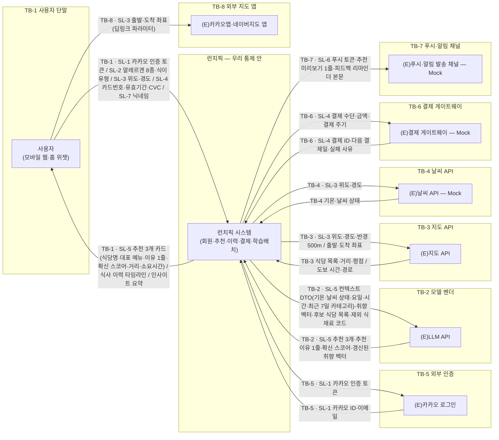
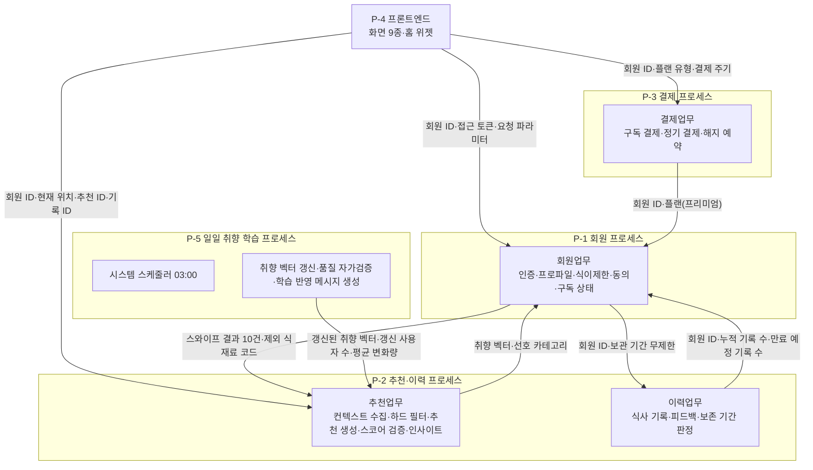
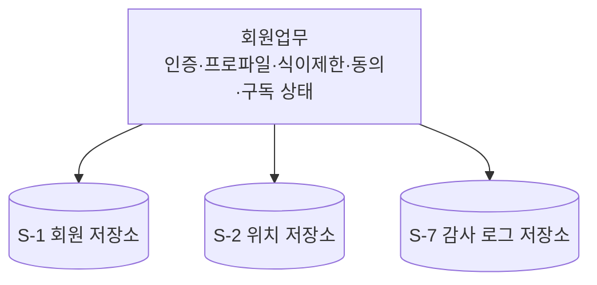
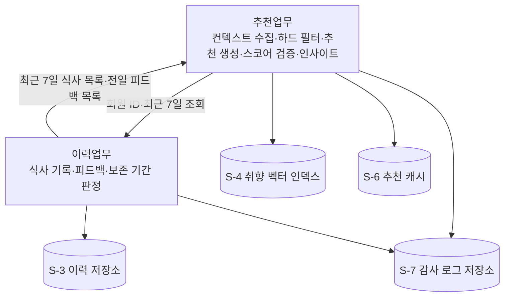
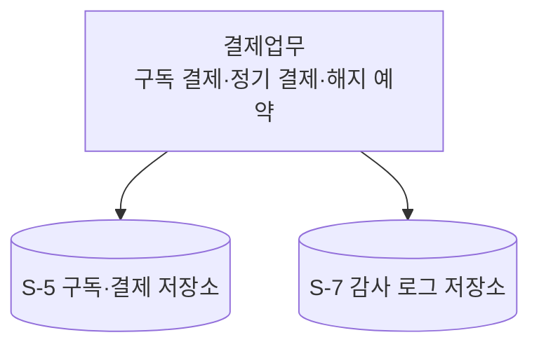
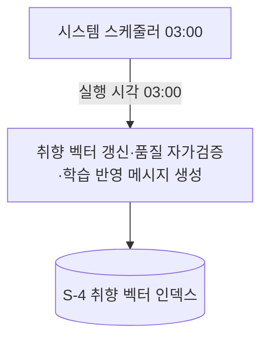

# 설계서 ② 논리아키텍처: 런치픽(LunchPick)

**작성**: 클로니(Agentic AI 아키텍트 총괄) · **작성일** 2026-08-11
**입력**: `_shared/프로젝트정보.md`(`V-01`·`V-06`·`V-08`·`V-11`) · `01-목표품질속성카드.md` ·
이벤트스토밍 도식 `docs/plan/think/es/01`~`07`
**미검증 설계**: 외부 시스템에 실제로 붙여 본 결과가 아니라 도식·요구 원문에서 도출한 배치임.

이 문서는 **"무엇이 어디에 있고 어디부터가 우리 통제 밖인가"**에 답함.
`TB`는 Trust Boundary(신뢰 경계), `SL`은 Sensitive Label(민감정보 라벨)의 약자임.

---

## 시작 조건 확인

| 변수·입력 | 상태 |
|----------|------|
| `V-01`·`V-06`·`V-08`·`V-11` | 값 있음: `프로젝트 확정 필요` 0건 |
| `01-목표품질속성카드.md` | 생성됨: 우선 품질속성 Q-1 응답시간 · Q-2 설명가능성 · Q-3 안전성 |

---

## 판정 기록 1: 두 도식을 가름

| 구분 | 1단계 전체 관계도 | 2단계 내부 관계도 |
|------|-----------------|-----------------|
| 담는 것 | 런치픽 전체를 상자 하나로 두고 사용자·외부 시스템과의 관계 | 그 상자 안의 실행 단위와 저장소 |
| 노드 출처 | ES 도식 `01`~`07`의 actor와 `(E)` 접두 participant | `V-08` 코드베이스 구성요소 8건 |
| 안 그린 것 | 내부 모듈·저장소 | 외부 시스템 내부 상세 |

## 판정 기록 2: 노드 수집 결과

ES 도식의 참여자를 그대로 옮겨 적음. 도식에 없으나 요구 원문에 있어 넣은 것은 `신설`로 표시함.

| 종류 | 노드 | 출처 |
|------|------|------|
| 사용자·액터 | 사용자 | ES:01 ~ ES:07 actor |
| 내부 업무 | 회원업무 · 추천업무 · 이력업무 · 결제업무 | ES:01#회원업무, ES:02#추천업무, ES:04#이력업무, ES:07#결제업무 |
| 내부 실행 | 시스템 스케줄러 | ES:05#시스템스케줄러 |
| 외부 시스템 | (E)카카오 로그인 | ES:01#카카오인증 |
| 외부 시스템 | (E)LLM API | ES:02#LLM추천생성, ES:05#취향임베딩갱신 |
| 외부 시스템 | (E)지도 API | ES:02#주변식당조회, ES:03#도보경로 |
| 외부 시스템 | (E)날씨 API | ES:02#날씨API |
| 외부 시스템 | (E)결제 게이트웨이 | ES:07#정기결제등록 |
| 외부 시스템 | (E)푸시·알림 발송 채널: **신설** | US:UFR-REC-090#검증요구사항(리마인더 푸시), BM:채널#Delivery(점심 30분 전 푸시·카카오톡 알림톡) |
| 외부 시스템 | (E)외부 지도 앱: **신설** | US:UFR-REC-060#검증요구사항(카카오맵·네이버지도 앱 전환) |

**신설 2건 · 미대응 0건**: ES 도식의 참여자 9종은 전부 옮겨 적었고 빠뜨린 것이 없음.

## 판정 기록 3: 신뢰 경계 판정(판정 2)

구조적 잣대 둘만 씀: 데이터 종류는 보지 않음.

| 대상 간선 | 로그를 못 보게 되나 | 권한 주체가 바뀌나 | 부여한 번호 |
|----------|------------------|-----------------|-----------|
| 런치픽 → 사용자 단말(브라우저·홈 위젯) | 예: 단말 안의 처리 기록을 볼 수 없음 | 예: 사용자 소유 기기임 | TB-1 |
| 추천업무 → (E)LLM API | 예 | 예: 모델 벤더 계정 권한임 | TB-2 |
| 추천업무 → (E)지도 API | 예 | 예 | TB-3 |
| 추천업무 → (E)날씨 API | 예 | 예 | TB-4 |
| 회원업무 → (E)카카오 로그인 | 예 | 예: 카카오 계정 권한으로 넘어감 | TB-5 |
| 결제업무 → (E)결제 게이트웨이 | 예 | 예: PG 가맹점 권한임 | TB-6 |
| 이력업무 → (E)푸시·알림 발송 채널 | 예 | 예 | TB-7 |
| 사용자 단말 → (E)외부 지도 앱 | 예 | 예: 단말의 다른 앱으로 제어권이 넘어감 | TB-8 |
| 회원업무 ↔ 추천·이력업무 ↔ 결제업무 | 아니오: 우리 로그에 남음 | 아니오: 같은 운영 주체임 | 경계 아님 |
| 내부 업무 → 내부 저장소(관계형 DB·벡터 인덱스·캐시) | 아니오 | 아니오 | 경계 아님 |

## 판정 기록 4: 민감정보 라벨 판정(판정 2-1)

**TB가 있는 간선에서만** 판정함. `V-06` 민감정보 15종을 재료로 씀.

| 대상 경계 | 지나는 민감정보 유형 | 부여한 번호 |
|----------|------------------|-----------|
| TB-1 사용자 단말 | 인증·계정 · 건강·신념 · 위치 좌표 · 결제 입력 · 행동 프로파일 · 닉네임 | SL-1 ~ SL-5, SL-7 |
| TB-2 모델 벤더 | 행동 프로파일(취향 벡터·최근 이력·컨텍스트 스냅샷) | SL-5 |
| TB-3 지도 API | 위치 좌표 | SL-3 |
| TB-4 날씨 API | 위치 좌표 | SL-3 |
| TB-5 외부 인증 | 인증·계정(카카오 인증 토큰·카카오 ID·이메일) | SL-1 |
| TB-6 결제 게이트웨이 | 결제 정보(결제 수단·금액·결제 ID) | SL-4 |
| TB-7 푸시·알림 채널 | 알림 채널 정보(푸시 토큰·추천 미리보기 본문) | SL-6 |
| TB-8 외부 지도 앱 | 위치 좌표(출발·도착) | SL-3 |

## 판정 기록 5: 실물·Mock 판정(판정 3)

기준은 "이번 범위에서 실제로 붙을 수 있는가"임. 제품·제공자가 정해지지 않은 것은
"아마 될 것"으로 실물이라 적지 않고 Mock으로 둠.

| 외부 시스템 | 실물·Mock | 판정 이유 |
|------------|----------|----------|
| (E)카카오 로그인 | 실물 | 카카오 로그인 OAuth2/OIDC가 요구에 특정돼 있음(US:UFR-MBR-010) |
| (E)LLM API | 실물 | 상용 LLM API 1종으로 확정, 설계 기본값 Claude(`V-07` 1행) |
| (E)지도 API | 실물 | 카카오 로컬·네이버 플레이스가 원문에 특정돼 있음(PR:MVP정의#실현가능성) |
| (E)날씨 API | Mock | 제공자가 원문에 없음 → `[확인필요: 날씨 API 제공자]` |
| (E)결제 게이트웨이 | Mock | `PG사 연동`만 있고 사업자가 특정되지 않음 → `[확인필요: PG사 제품명]` |
| (E)푸시·알림 발송 채널 | Mock | 제공자·토큰 저장소 미정(`V-06` 14번) → `[확인필요: 푸시·알림톡 제공자]` |
| (E)외부 지도 앱 | 실물 | 카카오맵·네이버지도 앱 전환이 요구에 특정돼 있음(US:UFR-REC-060) |

식약처 공공 API(식당 영업 상태)는 연동 확정 문장이 없어 이번 경계 목록에 넣지 않음 →
`[확인필요: 식약처 공공 API 연동 확정 여부]`.

## 판정 기록 6: 프로세스 분리 판정(판정 4)

기본값은 프로세스 1개임. 나눈 것마다 `P1` ~ `P4` 중 예인 문항을 적음.

| 후보 경계 | P1 배포 주기 | P2 늘리는 축 | P3 장애 격리 | P4 실행 방식 | 결론 |
|----------|:-----------:|:-----------:|:-----------:|:-----------:|------|
| 회원 업무 | 예: 인증·프로파일은 변경 빈도가 낮아 따로 배포됨 | 아니오 | 예: 인증이 죽으면 전체가 막히므로 격리함 | 아니오 | 분리 |
| 추천·이력 업무 | 예: AI 모델 교체로 변경 빈도가 높음 | 예: 피크타임 12 ~ 13시에만 부하가 몰림 | 아니오 | 아니오 | 분리 |
| 결제 업무 | 예 | 아니오 | 예: PG 장애를 추천 경로와 격리함 | 아니오 | 분리 |
| 프론트엔드 | 예: 정적 자원을 CDN 엣지에 따로 올림 | 아니오 | 아니오 | 예: 브라우저에서 실행됨 | 분리 |
| 일일 취향 학습 | 아니오 | 예: 03:00 배치 부하가 낮 피크와 겹치지 않음 | 예: 배치 실패 시 이전 벡터를 유지하고 서비스는 살아 있어야 함 | 예: 요청이 아니라 주기로 돎 | 분리 |
| 이력 업무를 추천과 쪼갬 | 아니오 | 아니오: 추천 경로가 매 요청 이력을 읽으므로 축이 같음 | 아니오 | 아니오 | 합침(전부 아니오) |

**추천·이력을 쪼개지 않은 이유**: 쪼개면 추천 경로의 이력 조회가 함수 호출에서 네트워크 호출로
바뀌어 규격·타임아웃·재시도·실패 처리가 새로 생기고, Q-1의 3,000ms 예산을 그만큼 더 씀.

---

## 구조: 전체 관계도

## 구조: 내부 관계도

### 프로세스 간 관계도(저장소 제외)

`REC↔HIS`(P-2 내부)와 `SCHED→LEARN`(P-5 내부)은 프로세스 경계를 안 넘어 이 도식에서 뺌:
각 프로세스 상세도에 있음.

### P-1 회원 프로세스 상세(저장소 포함)

### P-2 추천·이력 프로세스 상세(저장소 포함)

### P-3 결제 프로세스 상세(저장소 포함)

### P-5 일일 취향 학습 프로세스 상세(저장소 포함)

`P-4` 프론트엔드는 접근하는 내부 저장소가 없어 상세도를 따로 두지 않음.

**프로세스 간 공유 저장소**: `S-4` 취향 벡터 인덱스는 `P-2`(조회)·`P-5`(갱신)가 같이 접근함.
`S-7` 감사 로그 저장소는 `P-1`·`P-2`·`P-3` 셋이 같이 씀. 공유 저장소는 프로세스를 나눠도
남는 결합 지점임.

## 구조: 프로세스 분리표

| 프로세스 | 담는 구성요소 | 분리 근거 |
|---------|-------------|----------|
| `P-1` 회원 프로세스 | 회원업무(인증·프로파일·식이제한·동의 이력·구독 상태) | `P1` 배포 주기 · `P3` 장애 격리 |
| `P-2` 추천·이력 프로세스 | 추천업무 + 이력업무 | `P1` 배포 주기(AI 모델 교체) · `P2` 늘리는 축(피크 12 ~ 13시) |
| `P-3` 결제 프로세스 | 결제업무 | `P1` 배포 주기 · `P3` 장애 격리(PG 연동) |
| `P-4` 프론트엔드 | 화면 9종 + 공통 스타일 + 홈 위젯 | `P1` 배포 주기(CDN 엣지) · `P4` 실행 방식(브라우저) |
| `P-5` 일일 취향 학습 프로세스 | 시스템 스케줄러 + 취향 벡터 갱신 + 품질 자가검증 | `P4` 실행 방식(주기로 돎) · `P2` · `P3`. 원문이 소속을 특정하지 않음 → `[확인필요: 일일 취향 학습 배치의 소속 프로세스]` |

프로세스 5개 전부에 예인 문항이 적혀 있음: 근거 없는 분리 **0건**.

---

## 경계: 신뢰경계표

판정 2에서 모은 노드 전부를 담음. 판정 근거(왜 그 TB인지·왜 Mock인지)는 판정 기록 3·5에 있고,
여기는 결과만 옮김.

| 노드 | 종류 | 신뢰경계 | 실물/Mock |
|------|------|:-------:|:--------:|
| 사용자 | 사용자 | TB-1 | 실물 |
| 회원업무 | 내부업무 | — | — |
| 추천업무 | 내부업무 | — | — |
| 이력업무 | 내부업무 | — | — |
| 결제업무 | 내부업무 | — | — |
| 시스템 스케줄러 | 내부실행 | — | — |
| (E)카카오 로그인 | 외부시스템 | TB-5 | 실물 |
| (E)LLM API | 외부시스템 | TB-2 | 실물 |
| (E)지도 API | 외부시스템 | TB-3 | 실물 |
| (E)날씨 API | 외부시스템 | TB-4 | Mock: 제공자 미정 |
| (E)결제 게이트웨이 | 외부시스템 | TB-6 | Mock: PG사 미정 |
| (E)푸시·알림 발송 채널 | 외부시스템 | TB-7 | Mock: 제공자 미정 |
| (E)외부 지도 앱 | 외부시스템 | TB-8 | 실물 |

Mock 3건 · 실물 5건. 이 구분은 이 산출물이 값의 주인이며 ⑤ 지식/도구가 그대로 인용함.

## 경계: 경계통과 민감정보

TB가 있는 간선마다 방향별로 1행. SL 항목의 전체 정의(무엇을 묶었는지)는 판정 기록 4를 봄:
여기는 소스 → 대상 방향으로 실제 오간 값만 옮김.

| 소스 | 대상 | 정보 | 민감정보ID |
|------|------|------|:---------:|
| 사용자 | TB-1 시스템 | 카카오 인증 토큰·알레르겐 8종·식이 유형·위도·경도·카드번호·유효기간·CVC·닉네임 | SL-1, SL-2, SL-3, SL-4, SL-7 |
| TB-1 시스템 | 사용자 | 추천 3개 카드·추천 이유 1줄·식사 이력 타임라인·인사이트 요약 | SL-5 |
| 시스템 | TB-5 카카오 로그인 | 카카오 인증 토큰 | SL-1 |
| TB-5 카카오 로그인 | 시스템 | 카카오 ID·이메일 | SL-1 |
| 시스템 | TB-2 LLM API | 컨텍스트 DTO·취향 벡터·후보 식당 목록·제외 식재료 코드 | SL-5 |
| TB-2 LLM API | 시스템 | 추천 3개·추천 이유 1줄·확신 스코어·갱신된 취향 벡터 | SL-5 |
| 시스템 | TB-3 지도 API | 위도·경도·반경 500m / 출발·도착 좌표 | SL-3 |
| TB-3 지도 API | 시스템 | 식당 목록·거리·평점 / 도보 시간·경로 | — |
| 시스템 | TB-4 날씨 API | 위도·경도 | SL-3 |
| TB-4 날씨 API | 시스템 | 기온·날씨 상태 | — |
| 시스템 | TB-6 결제 게이트웨이 | 결제 수단·금액·결제 주기 | SL-4 |
| TB-6 결제 게이트웨이 | 시스템 | 결제 ID·다음 결제일·실패 사유 | SL-4 |
| 시스템 | TB-7 푸시·알림 채널 | 푸시 토큰·추천 미리보기 1줄·리마인더 본문 | SL-6 |
| 사용자 | TB-8 외부 지도 앱 | 출발·도착 좌표(딥링크 파라미터) | SL-3 |

TB·SL 간선 전부에 항목 라벨이 붙어 있음: 라벨 공란 **0건**(전체 관계도 화살표 14개 기준).

## 경계: 경계 미통과 항목

| 항목 이름 | 어느 경계를 안 넘나 | 안 넘기는 방법 |
|----------|------------------|--------------|
| 알레르겐 원문 라벨(`allergyItems[]`) · 알레르기 직접 입력 문자열 | TB-2 모델 벤더 | LLM 입력 규격에 `allergyItems` 칸을 만들지 않음. `제외 식재료 코드` 배열만 둠 |
| 식이 유형(`dietType`) | TB-2 모델 벤더 · TB-3 지도 API · TB-4 날씨 API | 외부로 나가는 요청 규격에 칸을 두지 않음. 하드 필터에서 `제외 식재료 코드`로 환산한 뒤 코드만 넘김 |
| 카드번호·유효기간·CVC(`cardNumber`·`cardExpiry`·`cardCvc`) | TB-2 모델 벤더 · TB-7 푸시·알림 채널 · 내부 저장소 전부 | 결제 화면 입력값을 TB-6 경로 외 어떤 규격에도 두지 않음. 내부에는 결제 ID만 남김 |
| 계정 식별정보(`user.email`·`kakao_id`) | TB-2 모델 벤더 | LLM 입력 규격에 식별자 칸을 만들지 않음. 요청 단위 임시 ID만 둠 |
| 정확한 좌표(`lat`·`lng`) | TB-2 모델 벤더 | LLM 입력 규격에 좌표 칸을 만들지 않음. 지역 라벨과 거리(m)만 둠 |
| 닉네임(`nickname`) | TB-2 모델 벤더 | 인사 문구는 화면에서 조립함. 프롬프트 입력 규격에 칸을 만들지 않음 |
| 자체 인증 토큰(`access_token`·`refresh_token`) | TB-2 · TB-3 · TB-4 · TB-6 · TB-7 | 외부 호출 규격에 우리 토큰 칸을 두지 않음. 외부는 각자의 자격증명만 씀 |

---

## 저장: 내부 저장소 목록

저장소가 존재한다는 사실과 소속만 적음. 정확한 필드 목록은 ⑤ 지식/도구, 보존 기간·삭제
주기는 ⑤ 지식/도구가 원문(US 컴플라이언스)에서 직접 인용해 정함(⑤ 가이드 3-3 민감·보존).
물리 배치(관계형 확장 vs 별도 인덱스, 안/밖)는 ⑦ 배포가 정하며 ⑦은 이 목록이 아니라 ⑤의
저장소 목록을 인용함.

| ID | 저장소명 | 용도 | 소속 프로세스 |
|----|---------|------|-------------|
| S-1 | 회원 저장소 | 회원 인증·프로필·동의·구독 상태 | P-1 |
| S-2 | 위치 저장소 | 위치 동의·현재·과거 좌표 | P-1 |
| S-3 | 이력 저장소 | 식사 기록·피드백 이력 | P-2 |
| S-4 | 취향 벡터 인덱스 | 취향 벡터·임베딩 | P-2, P-5 공유 |
| S-5 | 구독·결제 저장소 | 플랜·결제 상태 | P-3 |
| S-6 | 추천 캐시 | LLM 폴백용 최근 추천 결과 | P-2 |
| S-7 | 감사 로그 저장소 | 개인정보 접근·도구 호출 감사 로그 | P-1, P-2, P-3 공유 |

내부 저장소는 TB가 없는 내부 간선이므로 SL 판정 대상이 아님: 위 표에 성격만 적음.

## 저장: 배치 결정 ADR

① 목표/품질 카드의 우선 품질속성 3개(Q-1 응답시간 · Q-2 설명가능성 · Q-3 안전성)를 근거로 씀.

**ADR-1: 이력업무를 추천업무와 한 프로세스에 둠**

| 항목 | 내용 |
|------|------|
| 후보 | ⓐ 추천·이력을 한 프로세스에 둠 ⓑ 이력을 따로 떼어 냄 |
| ⓐ 장단점 | 장점: 추천 경로의 최근 7일 이력 조회가 함수 호출로 끝나 Q-1 예산을 덜 씀. 단점: 쓰기 부하가 추천 응답과 같은 프로세스를 씀 |
| ⓑ 장단점 | 장점: 이력 쓰기 부하를 따로 늘림. 단점: 추천 경로에 네트워크 홉·타임아웃·재시도가 새로 생김 |
| 결정 | **ⓐ**: 판정 4의 `P1` ~ `P4`가 전부 아니오이고, Q-1의 3,000ms 예산에 홉을 더할 근거가 없음 |
| 근거 출처 | ES:요약#분할병합결정, 설계판단(① Q-1 응답시간) |

**ADR-2: 일일 취향 학습을 별도 프로세스로 둠**

| 항목 | 내용 |
|------|------|
| 후보 | ⓐ 추천 프로세스 안의 스케줄러 ⓑ 별도 프로세스 |
| ⓐ 장단점 | 장점: 구성이 하나 줄어듦. 단점: 03:00 배치의 전체 사용자 루프가 추천 응답과 자원을 다툼 |
| ⓑ 장단점 | 장점: 배치 실패가 추천 응답에 닿지 않고 늘리는 축을 따로 잡음. 단점: 기동·설정·상태 점검 경로가 1벌 늘어남 |
| 결정 | **ⓑ**: `P4`(주기 실행)와 `P3`(배치 실패 시 이전 벡터 유지로 서비스는 살아 있어야 함)가 예임. Q-1을 지키려면 배치 부하를 응답 경로에서 떼야 함 |
| 근거 출처 | US:UFR-REC-100#처리결과, ES:05#일일학습, 설계판단(① Q-1) |

**ADR-3: 건강·신념 정보를 TB-2 모델 벤더로 넘기지 않음**

| 항목 | 내용 |
|------|------|
| 후보 | ⓐ 알레르겐·식이 유형 원문을 프롬프트에 넣고 모델이 걸러 냄 ⓑ 하드 필터로 후보를 미리 지우고 코드만 넘김 |
| ⓐ 장단점 | 장점: 추천 이유 문장이 제한을 직접 설명할 수 있음. 단점: 건강 민감정보가 경계를 넘고, 모델 판단에 안전을 의존하게 됨 |
| ⓑ 장단점 | 장점: 경계 통과 자체가 없어짐. 단점: 필터가 후보를 다 지우면 추천이 비므로 페일세이프가 필요함 |
| 결정 | **ⓑ**: Q-3 안전성의 목표가 `노출 0건`이고, Q-2의 설명 문장에 민감 필드를 인용하지 않아야 함 |
| 근거 출처 | ES:02#하드필터, US:UFR-MBR-040#검증요구사항, 설계판단(① Q-2 · Q-3) |

**ADR-4: 추천 캐시를 별도 저장소로 두고 이유·스코어까지 함께 담음**

| 항목 | 내용 |
|------|------|
| 후보 | ⓐ 캐시에 추천 목록만 담음 ⓑ 이유 1줄·확신 스코어까지 함께 담음 |
| ⓐ 장단점 | 장점: 담는 양이 적음. 단점: 폴백으로 나간 추천에 설명 3요소가 비어 Q-2 목표 100%가 깨짐 |
| ⓑ 장단점 | 장점: 폴백 응답도 3요소를 채움. 단점: 담는 양과 무효화 규칙이 늘어남 |
| 결정 | **ⓑ**: Q-1의 3,000ms 안에서 폴백이 끝나야 하고, 폴백 응답도 Q-2의 완비율 분모에 들어감 |
| 근거 출처 | US:NFR-SYS-020#체크리스트, US:UFR-REC-010#처리결과, 설계판단(① Q-1 · Q-2) |

**ADR-5: 취향 벡터를 관계형 저장소와 논리적으로 분리함**

| 항목 | 내용 |
|------|------|
| 후보 | ⓐ 관계형 저장소 안에 벡터 열을 둠 ⓑ 벡터 인덱스를 논리적으로 분리함 |
| ⓐ 장단점 | 장점: 저장소가 하나로 끝남. 단점: 유사도 검색이 이력 쓰기 트랜잭션과 자원을 다툼 |
| ⓑ 장단점 | 장점: 검색 경로를 따로 늘릴 수 있어 Q-1에 유리함. 단점: 저장소가 하나 늘고 갱신 시 정합성 규칙이 필요함 |
| 결정 | **ⓑ**(논리 분리 확정, 물리 제품은 미정): Q-1이 추천 경로의 최대 지연 요인을 LLM 호출로 보므로 검색 지연을 더 얹지 않음 |
| 근거 출처 | ES:05#취향임베딩갱신, US:NFR-SYS-020#체크리스트, 설계판단(① Q-1) |

---

## 부속 표

### 대조 기록

| 기획 항목 ID | 반영 여부 | 반영 위치 | 사유 |
|-------------|----------|----------|------|
| ES:01#회원업무 | 반영 | 내부 관계도 `P-1` · 신뢰경계표 TB-5 | 도식 참여자를 그대로 옮김 |
| ES:02#추천업무 | 반영 | 내부 관계도 `P-2` · TB-2 · TB-3 · TB-4 | 도식 참여자를 그대로 옮김 |
| ES:04#이력업무 | 반영 | 내부 관계도 `P-2` · S-3 | ADR-1로 추천과 같은 프로세스에 둠 |
| ES:07#결제업무 | 반영 | 내부 관계도 `P-3` · TB-6 · S-5 | 도식 참여자를 그대로 옮김 |
| ES:05#시스템스케줄러 | 반영 | 내부 관계도 `P-5` | ADR-2로 별도 프로세스로 둠 |
| ES:요약#MVP마이크로서비스구성 | 반영 | 프로세스 분리표 `P-1` ~ `P-3` | 3서비스 구성을 프로세스 경계로 씀 |
| ES:요약#컨텍스트맵 | 반영 | 내부 관계도 내부 간선 5개 | 동기·비동기 구분은 ③ 소관이라 방향만 옮김 |
| `V-08` 1 ~ 8번 | 반영 | 내부 관계도 · 내부 저장소 목록 | 8건 전부 노드로 옮김(미대응 0건) |
| `V-06` 1 ~ 15번 | 반영 | SL-1 ~ SL-7 | 15종을 7개 유형으로 묶음. 묶을 때 뺀 항목 0건 |
| US:UFR-REC-090#검증요구사항 | 부분반영 | TB-7 · SL-6 | 발송 채널을 노드로 신설함. 발송 조건 판정은 ⑥ 소관 |
| US:UFR-REC-060#검증요구사항 | 반영 | TB-8 · SL-3 | 딥링크 전환을 경계로 잡음 |
| ES:규제반영표#식품위생법 | 미반영 | — | 영업 상태 원천이 확정되지 않아 노드로 두지 않음 |
| `V-09` 1 · 5 · 6번(팀 합의·이미지·음성) | 범위외 | — | 입력 경계를 텍스트·좌표·라벨로 한정해 노드를 만들지 않음 |

**신설 2건**(푸시·알림 발송 채널, 외부 지도 앱) · **미대응 1건**(식당 영업 상태 원천).

### 변경요청

| 무엇 | 받는 곳 | 사유 |
|------|--------|------|
| — | — | 0건: ① 목표/품질 카드로 되돌릴 값이 없음. ①의 미확정 4건은 이 산출물이 쓰지 않는 값임 |

### 미확정 항목

| `[확인필요]` 태그 | 무엇이 없나 | 누구에게 되묻나 | 안 오면 무엇이 막히나 |
|------------------|-----------|---------------|---------------------|
| `[확인필요: 날씨 API 제공자]` | TB-4의 제공자·요청 규격 | 기획 담당자 · 아키텍트 | ⑤ 지식/도구가 커넥터 외부규격을 못 적고 TB-4가 Mock에 머묾 |
| `[확인필요: PG사 제품명]` | TB-6의 PG 사업자 | 기획 담당자 · 도메인 전문가 | ⑦ 배포가 결제 비밀값 항목을 특정 못 함 |
| `[확인필요: 푸시·알림톡 제공자]` | TB-7의 제공자·토큰 저장소 | 기획 담당자 | SL-6의 토큰 보관 위치와 ⑦ 비밀값이 비어 있음 |
| `[확인필요: 일일 취향 학습 배치의 소속 프로세스]` | `P-5`를 별도 실행 단위로 둘지 추천 프로세스 내부 스케줄러로 둘지 | 아키텍트 · DevOps | ⑦ 배포가 실행 단위 수를 확정 못 함 |
| `[확인필요: 식약처 공공 API 연동 확정 여부]` | 식당 영업 상태 원천의 연동 여부 | 기획 담당자 · 도메인 전문가 | 폐업 식당 제외 필터가 노드 없이 남음 |

`[확인필요]` **5건**: 위 표 5행과 같음. 저장소 필드·보존 기간·물리 배치 관련 확인 요청 5건은
이 산출물의 소관이 아니게 되어 뺌(⑤ 지식/도구·⑦ 배포가 각자 원문에서 다시 인용하며 되물음).
