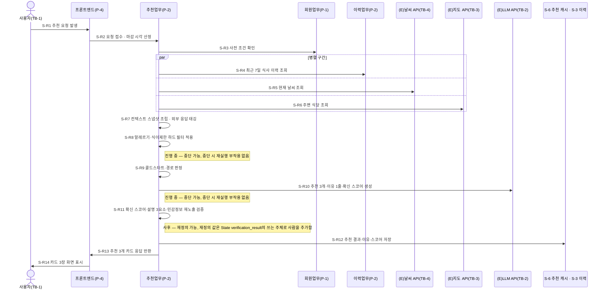
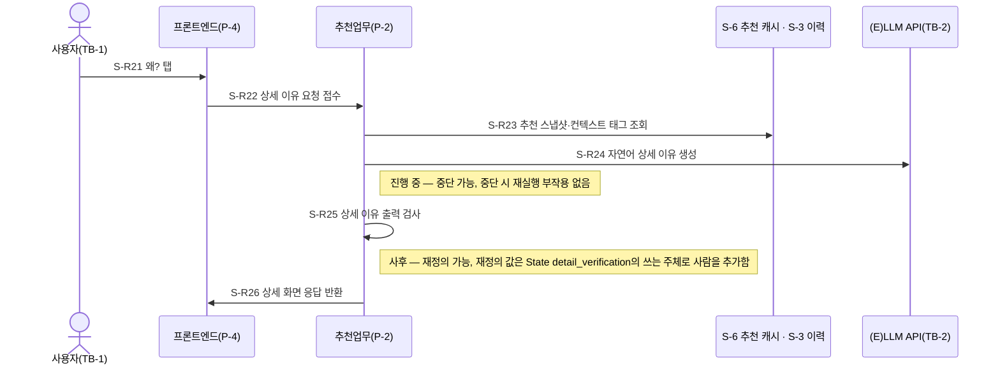
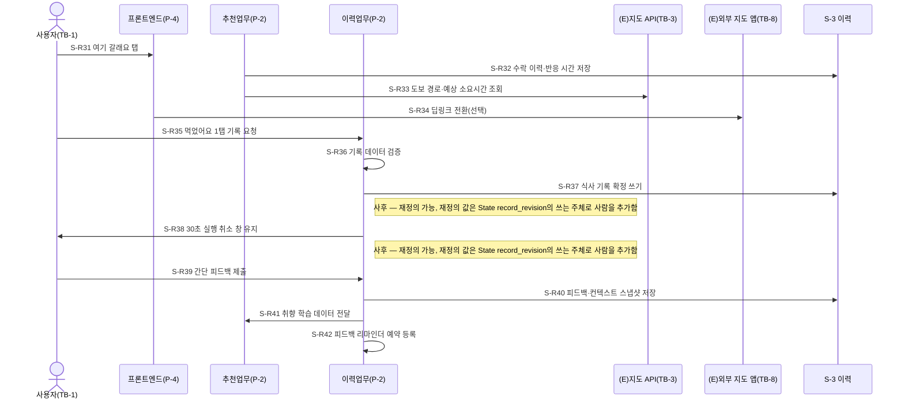
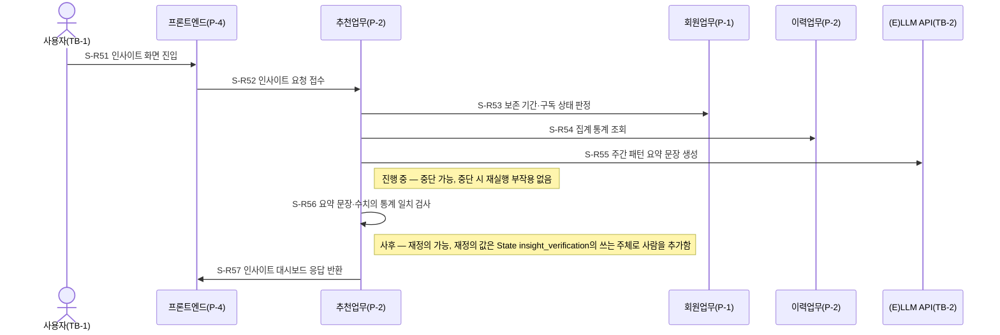
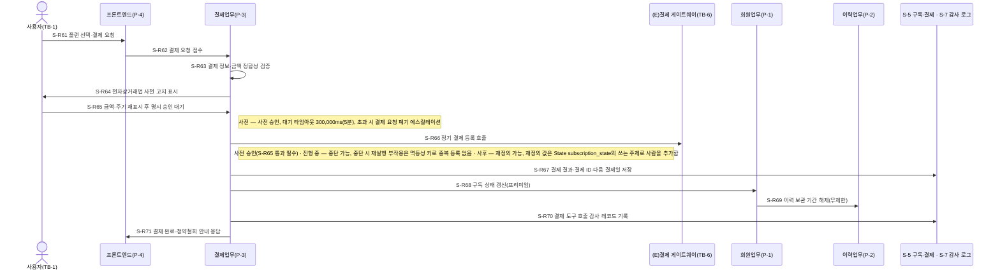
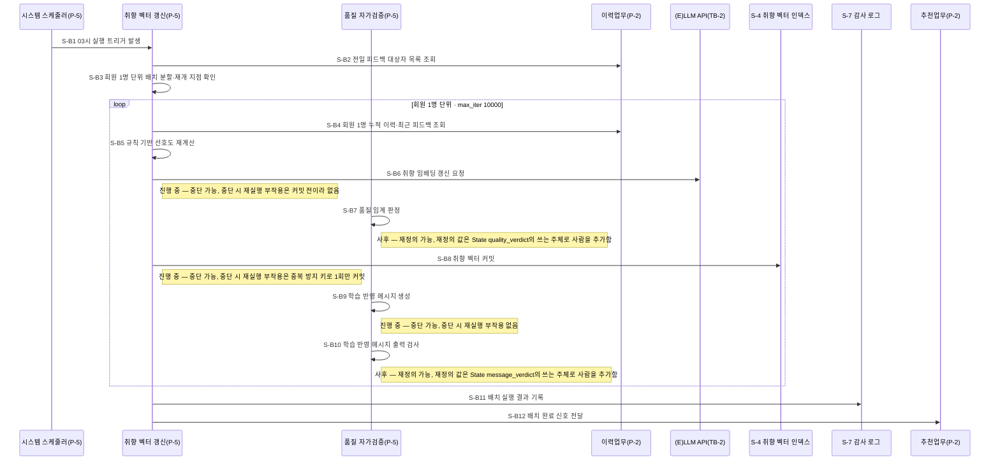
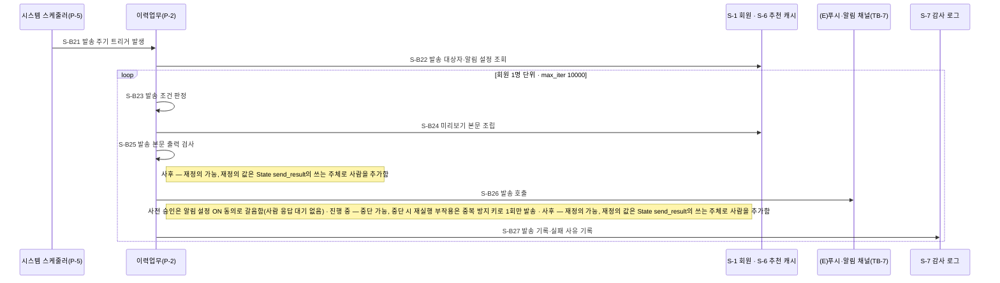
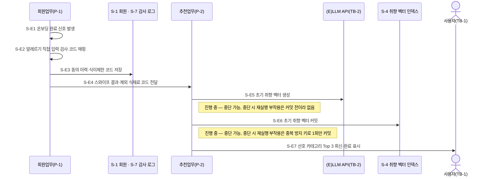
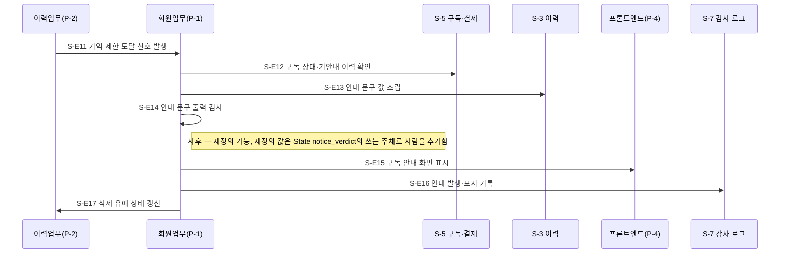

# 설계서 ③ 워크플로우 — 런치픽(LunchPick)

**작성**: 플로니(오케스트레이션 엔지니어) · **작성일** 2026-08-11
**입력**: `_shared/프로젝트정보.md`(`V-02`·`V-03`·`V-10`·`V-11`) · `01-목표품질속성카드.md` ·
`02-논리아키텍처.md` · 기획 산출물 `docs/plan/`
**미검증 설계** — 외부 시스템에 실제로 붙여 재 본 값이 아니라 요구 원문과 예산 분해로 정한 상한임.

이 문서는 **"누가 어떤 순서로 움직이고, 실패하면 무엇을 하는가"**에 답함.

**`타임아웃 값의 단일 출처는 본 산출물임`** — 재시도 횟수·반복 상한(`max_iter`)·State 필드 이름 ·
프로세스 경계를 넘는 API 요청·응답 키 이름(`프로세스별 API 설계`) · 모델 호출 횟수(`0회`·`N회`)도
본 산출물이 소유함.
④ 역할계약서 · ⑤ 지식/도구 · ⑥ 가드레일/관측은 이 값을 **인용만** 하고 옮겨 적지 않음.
어긋나는 것이 나오면 고치지 않고 말미 `변경요청` 표로 되돌려 보냄.

`TB`는 Trust Boundary(신뢰 경계), `S-n`은 내부 저장소, `P-n`은 프로세스, `SL`은 Sensitive
Label(민감정보 라벨)의 약자이며 전부 `02-논리아키텍처.md`가 붙인 번호임.
`p95`는 100건 중 95번째로 느린 값, `max_iter`는 되돌아가는 화살표의 반복 상한임.

---

## 시작 조건 확인

| 확인 대상 | 상태 |
|----------|------|
| `V-02` 케이스 정의 | 값 있음 — 케이스 2건, 시작 계기 3종(사람이 누름 · 정해진 주기 · 앞 단계 완료 신호) |
| `V-03` 최종 산출물 | 값 있음 — 오늘의 추천 카드 3장, 사람이 최종 결정함(수락 1탭·거절) |
| `V-10` 규제·안전 점검 항목 | 값 있음 — 32건, 4계열 전부 `0건 아님` |
| `V-11` 기획 산출물 경로 | 값 있음 — `docs/plan` 하위 마크다운 32건 + PlantUML 8건 |
| `01-목표품질속성카드.md` | 있음 — 응답시간 목표 3,000ms(p95) · 성격 선언 고위험 `예`(H1) |
| `02-논리아키텍처.md` | 있음 — 프로세스 5개 · 신뢰경계 8개 · 내부 저장소 7개 |

`프로젝트 확정 필요` **0건** — 작성을 시작함.

---

## 판정 기록 1 — 참여 주체(② 논리아키텍처에서 옮겨 적음)

**담당자 이름을 지어내지 않음.** ④ 역할계약서가 아직 없으므로 ② 논리아키텍처의 구성요소·외부
서비스·저장소 이름을 그대로 씀.

| 구분 | 주체 이름 | 어디서 옮겼나 |
|------|----------|--------------|
| 내부 | 프론트엔드(`P-4`) | ② 내부 관계도 `P-4` |
| 내부 | 회원업무(`P-1`) | ② 내부 관계도 `P-1` |
| 내부 | 추천업무(`P-2`) | ② 내부 관계도 `P-2` |
| 내부 | 이력업무(`P-2`) | ② 내부 관계도 `P-2` |
| 내부 | 결제업무(`P-3`) | ② 내부 관계도 `P-3` |
| 내부 | 시스템 스케줄러(`P-5`) | ② 내부 관계도 `P-5` |
| 내부 | 취향 벡터 갱신·품질 자가검증(`P-5`) | ② 내부 관계도 `P-5` |
| 외부 | 사용자(`TB-1` 사용자 단말) | ② 신뢰경계표 TB-1 |
| 외부 | (E)LLM API(`TB-2`) | ② 신뢰경계표 TB-2 |
| 외부 | (E)지도 API(`TB-3`) | ② 신뢰경계표 TB-3 |
| 외부 | (E)날씨 API(`TB-4`, Mock) | ② 신뢰경계표 TB-4 |
| 외부 | (E)카카오 로그인(`TB-5`) | ② 신뢰경계표 TB-5 |
| 외부 | (E)결제 게이트웨이(`TB-6`, Mock) | ② 신뢰경계표 TB-6 |
| 외부 | (E)푸시·알림 발송 채널(`TB-7`, Mock) | ② 신뢰경계표 TB-7 |
| 외부 | (E)외부 지도 앱(`TB-8`) | ② 신뢰경계표 TB-8 |
| 저장소 | `S-1` 회원 · `S-2` 위치 · `S-3` 이력 · `S-4` 취향 벡터 인덱스 · `S-5` 구독·결제 · `S-6` 추천 캐시 · `S-7` 감사 로그 | ② 내부 저장소 목록 |

지어낸 주체 **0건**.

---

## 판정 기록 2 — 트리거 판정(가이드 2-1)

`V-02`의 시작 계기를 트리거 3종으로 가르고 **트리거마다 시퀀스를 따로 그림.**

| `V-02` 시작 계기 | 트리거 | 단계 식별자 접두 | 예산 기준 | 펼친 워크플로우 |
|----------------|--------|----------------|----------|---------------|
| ⓐ 홈 화면 진입·새로고침·거절 후 대체 추천 | 동기 요청 | `S-R` | ① 응답시간 목표 3,000ms(p95) | `W-1` |
| ⓐ 추천 카드의 "왜?" 탭 | 동기 요청 | `S-R` | `[확인필요: 추천 이유 상세 조회 API 응답 목표]` | `W-2` |
| ⓐ 수락 1탭 · 길찾기 · "먹었어요" 1탭 · 피드백 제출 | 동기 요청 | `S-R` | ① 판정표 C-2 식사 기록 200ms(p95) · 길찾기 구간은 `[확인필요: 길찾기(도보 경로) 조회 API 응답 목표]` | `W-3` |
| ⓐ 인사이트 화면 진입 | 동기 요청 | `S-R` | `[확인필요: 인사이트 조회 API 응답 목표]`(집계 구간은 ① 판정표 C-3 500ms 참고) | `W-4` |
| ⓐ 구독 플랜 선택·결제 요청 | 동기 요청 | `S-R` | `[확인필요: 결제·해지 API 응답 목표]` | `W-5` |
| ⓐ 설정 > 구독 > 해지 진입 | 동기 요청 | `S-R` | `[확인필요: 결제·해지 API 응답 목표]` | `W-6` |
| ⓑ 매일 03:00 일일 취향 학습 | 스케줄 배치 | `S-B` | `[확인필요: 일일 학습 배치 완료 목표(03:00 실행 창)]` | `W-7` |
| ⓑ 점심 30분 전 푸시 · 피드백 미응답 1시간 후 리마인더 | 스케줄 배치 | `S-B` | `[확인필요: 알림 발송 배치 완료 목표·발송 창]` | `W-8` |
| ⓒ 온보딩 완료 신호 | 이벤트 | `S-E` | `[확인필요: 이벤트 전달 지연 목표]` | `W-9` |
| ⓒ 30일 기억 제한 도달 신호 | 이벤트 | `S-E` | `[확인필요: 이벤트 전달 지연 목표]` | `W-10` |

`V-02`가 든 시작 계기 10건이 전부 워크플로우로 펼쳐졌음 — 미대응 **0건**.
`W-3`이 ⓐ 4개 조작을 한 워크플로우로 묶은 이유는 수락 → 길찾기 → 기록 → 피드백이 같은 식사
1건을 상태로 이어받기 때문임(`meal_record`·`feedback`이 같은 State에 남음).

---

## 판정 기록 3 — 패턴 판정(가이드 2-2 결정 트리)

결정 트리는 **워크플로우 전체가 아니라 워크플로우를 이루는 단계마다** 돌림. 프레임워크 이름은
표에 올리지 않음. 아래 `Q1` 열은 그 워크플로우의 **모든 단계**에 개별로 물은 요약이며,
`W-1` ~ `W-10` 전 워크플로우의 **전 단계**가 `Q1=예`로 갈려 `Q2`·`Q3`까지 내려간 단계가
**0개**임 — 그래서 단계별 패턴 열을 표에 따로 만들지 않고 이 표로 갈음함(가이드 3절의
생략 규칙).

| 워크플로우 | Q1 순서가 미리 정해지는가(단계별 판정 요약) | Q2 첫 갈림길만 정하면 되는가 | Q3 하위 작업을 맡기고 결과만 받나 | 결론 |
|-----------|:----------------------:|:------------------------:|:-----------------------------:|------|
| `W-1` | **전 단계 예** — 컨텍스트 수집 → 하드 필터 → 생성 → 검증 → 응답 순서가 요구에 못 박혀 있고 분기 조건(피드백 5건 미만·확신 스코어 임계)이 숫자 비교임 | 묻지 않음 | 묻지 않음 | 전 단계 고정 워크플로우 |
| `W-2` | **전 단계 예** — 스냅샷 조회 → 생성 → 출력 검사 → 응답 | 묻지 않음 | 묻지 않음 | 전 단계 고정 워크플로우 |
| `W-3` | **전 단계 예** — 수락 → 경로 조회 → 기록 검증 → 쓰기 → 취소 창 → 피드백 → 전달 | 묻지 않음 | 묻지 않음 | 전 단계 고정 워크플로우 |
| `W-4` | **전 단계 예** — 보존 기간 판정 → 집계 조회 → 요약 생성 → 일치 검사 → 응답 | 묻지 않음 | 묻지 않음 | 전 단계 고정 워크플로우 |
| `W-5` | **전 단계 예** — 검증 → 법정 고지 → 승인 대기 → 등록 → 저장 → 상태 갱신 | 묻지 않음 | 묻지 않음 | 전 단계 고정 워크플로우 |
| `W-6` | **전 단계 예** — 조건 판정 → 고지 → 확인 모달 → 예약 저장 → 기록 | 묻지 않음 | 묻지 않음 | 전 단계 고정 워크플로우 |
| `W-7` | **전 단계 예** — 대상자 조회 → 회원 루프(재계산 → 임베딩 → 자가검증 → 커밋) → 기록 | 묻지 않음 | 묻지 않음 | 전 단계 고정 워크플로우 |
| `W-8` | **전 단계 예** — 대상자 조회 → 조건 판정 → 본문 조립 → 출력 검사 → 발송 → 기록 | 묻지 않음 | 묻지 않음 | 전 단계 고정 워크플로우 |
| `W-9` | **전 단계 예** — 입력 검사 → 동의 저장 → 전달 → 임베딩 → 커밋 → 회신 | 묻지 않음 | 묻지 않음 | 전 단계 고정 워크플로우 |
| `W-10` | **전 단계 예** — 신호 → 상태 확인 → 문구 조립 → 출력 검사 → 표시 → 기록 | 묻지 않음 | 묻지 않음 | 전 단계 고정 워크플로우 |

`Q1`이 전 워크플로우·전 단계에서 `예`라서 `Q2`·`Q3`으로 내려가지 않음. **후보 4종 대조**는 아래와 같음.

| 패턴 후보 | 채택 여부 | 이유 |
|----------|:--------:|------|
| 고정 워크플로우 | **채택(10개 워크플로우·전 단계)** | 단계 순서가 US 요구·ES 도식에 이미 못 박혀 있고 분기 조건이 전부 숫자·플래그 비교임. `V-04` 확정 원천 19건 중 비정형이 1건뿐이라 모델이 다음 단계를 고를 여지가 없음 |
| 라우터 | 탈락 | 갈림길이 있으나(콜드스타트·확신 스코어 미달·캐시 폴백) 모델이 아니라 임계값 비교가 고름. 모델에게 경로 선택을 맡길 근거가 원문에 없음 |
| 서브에이전트 | 탈락 | 결과만 받아 오면 되는 하위 작업이 없음. 추천 생성은 1회 호출로 끝나고 결과에 대한 후속 판단은 규칙(확신 스코어 임계)이 함 |
| 핸드오프 | 탈락 | 제어권을 넘길 다른 자율 실행 주체가 원문에 없음(`V-07` 4행이 A2A를 `해당 없음`으로 판정) |

모든 단계가 고정 워크플로우라 각 워크플로우별 설계의 "단계별 설계" 표에는 **패턴 열을 만들지
않음**(가이드 3절 생략 규칙). 라우터·서브에이전트·핸드오프에 해당하는 단계가 이후 추가되면
그 워크플로우에만 열을 만들어 표시함.

---

## 판정 기록 4 — 인간 개입·모델 호출 판정(가이드 2-3 · 2-4)

### 성격 선언 인용

| 고영향 인공지능 | 고위험 인공지능 | 이 문서가 지는 결과 |
|----------------|----------------|-------------------|
| 아니오(시행령 카목 보류) | **예**(H1 — 정기 결제 등록은 재산, 알레르기 하드 필터 실패는 건강에 닿고 되돌릴 수 없음) | 되돌릴 수 없는 쓰기 단계의 인간 개입 열에 `—`가 **0건**이어야 하고, 자율로 도는 단계에도 진행 중 중단·사후 재정의 채널을 둠 |

출처: `01-목표품질속성카드.md` 「성격 선언」. 이 문서는 인용만 하고 다시 판정하지 않음.

### 되돌릴 수 없는 쓰기 단계 목록과 인간 개입

| 단계 | 왜 되돌릴 수 없나 | 사전 | 진행 중 | 사후 |
|------|-----------------|:----:|:------:|:----:|
| `S-R66` TB-6 정기 결제 등록 | 재산에 영향을 주고 취소는 별도 청약철회 절차가 필요함 | O | O | O |
| `S-B26` TB-7 푸시·알림 발송 | 단말로 이미 나간 알림을 회수할 수 없음 | O(알림 설정 ON 동의로 갈음, 사람 응답 대기 없음) | O | O |

`—` **0건**. 되돌릴 수 있는 쓰기(`S-R37` 식사 기록 30초 취소 · `S-R85` 해지 예약 취소 ·
`S-B8`·`S-E6` 취향 벡터 커밋의 직전 1세대 보존)는 이 표에 넣지 않고 해당 단계 행에 사후 재정의만 둠.

### 사람 응답을 실시간으로 기다리는 단계

| 단계 | 대기 타임아웃(상한) | 초과 시 처리(에스컬레이션) |
|------|------------------|------------------------|
| `S-R65` 결제 금액·주기 재표시 후 명시 승인 | 300,000ms(5분) | 결제 요청 폐기 + "결제가 취소되었어요. 다시 시도해주세요" 안내 |
| `S-R84` 해지 확인 모달 승인 | 180,000ms(3분) | 해지 요청 폐기 + "해지가 취소되었어요" 안내 |

**2건뿐임.** 나머지 인간 개입은 진행 중 중단(외부 스위치)·사후 재정의(Override)이며 흐름을
세우지 않으므로 대기 타임아웃이 없음.

**도식 `Note`와 표의 문구를 같게 씀** — 인간 개입 열에 값이 있는 단계는 시퀀스 도식에 같은 문구의
`Note`를 붙였음. 도식에서는 마크다운 강조 기호(백틱)를 지운 것만 다르고 문장은 같음.
해당 단계는 `S-R8`·`S-R10`·`S-R11`·`S-R24`·`S-R25`·`S-R37`·`S-R38`·`S-R55`·`S-R56`·`S-R65`·
`S-R66`·`S-R84`·`S-R85`·`S-B6`·`S-B7`·`S-B8`·`S-B9`·`S-B10`·`S-B25`·`S-B26`·`S-E5`·`S-E6`·
`S-E14` **23개**이며 도식의 `Note` 수도 23개임(어긋난 행 0건).

### 판단과 실행을 쪼갠 짝(가이드 2-4)

| 판단 단계 | 실행 단계 | 왜 쪼갰나 |
|----------|----------|----------|
| `S-R11` 확신 스코어·설명 3요소 검증 | `S-R12` 추천 결과 저장 | 검증 결과가 저장 여부를 가르므로 한 단계에 두면 무엇을 승인한 값인지 흐려짐 |
| `S-R36` 기록 데이터 검증 | `S-R37` 식사 기록 확정 쓰기 | 중복·시간대 판정과 쓰기를 갈라 둠 |
| `S-R55` 요약 문장 생성 | `S-R56` 통계 일치 검사 | 생성과 검사를 갈라 `V-10` 11번을 걸 자리를 만듦 |
| `S-R63` 결제 정보·금액 정합성 검증 | `S-R66` 정기 결제 등록 호출 | 되돌릴 수 없는 실행에 판단을 섞지 않음 |
| `S-R82` 해지 가능 조건 판정 | `S-R85` 해지 예약 저장 | 같은 이유 |
| `S-B7` 품질 임계 판정 | `S-B8` 취향 벡터 커밋 | `V-10` 7번(임계 미달 시 자동 반영 금지)을 걸 자리 |
| `S-B10` 학습 반영 메시지 출력 검사 | `S-B9` 메시지 생성 | 생성과 검사를 갈라 `V-10` 10번을 걸 자리 |
| `S-B23` 발송 조건 판정 | `S-B26` 발송 호출 | `V-10` 3번(알림 ON·1일 상한 확인 후에만)을 걸 자리 |
| `S-B25` 발송 본문 출력 검사 | `S-B26` 발송 호출 | `V-10` 12번을 걸 자리 |
| `S-E2` 알레르기 직접 입력 검사 | `S-E3` 동의 이력·식이제한 코드 저장 | `V-10` 17번을 걸 자리 |
| `S-E14` 안내 문구 출력 검사 | `S-E15` 구독 안내 표시 | 검사 통과 전에는 화면에 내지 않음 |

**판단과 실행이 한 단계에 붙은 행 0건**임.

### 모델 호출 판정 요약(2-4의 `L1` ~ `L3`)

| 단계 | L1 규칙 완결성 | L2 비정형 해석 | L3 재구성·종합 | 판정 |
|------|:------------:|:------------:|:------------:|------|
| `S-R10` 추천 3개·이유 1줄·확신 스코어 생성 | 예 | 아니오 | **예** | 모델 호출 |
| `S-R24` 자연어 상세 이유 생성 | 예 | 아니오 | **예** | 모델 호출 |
| `S-R55` 주간 패턴 요약 문장 생성 | 예 | 아니오 | **예** | 모델 호출 |
| `S-B6` 취향 임베딩 갱신 | 아니오 | 아니오 | **예** | 모델 호출 |
| `S-B9` 학습 반영 메시지 생성 | 예 | 아니오 | **예** | 모델 호출 |
| `S-E5` 초기 취향 벡터(임베딩) 생성 | 아니오 | 아니오 | **예** | 모델 호출 |
| 위 6개를 뺀 84개 단계 | 아니오 | 아니오 | 아니오 | `0회`(결정론) |

`쓰기(되돌림 불가)` 단계(`S-R66`·`S-B26`)의 모델 호출은 **전부 `0회`** 임.
어떤 모델을 쓰는지·사고를 켜는지는 이 문서가 정하지 않음(④ 역할계약서 소유).

---

## 워크플로우 표

| 워크플로우명 | 트리거 유형 | 설명 |
|-------------|------------|------|
| `W-1` 오늘의 추천 조회 | 동기 요청 | 위치·날씨·최근 이력·취향으로 추천 3개와 이유 1줄·확신 스코어를 만들어 화면에 내는 핵심 경로 |
| `W-2` 추천 이유 상세 확인 | 동기 요청 | 추천 카드의 "왜?" 탭에 자연어 상세 이유와 컨텍스트 태그를 내는 경로 |
| `W-3` 추천 수락·식사 기록·피드백 | 동기 요청 | 수락 1탭 · 도보 경로 안내 · "먹었어요" 원탭 기록 · 30초 실행 취소 · 간단 피드백 저장을 한 식사 1건으로 잇는 경로 |
| `W-4` 취향 인사이트 조회 | 동기 요청 | 보존 기간을 판정하고 누적 이력을 집계해 카테고리 분포·주간 패턴·만족도 추이를 내는 경로 |
| `W-5` 구독 결제 | 동기 요청 | 법정 고지와 명시 승인을 거쳐 정기 결제를 등록하고 이력 보관을 무제한으로 푸는 경로 |
| `W-6` 구독 해지 예약 | 동기 요청 | 보관 안내와 확인 모달을 거쳐 기간 종료 시점 전환을 예약하는 경로 |
| `W-7` 일일 취향 학습 배치 | 스케줄 배치 | 매일 03:00에 전일 피드백으로 회원별 취향 벡터를 갱신하고 품질 자가검증을 통과한 것만 커밋하는 경로 |
| `W-8` 알림 발송 배치 | 스케줄 배치 | 점심 30분 전 추천 미리보기와 피드백 미응답 리마인더를 조건 검사 후 1회만 보내는 경로 |
| `W-9` 온보딩 완료 초기 프로파일 생성 | 이벤트 | 온보딩 완료 신호를 받아 알레르기 입력을 검사하고 초기 취향 벡터를 만들어 커밋하는 경로 |
| `W-10` 기억 제한 도달 구독 안내 | 이벤트 | 무료 30일 경계 도달 신호를 받아 구독 안내를 내고 삭제 유예 상태를 갱신하는 경로 |

---

## 워크플로우별 설계

### W-1 오늘의 추천 조회

**총 시간예산: 3,000ms** — ① 목표/품질 카드 `G-1`·`Q-1`의 응답시간 목표(p95)를 인용함.
최악 경로(재시도·폴백 포함)의 총량은 ①에 없어 같은 3,000ms를 상한으로 씀 →
`[확인필요: 최악 경로(재시도·폴백 포함) 총 시간예산]`.
화면 표시 3초와 API 3초가 같은 값이라 단말·렌더 몫이 남지 않는 쟁점은 ①에서 그대로 물고 옴 →
`[확인필요: 화면 표시 3초와 API 3초의 예산 분리 기준]`.

#### 1. Sequence

도식 단계 수 **14개**(`S-R1` ~ `S-R14`) = 단계 표 행 수 **14개**.

#### 2. 단계별 설계

| 단계 | 참여 주체 | 행동 1개 | p95 배정 | 타임아웃(상한) | 재시도 | 최악값 | 초과 시 처리 | 인간 개입 | 모델 호출 | 근거 출처 |
|------|----------|---------|---------|--------------|-------|-------|------------|----------|----------|----------|
| `S-R1` | 사용자 → 프론트엔드(P-4) | 추천 요청 발생(홈 진입·새로고침·거절 후 대체) | TB-1 단말 구간 · 예산 밖 | `[확인필요: 클라이언트·게이트웨이 타임아웃(단말 구간)]` | 0회 | 예산 밖 | 안전 종료 — "인터넷 연결을 확인해주세요" + 재시도 버튼 | — | 0회 | US:UFR-REC-010#시나리오 |
| `S-R2` | 프론트엔드 → 추천업무(P-2) | 요청 접수 · 마감 시각 산정 | 20ms | 50ms | 0회 | 50ms | 안전 종료 — "잠시 후 다시 시도해주세요" | — | 0회 | 설계판단(① G-1 예산 분해) |
| `S-R3` | 추천업무 → 회원업무(P-1) · S-1 · S-2 | 사전 조건 확인(위치 동의 · 건강 민감정보 동의 · 좌표 형식) | 60ms | 150ms | 1회 | 300ms | **안전 종료** — "위치를 설정해주세요" + 수동 입력 경로 | — | 0회 | US:UFR-MBR-030#검증요구사항, US:UFR-REC-010#처리결과 |
| `S-R4` | 추천업무 → 이력업무(P-2) · S-3 | 최근 7일 식사 이력 조회(병렬) | 80ms | 200ms | 1회 | 400ms | 부분 결과로 계속 — 반복 방지 없이 계산하고 응답에 빠진 것을 밝힘 | — | 0회 | ES:02#식사이력조회, US:UFR-REC-010#검증요구사항 |
| `S-R5` | 추천업무 → (E)날씨 API(TB-4) | 현재 날씨 조회(병렬) | 120ms | 300ms | 0회 | 300ms | 부분 결과로 계속 — 날씨 가중치 없이 계산하고 응답에 밝힘 | — | 0회 | ES:02#날씨API |
| `S-R6` | 추천업무 → (E)지도 API(TB-3) | 주변 식당 조회(반경 500m)(병렬) | 250ms | 500ms | 0회 | 500ms | 대체 경로로 계속 — S-6 추천 캐시의 직전 후보 목록을 씀(그 경로에 500ms를 배정함) | — | 0회 | ES:02#주변식당조회 |
| `S-R7` | 추천업무 | 컨텍스트 스냅샷 조립 · 외부 응답 데이터 태깅(지시 실행 금지 표시) | 20ms | 50ms | 0회 | 50ms | 안전 종료 — "추천을 준비하지 못했어요" + 재시도 경로 | — | 0회 | ES:02#컨텍스트DTO, `V-10` 15·16 |
| `S-R8` | 추천업무 | 알레르기·식이제한 하드 필터 적용(제외 식재료 코드로 환산) | 30ms | 80ms | 0회 | 80ms | **안전 종료** — 페일세이프로 해당 식당 전체 제외, 후보 0건이면 "안전한 후보를 찾지 못했어요" + 식이제한 설정 확인 경로 | 진행 중 — 중단 가능, 중단 시 재실행 부작용 없음 | 0회 | US:UFR-MBR-040#검증요구사항, ES:02#하드필터, `V-10` 5 |
| `S-R9` | 추천업무 → S-3 · S-4 | 콜드스타트·경로 판정(누적 피드백 5건 미만 여부) | 20ms | 50ms | 0회 | 50ms | 대체 경로로 계속 — 안전망 경로로 보냄(그 경로에 50ms를 배정함) | — | 0회 | US:UFR-REC-030#검증요구사항 |
| `S-R10` | 추천업무 → (E)LLM API(TB-2) | 추천 3개 · 이유 1줄 · 확신 스코어 생성 | 900ms | 1,200ms | 0회 | 1,200ms | 대체 경로로 계속 — S-6 캐시 폴백(이유·확신 스코어 포함)을 쓰고 "최신 추천을 불러오고 있어요"로 밝힘 | 진행 중 — 중단 가능, 중단 시 재실행 부작용 없음 | 1회 | ES:02#LLM추천생성, US:NFR-SYS-020#체크리스트 |
| `S-R11` | 추천업무 | 확신 스코어 · 설명 3요소 · 민감정보 재노출 검증 | 40ms | 100ms | 0회 | 100ms | 대체 경로로 계속 — 임계 미달·필드 누락 시 안전망 추천으로 강제 대체(100ms 배정) | 사후 — 재정의 가능, 재정의 값은 State `verification_result`의 쓰는 주체로 사람을 추가함 | 0회 | ES:02#확신스코어검증, `V-10` 6·9·13 |
| `S-R12` | 추천업무 → S-6 · S-3 | 추천 결과 · 이유 · 확신 스코어 저장(되돌릴 수 있는 쓰기) | 50ms | 120ms | 1회 | 240ms | 부분 결과로 계속 — 응답은 내보내고 저장 실패를 기록함 | — | 0회 | US:NFR-SYS-020#체크리스트 |
| `S-R13` | 추천업무 → 프론트엔드 | 추천 3개 카드 응답 반환 | 20ms | 50ms | 0회 | 50ms | 안전 종료 — "추천을 불러오지 못했어요" + 재시도 경로 | — | 0회 | US:UFR-REC-010#처리결과 |
| `S-R14` | 프론트엔드 → 사용자 | 카드 3장 화면 표시 | TB-1 단말 구간 · 예산 밖 | `[확인필요: 클라이언트·게이트웨이 타임아웃(단말 구간)]` | 0회 | 예산 밖 | 안전 종료 — 캐시된 이전 추천 표시 + "최신 추천을 불러오고 있어요" | — | 0회 | US:UFR-REC-010#검증요구사항 |

`S-R8`의 영업 상태(폐업·영업정지) 제외 필터는 원천이 확정되지 않아 이 단계에 두지 못함 →
`[확인필요: 식약처 공공 API 연동 확정 여부]`. 하드 필터가 쓸 알레르겐 판정 데이터도 원천이
없음 → `[확인필요: 알레르겐 판정 데이터 원천]`. 두 값이 오기 전까지 `S-R8`은 사용자 입력만으로
후보를 지우고, 불확실하면 해당 식당을 전체 제외함(`V-10` 5번의 페일세이프).

**반복 구간** — 0건(되돌아가는 화살표 없음). 거절 후 대체 추천은 루프가 아니라 `S-R1`로
다시 들어오는 새 요청임(`V-02` ⓐ).

**최악값 합계** = 50(`S-R2`) + 300(`S-R3`) + 500(병렬 구간 `S-R4`·`S-R5`·`S-R6`의 최댓값
`max(400, 300, 500)`) + 50(`S-R7`) + 80(`S-R8`) + 50(`S-R9`) + 1,200(`S-R10`) + 100(`S-R11`)
+ 240(`S-R12`) + 50(`S-R13`) = **2,620ms** ≤ 총 시간예산 3,000ms → **통과**
**p95 합계** = 20 + 60 + 250(병렬 최댓값 `max(80, 120, 250)`) + 20 + 30 + 20 + 900 + 40 + 50
+ 20 = **1,410ms** ≤ 응답시간 목표 3,000ms(① `G-1`·`Q-1` 인용) → **통과**
(`S-R1`·`S-R14`는 TB-1 단말 구간이라 두 합계에서 빼고 별도 관리함)

**최악 모델 호출** = `(1+0 재시도) × (1+0 max_iter)` = 1회(`S-R10`) = **요청당 1회**.
병렬 구간에도 모델을 부르는 단계가 없어 더할 것이 없음. 단가를 곱한 금액은 ⑥ 가드레일/관측이 계산함.

#### 3. State 구조

| 필드 | 타입 | 담는 것 | 쓰는 단계(주체) |
|------|------|--------|---------------|
| `request_id` | string | 요청 1건의 식별자 | `S-R2` |
| `deadline_at` | timestamp | 이 요청의 마감 시각(총 예산에서 산정) | `S-R2` |
| `member_context` | object | 동의 상태 · 구독 상태 · 식이제한 등록 여부 | `S-R3` |
| `location_point` | object | 위도 · 경도 · 지역 라벨 | `S-R3` |
| `recent_meal_days` | list | 최근 7일 식사 카테고리 · 방문 식당 | `S-R4` |
| `weather_snapshot` | object | 기온 · 날씨 상태 | `S-R5` |
| `candidate_restaurants` | list | 반경 500m 후보 식당 · 거리 · 평점 | `S-R6` |
| `context_snapshot` | object | 요일 · 시간 · 날씨 · 최근 7일 요약 · 태깅 표시 | `S-R7` |
| `excluded_ingredient_codes` | list | 하드 필터가 환산한 제외 식재료 코드 | `S-R8` |
| `filtered_candidates` | list | 하드 필터 통과 후보 | `S-R8` |
| `route_mode` | enum | `personalized` · `coldstart` · `cache_fallback` | `S-R9` |
| `recommendation_set` | list | 추천 3개 · 이유 1줄 · 확신 스코어 | `S-R10` |
| `verification_result` | object | 임계 통과 여부 · 3요소 완비 여부 · 대체 사유 | `S-R11` **+ 사람**(사후 재정의) |
| `persisted` | bool | 저장 성공 여부 | `S-R12` |
| `degraded_reasons` | list(누적) | 부분 결과·대체 경로로 내려간 사유 | `S-R4`·`S-R5`·`S-R6`·`S-R10`·`S-R12`가 **덮어쓰지 않고 append만 함** |

병렬 구간(`S-R4`·`S-R5`·`S-R6`)이 함께 쓰는 필드는 `degraded_reasons` 1개이며 누적(append)만
하므로 **동시 덮어쓰기 0건**임. 나머지 필드는 쓰는 단계가 1개씩임.

TB-2(LLM API)로 나가는 요청에는 알레르겐 원문·식이 유형·좌표·닉네임·계정 식별정보·자체 토큰
없이 `preference_vector_ref`와 `excluded_ingredient_codes`만 담음(② 논리아키텍처 「경계
미통과 항목」을 지킴). 외부 규격 이름으로 맞추는 매핑은 ⑤ 지식/도구가 만듦.

#### 4. 재개 방안

동기 요청이므로 **재개하지 않음.**

---

### W-2 추천 이유 상세 확인

**총 시간예산: `[확인필요: 추천 이유 상세 조회 API 응답 목표]`** — ①은 추천 조회(`C-1` 3,000ms) ·
식사 기록(`C-2` 200ms) · 이력 조회(`C-3` 500ms)만 갖고 있고 상세 이유 조회 기준이 없음.
`US:NFR-SYS-010`의 전칭 200ms와 예외 3초가 어긋나 합격선을 특정할 수 없음 →
`[확인필요: NFR-SYS-010 정본 기준(모든 API 200ms vs 추천 3초)]`.

#### 1. Sequence

도식 단계 수 **6개**(`S-R21` ~ `S-R26`) = 단계 표 행 수 **6개**.

#### 2. 단계별 설계

| 단계 | 참여 주체 | 행동 1개 | p95 배정 | 타임아웃(상한) | 재시도 | 최악값 | 초과 시 처리 | 인간 개입 | 모델 호출 | 근거 출처 |
|------|----------|---------|---------|--------------|-------|-------|------------|----------|----------|----------|
| `S-R21` | 사용자 → 프론트엔드(P-4) | 추천 카드의 "왜?" 탭 | TB-1 단말 구간 · 예산 밖 | `[확인필요: 클라이언트·게이트웨이 타임아웃(단말 구간)]` | 0회 | 예산 밖 | 안전 종료 — "잠시 후 다시 시도해주세요" | — | 0회 | US:UFR-REC-020#시나리오 |
| `S-R22` | 프론트엔드 → 추천업무(P-2) | 상세 이유 요청 접수(추천 ID) | 20ms | 50ms | 0회 | 50ms | 안전 종료 — "추천 이유를 준비 중이에요" | — | 0회 | US:UFR-REC-020#입력요구사항 |
| `S-R23` | 추천업무 → S-6 · S-3 | 추천 스냅샷 · 컨텍스트 태그 조회 | 60ms | 150ms | 1회 | 300ms | **안전 종료** — "추천 이유를 준비 중이에요" + 기본 이유(거리·평점) 표시 | — | 0회 | US:UFR-REC-020#처리결과, ADR-4(② 논리아키텍처) |
| `S-R24` | 추천업무 → (E)LLM API(TB-2) | 자연어 상세 이유 생성 | 700ms | 1,000ms | 0회 | 1,000ms | 대체 경로로 계속 — 기본 이유(거리·평점) 문장으로 대체(그 경로에 100ms를 배정함) | 진행 중 — 중단 가능, 중단 시 재실행 부작용 없음 | 1회 | US:UFR-REC-020#검증요구사항, ES:02#LLM추천생성 |
| `S-R25` | 추천업무 | 상세 이유 출력 검사(민감정보 재노출 · 의료·영양 단정 · 광고성 문구) | 40ms | 100ms | 0회 | 100ms | 대체 경로로 계속 — 검사 실패 시 기본 이유 문장으로 대체 | 사후 — 재정의 가능, 재정의 값은 State `detail_verification`의 쓰는 주체로 사람을 추가함 | 0회 | `V-10` 9·13, US:NFR-SYS-030#체크리스트 |
| `S-R26` | 추천업무 → 프론트엔드 → 사용자 | 상세 화면 응답 반환(자연어 이유 + 확신 스코어 + 컨텍스트 태그) | 20ms | 50ms | 0회 | 50ms | 안전 종료 — 기본 이유(거리·평점) 표시 | — | 0회 | US:UFR-REC-020#처리결과 |

**반복 구간** — 0건(되돌아가는 화살표 없음).

**최악값 합계** = 50(`S-R22`) + 300(`S-R23`) + 1,000(`S-R24`) + 100(`S-R25`) + 50(`S-R26`)
= **1,500ms** ↔ 총 시간예산 `[확인필요: 추천 이유 상세 조회 API 응답 목표]` → **대조 보류**
(참고로 ① `C-1`의 3,000ms를 상한으로 보면 그 안에 듦)
**p95 합계** = 20 + 60 + 700 + 40 + 20 = **840ms** ↔ 응답시간 목표
`[확인필요: NFR-SYS-010 정본 기준(모든 API 200ms vs 추천 3초)]` → **대조 보류**
(전칭 200ms를 정본으로 잡으면 초과, 3초를 정본으로 잡으면 통과이므로 값을 깎지 않고 되물음)

**최악 모델 호출** = `(1+0) × (1+0)` = 1회(`S-R24`) = **요청당 1회**.

#### 3. State 구조

| 필드 | 타입 | 담는 것 | 쓰는 단계(주체) |
|------|------|--------|---------------|
| `detail_request_id` | string | 상세 조회 요청 식별자 · 추천 ID | `S-R22` |
| `recommendation_snapshot` | object | 그 추천의 후보·스코어·이유 1줄 | `S-R23` |
| `context_tags` | list | 반영된 컨텍스트 태그(날씨·이력·취향) | `S-R23` |
| `detail_reason_text` | string | 생성된 자연어 상세 이유 | `S-R24` |
| `detail_verification` | object | 출력 검사 판정 · 차단 사유 | `S-R25` **+ 사람**(사후 재정의) |
| `fallback_used` | bool | 기본 이유 문장으로 대체했는지 | `S-R25` |

병렬 구간이 없어 같은 필드를 동시에 갱신하는 행 **0건**임.

#### 4. 재개 방안

동기 요청이므로 **재개하지 않음.**

---

### W-3 추천 수락·식사 기록·피드백

**총 시간예산: 600ms**(서버 구간) — 조작 3구간에 ① 판정표 `C-2`(식사 기록 API p95 200ms)를
구간마다 배정함 → 수락 200ms + 기록 200ms + 피드백 200ms. 근거는 `설계판단`(① 판정표 `C-2`)임.
길찾기 구간은 기준이 없어 예산 밖으로 두고 `[확인필요: 길찾기(도보 경로) 조회 API 응답 목표]`로 남김.
30초 실행 취소 창과 단말 조작 구간은 **사용자 대기**이므로 예산 밖임.

#### 1. Sequence

도식 단계 수 **12개**(`S-R31` ~ `S-R42`) = 단계 표 행 수 **12개**.

#### 2. 단계별 설계

| 단계 | 참여 주체 | 행동 1개 | p95 배정 | 타임아웃(상한) | 재시도 | 최악값 | 초과 시 처리 | 인간 개입 | 모델 호출 | 근거 출처 |
|------|----------|---------|---------|--------------|-------|-------|------------|----------|----------|----------|
| `S-R31` | 사용자 → 프론트엔드(P-4) | "여기 갈래요" 탭 | TB-1 단말 구간 · 예산 밖 | `[확인필요: 클라이언트·게이트웨이 타임아웃(단말 구간)]` | 0회 | 예산 밖 | 안전 종료 — 오프라인 저장 후 재접속 시 동기화 안내 | — | 0회 | US:UFR-REC-040#처리결과 |
| `S-R32` | 추천업무(P-2) → S-3 | 수락 이력 · 반응 시간 저장(되돌릴 수 있는 쓰기) | 60ms | 150ms | 1회 | 300ms | 부분 결과로 계속 — 화면은 길찾기로 진행하고 미저장 건을 재처리 대상으로 표시함 | — | 0회 | US:UFR-REC-040#검증요구사항, ES:03#수락이력저장 |
| `S-R33` | 추천업무 → (E)지도 API(TB-3) | 도보 경로 · 예상 소요시간 조회 | 200ms | 500ms | 0회 | 500ms | 부분 결과로 계속 — 식당 주소 텍스트 + "지도 앱에서 검색하기" 버튼 | — | 0회 | US:UFR-REC-060#처리결과, ES:03#도보경로 |
| `S-R34` | 프론트엔드 → (E)외부 지도 앱(TB-8) | 딥링크 전환(선택 조작) | TB-8 단말 구간 · 예산 밖 | `[확인필요: 클라이언트·게이트웨이 타임아웃(단말 구간)]` | 0회 | 예산 밖 | 안전 종료 — 앱 전환 실패 시 주소 텍스트 표시 | — | 0회 | US:UFR-REC-060#검증요구사항 |
| `S-R35` | 사용자 → 이력업무(P-2) | "먹었어요" 1탭 기록 요청(홈 위젯 포함) | TB-1 단말 구간 · 예산 밖 | `[확인필요: 클라이언트·게이트웨이 타임아웃(단말 구간)]` | 0회 | 예산 밖 | 안전 종료 — "기록을 저장하지 못했어요" + 재시도 경로 | — | 0회 | US:UFR-REC-070#입력요구사항 |
| `S-R36` | 이력업무 | 기록 데이터 검증(중복 기록 · 식사 시간대 10:30 ~ 15:00) | 30ms | 80ms | 0회 | 80ms | **안전 종료** — "이미 기록되었어요. 수정하시겠어요?" + 수정 화면 경로 | — | 0회 | US:UFR-REC-070#검증요구사항, ES:04#기록데이터검증 |
| `S-R37` | 이력업무 → S-3 | 식사 기록 확정 쓰기(30초 안에 되돌릴 수 있음) | 50ms | 120ms | 1회 | 240ms | **안전 종료** — "기록을 저장하지 못했어요. 다시 시도해주세요" | 사후 — 재정의 가능, 재정의 값은 State `record_revision`의 쓰는 주체로 사람을 추가함 | 0회 | US:UFR-REC-070#처리결과, `V-10` 8 |
| `S-R38` | 이력업무 → 사용자 | 30초 실행 취소 창 유지 | 사용자 대기 구간 · 예산 밖 | 30,000ms(30초) | 0회 | 예산 밖 | **안전 종료** — 30초 초과 시 "이력 화면에서 수정할 수 있어요" 안내 | 사후 — 재정의 가능, 재정의 값은 State `record_revision`의 쓰는 주체로 사람을 추가함 | 0회 | US:UFR-REC-080#검증요구사항, ES:04#실행취소 |
| `S-R39` | 사용자 → 이력업무 | 간단 피드백 제출(만족도 필수 · 키워드 선택, 고정 라벨만) | TB-1 단말 구간 · 예산 밖 | `[확인필요: 클라이언트·게이트웨이 타임아웃(단말 구간)]` | 0회 | 예산 밖 | 안전 종료 — 스킵 허용, 기본값(중립) 적용 안내 | — | 0회 | US:UFR-REC-090#입력요구사항, `V-10` 20 |
| `S-R40` | 이력업무 → S-3 | 피드백 · 컨텍스트 스냅샷 저장 | 50ms | 120ms | 1회 | 240ms | 부분 결과로 계속 — 기본값(중립)을 적용하고 미저장 건을 재처리 대상으로 표시함 | — | 0회 | ES:04#피드백제출, `V-10` 28 |
| `S-R41` | 이력업무 → 추천업무 | 취향 학습 데이터 전달(기록 ID · 만족도 · 키워드 · 스냅샷) | 40ms | 100ms | 1회 | 200ms | 부분 결과로 계속 — 전달 실패 시 다음 03:00 배치가 S-3에서 직접 읽음 | — | 0회 | ES:04#학습데이터전달 |
| `S-R42` | 이력업무 | 피드백 리마인더 예약 등록(미응답 1시간 후 1회) | 30ms | 80ms | 0회 | 80ms | 부분 결과로 계속 — 예약 실패 시 리마인더를 생략함(강제하지 않음) | — | 0회 | US:UFR-REC-090#검증요구사항, ES:04#리마인더 |

**반복 구간** — 0건(되돌아가는 화살표 없음). 30초 취소 창은 반복이 아니라 대기 구간이라
`max_iter` 대상이 아님.

**최악값 합계**(서버 구간, 직렬) = 300(`S-R32`) + 500(`S-R33`) + 80(`S-R36`) + 240(`S-R37`)
+ 240(`S-R40`) + 200(`S-R41`) + 80(`S-R42`) = **1,640ms** ↔ 총 시간예산 600ms + 길찾기 구간
`[확인필요]` → **초과(1,040ms 초과)**. 정상 경로 타임아웃을 깎지 않고 다음 2가지로 되물음 —
ⓐ `[확인필요: 최악 경로(재시도·폴백 포함) 총 시간예산]` ⓑ `[확인필요: 길찾기(도보 경로) 조회 API
응답 목표]`. ① `C-2`의 200ms는 **p95 기준**이라 재시도 포함 최악값의 대조 기준이 아님.
**p95 합계** = 60(`S-R32`) + 200(`S-R33`) + 30(`S-R36`) + 50(`S-R37`) + 50(`S-R40`)
+ 40(`S-R41`) + 30(`S-R42`) = **460ms**이며 구간별로는 수락 60ms ≤ 200ms · 기록 80ms ≤ 200ms ·
피드백 120ms ≤ 200ms로 **3구간 전부 통과**, 길찾기 구간 200ms는 기준 미확정으로 **보류**임.

**최악 모델 호출** = **세션당 0회** — 12개 단계가 전부 결정론임(2-4의 `L1` ~ `L3` 모두 아니오).

#### 3. State 구조

| 필드 | 타입 | 담는 것 | 쓰는 단계(주체) |
|------|------|--------|---------------|
| `accept_record` | object | 수락 추천 ID · 식당 ID · 반응 시간 | `S-R32` |
| `walk_route` | object | 도보 시간 · 경로 요약 · 조회 실패 여부 | `S-R33` |
| `record_validation` | object | 중복 여부 · 시간대 적합 여부 | `S-R36` |
| `meal_record` | object | 기록 ID · 식당 · 메뉴 · 기록 시각 | `S-R37` |
| `record_revision` | object | 취소·수정 결과와 사유 | `S-R38` **+ 사람**(사후 재정의) |
| `feedback` | object | 만족도 · 키워드 · 컨텍스트 스냅샷 | `S-R40` |
| `learning_handoff_ok` | bool | 학습 데이터 전달 성공 여부 | `S-R41` |
| `reminder_scheduled` | bool | 리마인더 예약 등록 여부 | `S-R42` |

병렬 구간이 없어 같은 필드를 동시에 갱신하는 행 **0건**임.

#### 4. 재개 방안

동기 요청이므로 **재개하지 않음.** `S-R42`가 등록한 리마인더는 `W-8` 알림 발송 배치가 집어 감.

---

### W-4 취향 인사이트 조회

**총 시간예산: `[확인필요: 인사이트 조회 API 응답 목표]`** — ① 판정표 `C-3`(이력 조회 p95 500ms)을
**집계 조회 구간의 참고 기준**으로만 씀. 요약 문장 생성 구간의 목표가 원문에 없음.

#### 1. Sequence

도식 단계 수 **7개**(`S-R51` ~ `S-R57`) = 단계 표 행 수 **7개**.

#### 2. 단계별 설계

| 단계 | 참여 주체 | 행동 1개 | p95 배정 | 타임아웃(상한) | 재시도 | 최악값 | 초과 시 처리 | 인간 개입 | 모델 호출 | 근거 출처 |
|------|----------|---------|---------|--------------|-------|-------|------------|----------|----------|----------|
| `S-R51` | 사용자 → 프론트엔드(P-4) | 인사이트 화면 진입 | TB-1 단말 구간 · 예산 밖 | `[확인필요: 클라이언트·게이트웨이 타임아웃(단말 구간)]` | 0회 | 예산 밖 | 안전 종료 — "잠시 후 다시 시도해주세요" | — | 0회 | US:UFR-REC-120#시나리오 |
| `S-R52` | 프론트엔드 → 추천업무(P-2) | 인사이트 요청 접수 | 20ms | 50ms | 0회 | 50ms | 안전 종료 — "인사이트를 준비 중이에요" | — | 0회 | ES:06#취향인사이트요청 |
| `S-R53` | 추천업무 → 회원업무(P-1) · S-5 | 보존 기간 · 구독 상태 판정(무료 30일 · 프리미엄 무제한) | 40ms | 100ms | 1회 | 200ms | **안전 종료** — "프리미엄에서 전체 이력을 확인하세요" + 플랜 화면 경로 | — | 0회 | US:UFR-REC-110#검증요구사항, `V-10` 25 |
| `S-R54` | 추천업무 → 이력업무(P-2) · S-3 | 집계 통계 조회(카테고리 분포 · 만족도 추이 · 방문 빈도) | 200ms | 400ms | 1회 | 800ms | 부분 결과로 계속 — 조회된 구간만 표시하고 빠진 구간을 화면에 밝힘 | — | 0회 | ES:06#통계데이터조회, US:UFR-REC-120#검증요구사항 |
| `S-R55` | 추천업무 → (E)LLM API(TB-2) | 주간 패턴 요약 문장 생성 | 600ms | 900ms | 0회 | 900ms | 대체 경로로 계속 — 규칙 기반 요약(선호 카테고리 Top 5 나열)으로 대체(100ms 배정) | 진행 중 — 중단 가능, 중단 시 재실행 부작용 없음 | 1회 | US:UFR-REC-120#검증요구사항, 설계판단(가이드 2-4 L3 재구성·종합) |
| `S-R56` | 추천업무 | 요약 문장 · 수치의 통계 일치 검사 | 40ms | 100ms | 0회 | 100ms | 대체 경로로 계속 — 불일치 시 문장을 비노출하고 그래프만 표시 | 사후 — 재정의 가능, 재정의 값은 State `insight_verification`의 쓰는 주체로 사람을 추가함 | 0회 | `V-10` 11·13, US:UFR-REC-120#검증요구사항 |
| `S-R57` | 추천업무 → 프론트엔드 → 사용자 | 인사이트 대시보드 응답 반환 | 20ms | 50ms | 0회 | 50ms | 안전 종료 — "10끼 이상 기록하면 취향 인사이트가 열려요" 안내 | — | 0회 | US:UFR-REC-120#처리결과 |

**반복 구간** — 0건(되돌아가는 화살표 없음).

**최악값 합계** = 50 + 200 + 800 + 900 + 100 + 50 = **2,100ms** ↔ 총 시간예산
`[확인필요: 인사이트 조회 API 응답 목표]` → **대조 보류**
**p95 합계** = 20 + 40 + 200 + 600 + 40 + 20 = **920ms** ↔ 응답시간 목표 기준 미확정 →
**대조 보류**. 집계 조회 구간만 떼면 40 + 200 = **240ms** ≤ ① `C-3` 500ms → 그 구간은 통과임

**최악 모델 호출** = `(1+0) × (1+0)` = 1회(`S-R55`) = **요청당 1회**.

#### 3. State 구조

| 필드 | 타입 | 담는 것 | 쓰는 단계(주체) |
|------|------|--------|---------------|
| `insight_request_id` | string | 인사이트 요청 식별자 | `S-R52` |
| `retention_scope` | object | 조회 허용 기간 · 구독 플랜 · 제한 안내 필요 여부 | `S-R53` |
| `insight_aggregates` | object | 카테고리 분포 · 만족도 추이 · 방문 빈도 · 누적 기록 수 | `S-R54` |
| `insight_summary_text` | string | 주간 패턴 요약 문장 | `S-R55` |
| `insight_verification` | object | 수치 일치 판정 · 비노출 사유 | `S-R56` **+ 사람**(사후 재정의) |
| `insight_payload` | object | 화면으로 나가는 최종 묶음 | `S-R57` |

병렬 구간이 없어 같은 필드를 동시에 갱신하는 행 **0건**임.

#### 4. 재개 방안

동기 요청이므로 **재개하지 않음.**

---

### W-5 구독 결제

**총 시간예산: `[확인필요: 결제·해지 API 응답 목표]`** — ①에 결제 경로의 응답 목표가 없음.
사람이 승인을 누르기를 기다리는 `S-R65`는 **예산 밖**으로 두고 별도 관리함.
이 워크플로우에는 되돌릴 수 없는 쓰기(`S-R66`)가 있어 인간 개입 3시점을 모두 둠.
**금액·비용 상한은 이 문서에 적지 않음**(⑥ 가드레일/관측 소유). 단계는 금액 값이 아니라
`금액 정합성 검증`·`금액·주기 재표시`라는 행동만 가짐.

#### 1. Sequence

도식 단계 수 **11개**(`S-R61` ~ `S-R71`) = 단계 표 행 수 **11개**.

#### 2. 단계별 설계

| 단계 | 참여 주체 | 행동 1개 | p95 배정 | 타임아웃(상한) | 재시도 | 최악값 | 초과 시 처리 | 인간 개입 | 모델 호출 | 근거 출처 |
|------|----------|---------|---------|--------------|-------|-------|------------|----------|----------|----------|
| `S-R61` | 사용자 → 프론트엔드(P-4) | 플랜 선택 · 결제 요청 | TB-1 단말 구간 · 예산 밖 | `[확인필요: 클라이언트·게이트웨이 타임아웃(단말 구간)]` | 0회 | 예산 밖 | 안전 종료 — "잠시 후 다시 시도해주세요" | — | 0회 | US:UFR-PAY-020#시나리오 |
| `S-R62` | 프론트엔드 → 결제업무(P-3) | 결제 요청 접수(플랜 유형 · 결제 주기 · 멱등성 키 발급) | 20ms | 50ms | 0회 | 50ms | 안전 종료 — "결제를 시작하지 못했어요" | — | 0회 | US:UFR-PAY-020#입력요구사항, `V-07` 4행(멱등성 키) |
| `S-R63` | 결제업무 | 결제 정보 유효성 · 금액 정합성 검증 | 40ms | 100ms | 0회 | 100ms | **안전 종료** — "결제 정보를 확인해주세요" | — | 0회 | ES:07#결제정보검증, US:UFR-PAY-020#검증요구사항 |
| `S-R64` | 결제업무 → 사용자 | 전자상거래법 사전 고지 표시(청약철회 7일 · 자동 갱신 · 해지 방법) | 30ms | 80ms | 0회 | 80ms | **안전 종료** — 고지 실패 시 결제를 진행하지 않고 "잠시 후 다시 시도해주세요" | — | 0회 | `V-10` 31, ES:규제반영표#전자상거래법 |
| `S-R65` | 사용자 → 결제업무 | 금액 · 주기 재표시 후 명시 승인 대기 | 사람 대기 구간 · 예산 밖 | 300,000ms(5분) | 0회 | 예산 밖 | **안전 종료** — 5분 초과 시 결제 요청 폐기 + "결제가 취소되었어요. 다시 시도해주세요"(에스컬레이션: 요청 폐기 후 사용자 재시작) | 사전 — 사전 승인, 대기 타임아웃 300,000ms(5분), 초과 시 결제 요청 폐기 에스컬레이션 | 0회 | `V-10` 1, US:UFR-PAY-020#검증요구사항 |
| `S-R66` | 결제업무 → (E)결제 게이트웨이(TB-6) | 정기 결제 등록 호출(**되돌릴 수 없는 쓰기**) | 500ms | 1,500ms | 0회 | 1,500ms | **안전 종료** — "결제가 실패했어요. 다른 결제 수단을 시도해주세요"(자동 재시도하지 않음) | 사전 승인(`S-R65` 통과 필수) · 진행 중 — 중단 가능, 중단 시 재실행 부작용은 멱등성 키로 중복 등록 없음 · 사후 — 재정의 가능, 재정의 값은 State `subscription_state`의 쓰는 주체로 사람을 추가함 | **0회** | ES:07#정기결제등록, `V-10` 1 |
| `S-R67` | 결제업무 → S-5 | 결제 결과 · 결제 ID · 다음 결제일 저장 | 60ms | 150ms | 1회 | 300ms | **안전 종료** — 등록은 됐고 저장이 실패한 경우 보상 취소를 걸고 "처리 중 문제가 있었어요. 고객 지원으로 연결해드릴게요" | — | 0회 | ES:07#정기결제등록, US:UFR-PAY-020#처리결과 |
| `S-R68` | 결제업무 → 회원업무(P-1) | 구독 상태 갱신(프리미엄) | 50ms | 120ms | 1회 | 240ms | 부분 결과로 계속 — 결제는 유효하므로 갱신을 재처리 대상으로 표시하고 반영 지연을 화면에 밝힘 | — | 0회 | ES:07#구독상태갱신 |
| `S-R69` | 회원업무 → 이력업무(P-2) | 이력 보관 기간 해제(무제한) | 40ms | 100ms | 1회 | 200ms | 부분 결과로 계속 — 해제를 재처리 대상으로 표시하고 30일 경계 삭제를 보류 표시로 막음 | — | 0회 | ES:07#이력보관해제, `V-10` 25 |
| `S-R70` | 결제업무 → S-7 | 결제 도구 호출 감사 레코드 기록 | 30ms | 80ms | 1회 | 160ms | 부분 결과로 계속 — 감사 기록 실패를 별도 경보로 올림 | — | 0회 | `V-10` 29 |
| `S-R71` | 결제업무 → 프론트엔드 → 사용자 | 결제 완료 · 청약철회 안내 응답 반환 | 20ms | 50ms | 0회 | 50ms | 안전 종료 — "결제 결과를 확인 중이에요" + 구독 상태 재조회 경로 | — | 0회 | US:UFR-PAY-020#처리결과 |

**반복 구간** — 0건(되돌아가는 화살표 없음). 결제 실패 후 다시 시도하는 것은 사용자가
`S-R61`로 새로 들어오는 별도 요청이며, 이 문서가 다루는 시스템 루프(같은 실행 안에서
되돌아가는 구간)가 아님 — 그래서 반복 구간 표에도 안 올림.

**참고 — 워크플로우 경계를 넘는 재시도 허용치**: `S-R66`(TB-6 호출) 자체의 시스템 재시도는
0회(중복 청구 방지, 중복 방지는 `S-R62`가 발급한 멱등성 키가 맡음)이지만, US:UFR-PAY-020#처리결과가
사용자에게 **3회까지 재요청**을 허용함. 매 재요청이 `S-R61`부터 새로 도는 별개의 워크플로우
실행이라 이 문서의 반복 구간·최악값 계산 대상은 아니고, TB-6 누적 호출은 최대 3회·
누적 소요는 1,500ms × 3 = **4,500ms**(재요청 사이 사람 대기 시간은 제외)로 참고만 남김.

**최악값 합계**(서버 구간, `S-R65` 사람 대기 제외) = 50 + 100 + 80 + 1,500 + 300 + 240 + 200
+ 160 + 50 = **2,680ms** ↔ 총 시간예산 `[확인필요: 결제·해지 API 응답 목표]` → **대조 보류**
**p95 합계** = 20 + 40 + 30 + 500 + 60 + 50 + 40 + 30 + 20 = **790ms** ↔ 응답시간 목표
기준 미확정 → **대조 보류**

**최악 모델 호출** = **요청당 0회.** 되돌릴 수 없는 쓰기 단계(`S-R66`)는 규칙상 항상 `0회`임.

#### 3. State 구조

| 필드 | 타입 | 담는 것 | 쓰는 단계(주체) |
|------|------|--------|---------------|
| `payment_request` | object | 플랜 유형 · 결제 주기 · 요청 시각 | `S-R62` |
| `idempotency_key` | string | 같은 요청이 두 번 와도 한 번만 처리하게 하는 표식 | `S-R62` |
| `payment_validation` | object | 결제 수단 유효성 · 금액 정합성 판정 | `S-R63` |
| `legal_notice_shown` | bool | 청약철회 7일 · 자동 갱신 · 해지 방법 고지 여부 | `S-R64` |
| `user_approval` | object | 승인 시각 · 승인 여부 | `S-R65`(쓰는 주체가 **사람**임) |
| `pg_registration` | object | 등록 성공 여부 · 결제 ID · 다음 결제일 · 실패 사유 | `S-R66` |
| `subscription_state` | object | 구독 활성 상태 · 시작일 · 다음 결제일 | `S-R67` **+ 사람**(사후 재정의 — 청약철회로 등록 취소) |
| `member_plan` | enum | 무료 · 프리미엄 | `S-R68` |
| `retention_unlimited` | bool | 이력 보관 무제한 적용 여부 | `S-R69` |
| `audit_record_id` | string | 감사 레코드 식별자 | `S-R70` |

병렬 구간이 없어 같은 필드를 동시에 갱신하는 행 **0건**임.

TB-6(결제 게이트웨이)로 나가는 요청에는 카드번호·유효기간·CVC 없이 결제 수단 토큰만 담음
(② 논리아키텍처 「경계 미통과 항목」). 외부 규격 이름 매핑은 ⑤ 지식/도구가 만듦.

#### 4. 재개 방안

동기 요청이므로 **재개하지 않음.** 되돌릴 수 없는 쓰기가 있어 재개보다 멱등성 키와 보상 취소로 다룸.

---

### W-6 구독 해지 예약

**총 시간예산: `[확인필요: 결제·해지 API 응답 목표]`** — 확인 모달 승인 대기(`S-R84`)는 예산 밖임.
해지는 즉시 효력이 아니라 기간 종료 시점 전환이므로 되돌릴 수 있는 쓰기임(예약 취소 가능).

#### 1. Sequence

```mermaid
sequenceDiagram
  actor U as 사용자(TB-1)
  participant FE as 프론트엔드(P-4)
  participant PAY as 결제업무(P-3)
  participant ST as S-5 구독·결제 · S-7 감사 로그

  U->>FE: S-R81 설정>구독>해지 진입·해지 요청
  PAY->>PAY: S-R82 해지 가능 조건 판정
  PAY->>U: S-R83 데이터 보관 안내·복귀 제안 표시
  U->>PAY: S-R84 확인 모달 승인 대기
  Note right of PAY: 사전 — 사전 승인, 대기 타임아웃 180,000ms(3분), 초과 시 해지 요청 폐기 에스컬레이션
  PAY->>ST: S-R85 해지 예약·해지 사유 저장
  Note right of PAY: 사후 — 재정의 가능, 재정의 값은 State cancel_reservation의 쓰는 주체로 사람을 추가함
  PAY->>ST: S-R86 해지 도구 호출 감사 레코드 기록
  PAY->>FE: S-R87 해지 예약 완료·남은 기간·보관 안내 응답
```

도식 단계 수 **7개**(`S-R81` ~ `S-R87`) = 단계 표 행 수 **7개**.

#### 2. 단계별 설계

| 단계 | 참여 주체 | 행동 1개 | p95 배정 | 타임아웃(상한) | 재시도 | 최악값 | 초과 시 처리 | 인간 개입 | 모델 호출 | 근거 출처 |
|------|----------|---------|---------|--------------|-------|-------|------------|----------|----------|----------|
| `S-R81` | 사용자 → 프론트엔드(P-4) | 설정 > 구독 > 해지 진입 · 해지 요청 | TB-1 단말 구간 · 예산 밖 | `[확인필요: 클라이언트·게이트웨이 타임아웃(단말 구간)]` | 0회 | 예산 밖 | 안전 종료 — "잠시 후 다시 시도해주세요" | — | 0회 | US:UFR-PAY-030#시나리오 |
| `S-R82` | 결제업무(P-3) → S-5 | 해지 가능 조건 판정(구독 상태 · 남은 기간 · 연장 제안 이력) | 40ms | 100ms | 1회 | 200ms | **안전 종료** — "해지 요청이 접수되었어요" + 고객 지원 연결 | — | 0회 | US:UFR-PAY-030#검증요구사항 |
| `S-R83` | 결제업무 → 사용자 | 데이터 보관 안내 · 복귀 제안(7일 무료 연장 1회) 표시 | 30ms | 80ms | 0회 | 80ms | **안전 종료** — 고지 없이 해지를 진행하지 않고 "잠시 후 다시 시도해주세요" | — | 0회 | US:UFR-PAY-030#검증요구사항 |
| `S-R84` | 사용자 → 결제업무 | 확인 모달 승인 대기(확인 플래그 필수) | 사람 대기 구간 · 예산 밖 | 180,000ms(3분) | 0회 | 예산 밖 | **안전 종료** — 3분 초과 시 해지 요청 폐기 + "해지가 취소되었어요"(에스컬레이션: 요청 폐기 후 사용자 재시작) | 사전 — 사전 승인, 대기 타임아웃 180,000ms(3분), 초과 시 해지 요청 폐기 에스컬레이션 | 0회 | `V-10` 2, US:UFR-PAY-030#시나리오 |
| `S-R85` | 결제업무 → S-5 | 해지 예약 · 해지 사유 저장(기간 종료 시점 전환) | 60ms | 150ms | 1회 | 300ms | **안전 종료** — "해지 요청이 접수되었어요" + 고객 지원 연결 | 사후 — 재정의 가능, 재정의 값은 State `cancel_reservation`의 쓰는 주체로 사람을 추가함 | 0회 | US:UFR-PAY-030#처리결과 |
| `S-R86` | 결제업무 → S-7 | 해지 도구 호출 감사 레코드 기록 | 30ms | 80ms | 1회 | 160ms | 부분 결과로 계속 — 감사 기록 실패를 별도 경보로 올림 | — | 0회 | `V-10` 29 |
| `S-R87` | 결제업무 → 프론트엔드 → 사용자 | 해지 예약 완료 · 남은 기간 · 보관 안내 응답 반환 | 20ms | 50ms | 0회 | 50ms | 안전 종료 — "해지 요청이 접수되었어요" 안내 | — | 0회 | US:UFR-PAY-030#처리결과 |

**반복 구간** — 0건(되돌아가는 화살표 없음).

**최악값 합계**(서버 구간, `S-R84` 사람 대기 제외) = 200 + 80 + 300 + 160 + 50 = **790ms**
↔ 총 시간예산 `[확인필요: 결제·해지 API 응답 목표]` → **대조 보류**
**p95 합계** = 40 + 30 + 60 + 30 + 20 = **180ms** ↔ 응답시간 목표 기준 미확정 → **대조 보류**
(참고로 ① `C-2`의 쓰기 계열 200ms 안에 듦)

**최악 모델 호출** = **요청당 0회** — 7개 단계가 전부 결정론임.

#### 3. State 구조

| 필드 | 타입 | 담는 것 | 쓰는 단계(주체) |
|------|------|--------|---------------|
| `cancel_request` | object | 해지 요청 시각 · 구독 상태 · 남은 기간 | `S-R82` |
| `retention_notice_shown` | bool | 보관 안내 · 복귀 제안 표시 여부 | `S-R83` |
| `cancel_confirm_flag` | bool | 확인 모달 승인 여부 | `S-R84`(쓰는 주체가 **사람**임) |
| `cancel_reservation` | object | 예약 시각 · 전환 예정일 · 해지 사유 라벨 | `S-R85` **+ 사람**(사후 재정의 — 예약 취소) |
| `cancel_audit_id` | string | 감사 레코드 식별자 | `S-R86` |

병렬 구간이 없어 같은 필드를 동시에 갱신하는 행 **0건**임.

#### 4. 재개 방안

동기 요청이므로 **재개하지 않음.**

---

### W-7 일일 취향 학습 배치

**총 시간예산: `[확인필요: 일일 학습 배치 완료 목표(03:00 실행 창)]`** — 가이드 2-1의 배치 예산
기준은 ① 목표/품질 카드의 배치 완료 목표인데 ①에는 `G-3`의 반영률만 있고 완료 시각·실행 창이 없음.
회원 단위 **동시 실행 폭 20**으로 둠 — `설계판단`(피크 12 ~ 13시와 03:00 배치가 겹치지 않게
자원 폭을 고정함. ② ADR-2의 부하 격리 결정을 따름).

#### 1. Sequence

도식 단계 수 **12개**(`S-B1` ~ `S-B12`) = 단계 표 행 수 **12개**.

#### 2. 단계별 설계

| 단계 | 참여 주체 | 행동 1개 | p95 배정 | 타임아웃(상한) | 재시도 | 최악값 | 초과 시 처리 | 인간 개입 | 모델 호출 | 근거 출처 |
|------|----------|---------|---------|--------------|-------|-------|------------|----------|----------|----------|
| `S-B1` | 시스템 스케줄러(P-5) → 취향 벡터 갱신(P-5) | 03:00 실행 트리거 발생 | 0ms | 60,000ms(1분) | 0회 | 60,000ms | **안전 종료** — 실행 누락을 경보로 올리고 다음 주기까지 이전 벡터를 유지함(관리자 화면에 미실행을 표시) | — | 0회 | US:UFR-REC-100#시나리오, ES:05#일일학습 |
| `S-B2` | 취향 벡터 갱신 → 이력업무(P-2) · S-3 | 전일 피드백 대상자 목록 조회 | 3,000ms | 10,000ms | 1회 | 20,000ms | **안전 종료** — 대상자 목록 없이는 진행 불가. 이전 벡터 유지 + 경보(관리자에게 미실행 사유 표시) | — | 0회 | ES:05#피드백데이터조회 |
| `S-B3` | 취향 벡터 갱신 | 회원 1명 단위 배치 분할 · 재개 지점 확인 | 100ms | 500ms | 0회 | 500ms | 부분 결과로 계속 — 재개 지점을 못 읽으면 처음부터 처리함(중복 방지 키로 멱등) | — | 0회 | 설계판단(재개 단위를 회원 1명으로 둠) |
| `S-B4` | 취향 벡터 갱신 → 이력업무 · S-3 | 회원 1명 누적 이력 · 최근 피드백 조회 | 80ms | 200ms | 1회 | 400ms | 부분 결과로 계속 — 이 회원을 건너뛰고 이전 벡터를 유지함 | — | 0회 | ES:05#피드백데이터조회 |
| `S-B5` | 취향 벡터 갱신 | 규칙 기반 선호도 재계산(최근 가중치 · 반복 방지 패턴) | 60ms | 150ms | 0회 | 150ms | 부분 결과로 계속 — 이 회원을 건너뛰고 이전 벡터를 유지함 | — | 0회 | ES:05#장기취향벡터, US:UFR-REC-100#검증요구사항 |
| `S-B6` | 취향 벡터 갱신 → (E)LLM API(TB-2) | 취향 임베딩 갱신 요청 | 700ms | 1,500ms | 1회 | 3,000ms | 부분 결과로 계속 — 이 회원은 이전 벡터를 유지하고 다음 회원으로 감 | 진행 중 — 중단 가능, 중단 시 재실행 부작용은 커밋 전이라 없음 | 2회 = `(1+1) × (1+0)` | ES:05#취향임베딩갱신 |
| `S-B7` | 품질 자가검증(P-5) | 품질 임계 판정(전일 수락률 · 만족 피드백 비율) | 80ms | 200ms | 0회 | 200ms | **안전 종료** — 임계 미달이면 이 회원 커밋을 막고 이전 벡터를 유지함 + 임계 미달 알림(관리자 화면 표시) | 사후 — 재정의 가능, 재정의 값은 State `quality_verdict`의 쓰는 주체로 사람을 추가함 | 0회 | US:UFR-REC-100#검증요구사항, ES:05#자가검증, `V-10` 7 |
| `S-B8` | 취향 벡터 갱신 → S-4 | 취향 벡터 커밋(직전 1세대 보존) | 100ms | 300ms | 1회 | 600ms | **안전 종료** — 커밋 실패 시 이전 벡터를 유지하고 이 회원을 재처리 대상으로 표시함 | 진행 중 — 중단 가능, 중단 시 재실행 부작용은 중복 방지 키로 1회만 커밋 | 0회 | ES:05#취향임베딩갱신, ADR-5(② 논리아키텍처) |
| `S-B9` | 품질 자가검증 | 학습 반영 메시지 문구 생성 | 400ms | 800ms | 0회 | 800ms | 부분 결과로 계속 — 기본 문구("어제 피드백을 반영했어요")로 대체 | 진행 중 — 중단 가능, 중단 시 재실행 부작용 없음 | 1회 = `(1+0) × (1+0)` | ES:05#학습반영메시지, 설계판단(메시지가 회원별 피드백을 인용하므로 회원 루프 안으로 옮김) |
| `S-B10` | 품질 자가검증 | 학습 반영 메시지 출력 검사(사실 일치 · 민감정보 재노출) | 40ms | 100ms | 0회 | 100ms | 대체 경로로 계속 — 불일치 시 기본 문구로 대체 | 사후 — 재정의 가능, 재정의 값은 State `message_verdict`의 쓰는 주체로 사람을 추가함 | 0회 | `V-10` 10·13, US:UFR-REC-100#검증요구사항 |
| `S-B11` | 취향 벡터 갱신 → S-7 | 배치 실행 결과 기록(갱신 사용자 수 · 평균 변화량 · 임계 미달 알림) | 200ms | 500ms | 1회 | 1,000ms | 부분 결과로 계속 — 지표 기록 실패를 경보로 올림 | — | 0회 | `V-10` 27, ES:05#자가검증 |
| `S-B12` | 취향 벡터 갱신 → 추천업무(P-2) · 시스템 스케줄러 | 배치 완료 신호 전달 | 100ms | 300ms | 1회 | 600ms | 부분 결과로 계속 — 신호 유실 시 다음 추천 요청이 S-4에서 최신 벡터를 직접 읽음 | — | 0회 | ES:05#일일취향학습완료 |

**반복 구간**

| 반복구간ID | 되돌아가는 구간(단계 범위) | 최대 반복 횟수(`max_iter`) | 착지 노드 |
|-----------|----------------------|------------------------|---------|
| `R-1` | `S-B4` ~ `S-B10`(회원 1명 단위) | 10,000(MAU 1만 명 상한. 근거 BM:비용구조#LLMAPI비용) | `S-B11`(남은 대상자는 처리하지 않고 미처리 수를 배치 실행 결과에 기록한 뒤 다음 주기로 넘김) |

`S-B6`(재시도 1회, 자체 최악값 이미 3,000ms에 반영됨)·`S-B9`가 `R-1` 안에 있어, 이 둘의
모델 호출은 아래 `최악값 합계`·`최악 모델 호출`에서 `R-1`의 10,000회를 한 번만 곱해 계산함
(`S-B6` 회원당 2회 × 10,000 = 20,000회, `S-B9` 회원당 1회 × 10,000 = 10,000회 — 칸 자체가
아니라 합계 단계에서 곱함).

**최악값 합계** = 60,000(`S-B1`) + 20,000(`S-B2`) + 500(`S-B3`) + [400 + 150 + 3,000 + 200 +
600 + 800 + 100 = 5,250ms(회원 1명 최악)] × 10,000회 ÷ 20(동시 실행 폭) + 1,000(`S-B11`) +
600(`S-B12`) = 80,500 + 2,625,000 + 1,600 = **2,707,100ms(약 45.1분)** ↔ 총 시간예산
`[확인필요: 일일 학습 배치 완료 목표(03:00 실행 창)]` → **대조 보류**
**p95 합계** = 0 + 3,000 + 100 + [80 + 60 + 700 + 80 + 100 + 400 + 40 = 1,460ms(회원 1명 p95)]
× 10,000 ÷ 20 + 200 + 100 = 3,400 + 730,000 = **733,400ms(약 12.2분)** ↔ 배치 완료 목표
기준 미확정 → **대조 보류**
(동시 실행 폭 20을 1로 낮추면 최악 14.6시간이 되어 03:00 ~ 다음 점심 사이에 끝나지 못함.
값을 깎는 대신 실행 폭을 고정하는 구조 변경으로 다룬 것임)

**최악 모델 호출** = `S-B6` 2회 + `S-B9` 1회 = 회원 1명당 3회 → `3회 × max_iter 10,000` =
**실행당 30,000회.** 동시 실행 폭으로 나누지 않음 — 병렬로 돌아도 토큰은 각각 씀.
단가를 곱한 금액과 상한은 ⑥ 가드레일/관측이 정함.

#### 3. State 구조

State는 **회원 1명 단위 인스턴스**로 나뉘어 돎. 동시 실행 폭 20의 샤드 사이에 공유하는 필드는
`batch_progress` 1개이며 누적(append)만 함.

| 필드 | 타입 | 담는 것 | 쓰는 단계(주체) |
|------|------|--------|---------------|
| `batch_run_id` | string | 이 배치 실행의 식별자 · 대상 날짜 | `S-B1` |
| `target_members` | list | 전일 피드백 보유 대상자 목록 | `S-B2` |
| `resume_cursor` | object | 마지막으로 커밋한 회원 · 재개 지점 | `S-B3` |
| `member_history` | object | 회원 1명의 누적 이력 · 최근 피드백 | `S-B4` |
| `preference_scores` | object | 카테고리별 선호도 · 반복 방지 패턴 | `S-B5` |
| `preference_vector_new` | object | 갱신 후보 취향 벡터 | `S-B6` |
| `quality_verdict` | object | 임계 통과 여부 · 수락률 · 만족 비율 | `S-B7` **+ 사람**(사후 재정의) |
| `commit_result` | object | 커밋 성공 여부 · 직전 세대 참조 | `S-B8` |
| `reflection_message` | string | 학습 반영 메시지 문구 | `S-B9` |
| `message_verdict` | object | 사실 일치 판정 · 기본 문구 대체 여부 | `S-B10` **+ 사람**(사후 재정의) |
| `batch_progress` | list(누적) | 회원별 처리 결과(커밋·건너뜀·미처리) | `S-B8`이 **덮어쓰지 않고 append만 함** |
| `batch_metrics` | object | 갱신 사용자 수 · 평균 변화량 · 임계 미달 수 | `S-B11` |

병렬(동시 실행 폭 20) 구간에서 같은 필드를 덮어쓰는 행 **0건**임 — 공유 필드는 append 전용
`batch_progress` 1개뿐이고 나머지는 회원 인스턴스마다 따로 있음.

#### 4. 재개 방안

| 재개 단위 | 경계 단계 | 재실행 부작용 | 중복 방지 키(집합 식별자) |
|----------|----------|-------------|----------------------|
| 회원 1명 | `S-B8` 취향 벡터 커밋 후 | **있음** — S-4 벡터 쓰기. 직전 1세대를 보존하므로 되돌릴 수 있음 | `회원 ID + 대상 날짜`(`S-B3`·`S-B7`이 넘기는 `dedupe_key` 필드) |

---

### W-8 알림 발송 배치

**총 시간예산: `[확인필요: 알림 발송 배치 완료 목표·발송 창]`** — 점심 30분 전 발송 창과
리마인더 발송 창의 길이가 원문에 없음. 회원 단위 **동시 실행 폭 20**으로 둠(`설계판단`, `W-7`과 같음).
`S-B26`은 **되돌릴 수 없는 쓰기**임 — 단말로 나간 알림을 회수할 수 없음.

#### 1. Sequence

도식 단계 수 **7개**(`S-B21` ~ `S-B27`) = 단계 표 행 수 **7개**.

#### 2. 단계별 설계

| 단계 | 참여 주체 | 행동 1개 | p95 배정 | 타임아웃(상한) | 재시도 | 최악값 | 초과 시 처리 | 인간 개입 | 모델 호출 | 근거 출처 |
|------|----------|---------|---------|--------------|-------|-------|------------|----------|----------|----------|
| `S-B21` | 시스템 스케줄러(P-5) → 이력업무(P-2) | 발송 주기 트리거 발생(점심 30분 전 · 리마인더 예약 시각) | 0ms | 60,000ms(1분) | 0회 | 60,000ms | **안전 종료** — 발송 누락을 경보로 올리고 재발송하지 않음(1일 상한 보호) | — | 0회 | BM:채널#Delivery, US:UFR-REC-090#검증요구사항 |
| `S-B22` | 이력업무 → S-1 · S-3 | 발송 대상자 · 알림 설정 조회 | 1,000ms | 5,000ms | 1회 | 10,000ms | **안전 종료** — 대상자를 확정할 수 없으면 발송하지 않고 경보를 올림 | — | 0회 | US:UFR-MBR-050#입력요구사항, ES:04#리마인더 |
| `S-B23` | 이력업무 | 발송 조건 판정(알림 설정 ON · 1일 상한 · 리마인더 1회 한정) | 50ms | 150ms | 0회 | 150ms | **안전 종료** — 조건을 확정 못 하면 발송하지 않음(기본 거부) | — | 0회 | `V-10` 3, US:UFR-REC-090#검증요구사항 |
| `S-B24` | 이력업무 → S-6 · S-3 | 미리보기 본문 조립(직전 추천 이유 1줄 인용, 새로 생성하지 않음) | 60ms | 200ms | 1회 | 400ms | 부분 결과로 계속 — 고정 문구("오늘 점심은 어땠나요?")로 대체 | — | 0회 | ES:04#리마인더, ADR-4(② 논리아키텍처) |
| `S-B25` | 이력업무 | 발송 본문 출력 검사(민감정보 재노출 · 식이제한 위반 언급 · 광고성 문구) | 30ms | 100ms | 0회 | 100ms | 대체 경로로 계속 — 검사 실패 시 고정 문구로 대체 | 사후 — 재정의 가능, 재정의 값은 State `send_result`의 쓰는 주체로 사람을 추가함 | 0회 | `V-10` 12·13 |
| `S-B26` | 이력업무 → (E)푸시·알림 채널(TB-7) | 발송 호출(회원 1명 단위, **되돌릴 수 없는 쓰기**) | 200ms | 800ms | 0회 | 800ms | **안전 종료** — 발송 실패는 재발송하지 않고 실패로 기록함(리마인더 1회 상한 보호) | 사전 승인은 알림 설정 ON 동의로 갈음함(사람 응답 대기 없음) · 진행 중 — 중단 가능, 중단 시 재실행 부작용은 중복 방지 키로 1회만 발송 · 사후 — 재정의 가능, 재정의 값은 State `send_result`의 쓰는 주체로 사람을 추가함 | **0회** | `V-10` 3·4, US:UFR-REC-090#검증요구사항 |
| `S-B27` | 이력업무 → S-7 | 발송 기록 · 실패 사유 기록 | 50ms | 150ms | 1회 | 300ms | 부분 결과로 계속 — 기록 실패를 경보로 올림 | — | 0회 | US:UFR-REC-090#검증요구사항, `V-10` 29 |

`S-B26`의 인간 개입에 대기 타임아웃이 없는 이유는 **발송 시점에 사람을 기다리지 않기** 때문임 —
사전 승인 역할은 이미 받아 둔 알림 설정 ON 동의가 하고, 그 확인은 `S-B23`이 함.
실시간으로 사람을 기다리는 단계는 이 문서 전체에서 `S-R65`·`S-R84` 2건뿐임.

**반복 구간**

| 반복구간ID | 되돌아가는 구간(단계 범위) | 최대 반복 횟수(`max_iter`) | 착지 노드 |
|-----------|----------------------|------------------------|---------|
| `R-1` | `S-B23` ~ `S-B27`(회원 1명 단위) | 10,000(MAU 1만 명 상한, BM:비용구조#LLMAPI비용) | `S-B27`(남은 대상자는 발송하지 않고 미발송 수를 기록함) |

`S-B26`은 재시도 0회임(자동 재시도를 두면 `V-10` 3번의 1일 상한·리마인더 1회 규정이 깨짐).
`R-1` 안에 있어 발송 누적 최대치는 아래 `최악값 합계`에서 10,000을 한 번만 곱해 계산함
(TB-7 발송 최대 10,000회/실행 — 칸 자체가 아니라 합계 단계에서 곱함).

**최악값 합계** = 60,000(`S-B21`) + 10,000(`S-B22`) + [150 + 400 + 100 + 800 + 300 = 1,750ms
(회원 1명 최악)] × 10,000 ÷ 20(동시 실행 폭) = 70,000 + 875,000 = **945,000ms(약 15.8분)**
↔ 총 시간예산 `[확인필요: 알림 발송 배치 완료 목표·발송 창]` → **대조 보류**
**p95 합계** = 0 + 1,000 + [50 + 60 + 30 + 200 + 50 = 390ms(회원 1명 p95)] × 10,000 ÷ 20
= 1,000 + 195,000 = **196,000ms(약 3.3분)** ↔ 발송 창 기준 미확정 → **대조 보류**

**최악 모델 호출** = **실행당 0회** — 7개 단계가 전부 결정론임. 본문은 `S-B24`가 직전 추천의
이유 1줄을 **인용**하며 새로 생성하지 않음(생성을 넣으면 되돌릴 수 없는 발송 앞에 판단이 붙음).

#### 3. State 구조

| 필드 | 타입 | 담는 것 | 쓰는 단계(주체) |
|------|------|--------|---------------|
| `notify_run_id` | string | 이 발송 실행의 식별자 · 발송 유형 · 발송 일자 | `S-B21` |
| `notify_targets` | list | 발송 대상자 · 알림 설정 상태 | `S-B22` |
| `send_eligibility` | object | 알림 ON 여부 · 1일 상한 잔여 · 리마인더 기발송 여부 | `S-B23` |
| `push_body` | string | 발송 본문(미리보기 1줄 또는 고정 문구) | `S-B24` |
| `push_body_verdict` | object | 출력 검사 판정 · 고정 문구 대체 여부 | `S-B25` |
| `send_result` | object | 발송 성공 여부 · 실패 사유 · 취소 기록 | `S-B26` **+ 사람**(사후 재정의 — 알림 OFF 즉시 반영·발송 취소) |
| `send_audit_id` | string | 감사 레코드 식별자 | `S-B27` |

병렬(동시 실행 폭 20) 구간은 회원 인스턴스마다 State가 따로 있어 같은 필드를 덮어쓰는 행 **0건**임.

TB-7(푸시·알림 채널)로 나가는 요청에는 푸시 토큰 원문 대신 참조 키(`push_token_ref`)만 담고,
알레르겐·식이 유형·좌표 칸을 두지 않음(② 논리아키텍처 「경계 미통과 항목」).

#### 4. 재개 방안

| 재개 단위 | 경계 단계 | 재실행 부작용 | 중복 방지 키(집합 식별자) |
|----------|----------|-------------|----------------------|
| 회원 1명 | `S-B26` 발송 후 | **있음** — 단말로 중복 알림이 나감(회수 불가) | `회원 ID + 발송 유형 + 발송 일자`(`S-B22`·`S-B25`가 넘기는 `dedupe_key` 필드) |

---

### W-9 온보딩 완료 초기 프로파일 생성

**총 시간예산: `[확인필요: 이벤트 전달 지연 목표]`** — 가이드 2-1의 이벤트 예산 기준은 전달 지연
목표인데 ①에 값이 없음. 온보딩 완료부터 첫 추천이 가능해지기까지 걸려도 되는 시간이 원문에 없음.

#### 1. Sequence

도식 단계 수 **7개**(`S-E1` ~ `S-E7`) = 단계 표 행 수 **7개**.

#### 2. 단계별 설계

| 단계 | 참여 주체 | 행동 1개 | p95 배정 | 타임아웃(상한) | 재시도 | 최악값 | 초과 시 처리 | 인간 개입 | 모델 호출 | 근거 출처 |
|------|----------|---------|---------|--------------|-------|-------|------------|----------|----------|----------|
| `S-E1` | 회원업무(P-1) | 온보딩 완료 신호 발생(스와이프 7장 이상 · 동의 입력 완료) | 20ms | 100ms | 0회 | 100ms | **안전 종료** — 신호가 유실되면 다음 추천 요청에서 콜드스타트 안전망으로 감(사용자에게 "아직 취향을 학습 중이에요" 표시) | — | 0회 | US:UFR-MBR-020#입력요구사항, ES:01#초기프로파일 |
| `S-E2` | 회원업무 | 알레르기 직접 입력 문자열 검사(길이 · 허용문자 · 지시문 패턴) · 코드 매핑 | 40ms | 120ms | 0회 | 120ms | **안전 종료** — 매핑 실패 시 페일세이프로 해당 식재료를 전체 제외로 두고 "알레르기 설정을 다시 확인해주세요" 안내 | — | 0회 | `V-10` 17, US:UFR-MBR-040#검증요구사항 |
| `S-E3` | 회원업무 → S-1 · S-7 | 동의 이력(위치 · 건강) · 식이제한 코드 저장 | 60ms | 150ms | 1회 | 300ms | **안전 종료** — 동의 이력 저장이 실패하면 해당 도구 호출을 기본 거부 상태로 두고 재설정 안내 | — | 0회 | `V-10` 24, US:UFR-MBR-030#검증요구사항 |
| `S-E4` | 회원업무 → 추천업무(P-2) | 스와이프 결과 10건 · 제외 식재료 코드 전달 | 40ms | 120ms | 1회 | 240ms | 부분 결과로 계속 — 전달 실패 시 콜드스타트 안전망을 유지하고 다음 추천에서 다시 시도함 | — | 0회 | ES:01#스와이프, `V-08` 2번 |
| `S-E5` | 추천업무 → (E)LLM API(TB-2) | 초기 취향 벡터(임베딩) 생성 | 700ms | 1,500ms | 1회 | 3,000ms | 대체 경로로 계속 — 규칙 기반 초기 벡터(좋아요 카테고리 평균)로 대체(150ms 배정) | 진행 중 — 중단 가능, 중단 시 재실행 부작용은 커밋 전이라 없음 | 2회 = `(1+1) × (1+0)` | ES:01#초기프로파일, `V-07` 3행 |
| `S-E6` | 추천업무 → S-4 | 초기 취향 벡터 커밋 | 80ms | 250ms | 1회 | 500ms | **안전 종료** — 커밋 실패 시 콜드스타트 안전망을 유지하고 이 회원을 재처리 대상으로 표시함 | 진행 중 — 중단 가능, 중단 시 재실행 부작용은 중복 방지 키로 1회만 커밋 | 0회 | ES:01#초기프로파일, ADR-5(② 논리아키텍처) |
| `S-E7` | 추천업무 → 회원업무 → 사용자 | 선호 카테고리 Top 3 회신 · 완료 표시 | 40ms | 120ms | 0회 | 120ms | 부분 결과로 계속 — Top 3 없이 완료 메시지만 표시함 | — | 0회 | US:UFR-MBR-020#처리결과 |

**반복 구간** — 0건(되돌아가는 화살표 없음). 온보딩 중간 이탈 후 재진입은 새 이벤트임.

**최악값 합계** = 100 + 120 + 300 + 240 + 3,000 + 500 + 120 = **4,380ms** ↔ 총 시간예산
`[확인필요: 이벤트 전달 지연 목표]` → **대조 보류**
**p95 합계** = 20 + 40 + 60 + 40 + 700 + 80 + 40 = **980ms** ↔ 전달 지연 목표 기준 미확정 →
**대조 보류**

**최악 모델 호출** = `(1+1) × (1+0)` = 2회(`S-E5`) = **이벤트당 2회.**

#### 3. State 구조

| 필드 | 타입 | 담는 것 | 쓰는 단계(주체) |
|------|------|--------|---------------|
| `onboarding_event_id` | string | 온보딩 세션 식별자 · 완료 시각 | `S-E1` |
| `allergy_input_check` | object | 입력 검사 판정 · 매핑 실패 항목 | `S-E2` |
| `consent_log_id` | string | 동의 이력 레코드 식별자 | `S-E3` |
| `swipe_result` | list | 음식 카드 좋아요·싫어요 결과 | `S-E4` |
| `initial_vector` | object | 초기 취향 벡터 후보 | `S-E5` |
| `vector_commit` | object | 커밋 성공 여부 · 대체 경로 사용 여부 | `S-E6` |
| `top_categories` | list | 선호 카테고리 Top 3 | `S-E7` |

병렬 구간이 없어 같은 필드를 동시에 갱신하는 행 **0건**임.

TB-2(LLM API)로 나가는 요청에는 닉네임·이메일·좌표 칸이 없음(② 논리아키텍처 「경계 미통과
항목」을 지킴). 음식 카드 태그 체계가 확정되지 않아 그 요청에 실리는 `card_tags`의 값 범위는
⑤ 지식/도구가 물고 감(`V-04` 4번의 미확정 항목이며 이 문서의 `[확인필요]` 건수에는 넣지 않음
— 값의 주인이 ⑤임).

#### 4. 재개 방안

| 재개 단위 | 경계 단계 | 재실행 부작용 | 중복 방지 키(집합 식별자) |
|----------|----------|-------------|----------------------|
| 회원 1명(온보딩 세션 1건) | `S-E6` 초기 취향 벡터 커밋 후 | **있음** — S-4 벡터 쓰기. 직전 세대가 없으므로 재실행 시 덧쓰기가 됨 | `회원 ID + 온보딩 세션 ID`(`S-E5`가 넘기는 `dedupe_key` 필드) |

---

### W-10 기억 제한 도달 구독 안내

**총 시간예산: `[확인필요: 이벤트 전달 지연 목표]`** — `W-9`와 같은 사유임.
`V-02` 케이스 2의 시작 계기(30일 기억 제한 도달)를 여기서 받음.

#### 1. Sequence

도식 단계 수 **7개**(`S-E11` ~ `S-E17`) = 단계 표 행 수 **7개**.

#### 2. 단계별 설계

| 단계 | 참여 주체 | 행동 1개 | p95 배정 | 타임아웃(상한) | 재시도 | 최악값 | 초과 시 처리 | 인간 개입 | 모델 호출 | 근거 출처 |
|------|----------|---------|---------|--------------|-------|-------|------------|----------|----------|----------|
| `S-E11` | 이력업무(P-2) → 회원업무(P-1) | 기억 제한 도달 신호 발생(누적 기록 수 · 만료 예정 기록 수) | 100ms | 500ms | 0회 | 500ms | **안전 종료** — 신호가 유실되면 다음 이력 조회에서 기억 제한 안내로 대체함 | — | 0회 | ES:07#기억제한도달알림 |
| `S-E12` | 회원업무 → S-5 | 구독 상태 · 기안내 이력 확인(중복 안내 방지) | 40ms | 120ms | 1회 | 240ms | **안전 종료** — 상태를 확인 못 하면 안내하지 않음(기본 거부) | — | 0회 | US:UFR-PAY-010#시나리오 |
| `S-E13` | 회원업무 → S-3 | 안내 문구 값 조립(누적 기록 수 · 정확도 향상률, 고정 템플릿) | 80ms | 250ms | 1회 | 500ms | 부분 결과로 계속 — 수치 없이 고정 문구만 표시 | — | 0회 | ES:07#구독안내표시, US:UFR-PAY-010#검증요구사항 |
| `S-E14` | 회원업무 | 안내 문구 출력 검사(수치 일치 · 민감정보 재노출 · 광고성 문구) | 30ms | 100ms | 0회 | 100ms | 대체 경로로 계속 — 불일치 시 수치 없는 고정 문구로 대체 | 사후 — 재정의 가능, 재정의 값은 State `notice_verdict`의 쓰는 주체로 사람을 추가함 | 0회 | `V-10` 11·13, 설계판단(안내 문구가 향상률 수치를 인용함) |
| `S-E15` | 회원업무 → 프론트엔드(P-4) → 사용자 | 구독 안내 화면 표시(강제 차단 없이 가치 제안) | 40ms | 120ms | 0회 | 120ms | 부분 결과로 계속 — 안내를 못 내면 설정 > 구독 경로만 남김 | — | 0회 | ES:07#구독안내표시, US:UFR-PAY-010#검증요구사항 |
| `S-E16` | 회원업무 → S-7 | 안내 발생 · 표시 기록 | 30ms | 100ms | 1회 | 200ms | 부분 결과로 계속 — 기록 실패를 경보로 올림 | — | 0회 | `V-10` 29 |
| `S-E17` | 회원업무 → 이력업무 | 삭제 유예 상태 갱신(무료 30일 경계 · 결제 실패 7일 유예) | 50ms | 150ms | 1회 | 300ms | **안전 종료** — 유예 상태를 갱신 못 하면 삭제 배치를 보류 표시로 막고 경보를 올림 | — | 0회 | US:UFR-REC-110#검증요구사항, US:UFR-PAY-020#처리결과, `V-10` 25 |

**반복 구간** — 0건(되돌아가는 화살표 없음).

**최악값 합계** = 500 + 240 + 500 + 100 + 120 + 200 + 300 = **1,960ms** ↔ 총 시간예산
`[확인필요: 이벤트 전달 지연 목표]` → **대조 보류**
**p95 합계** = 100 + 40 + 80 + 30 + 40 + 30 + 50 = **370ms** ↔ 전달 지연 목표 기준 미확정 →
**대조 보류**

**최악 모델 호출** = **이벤트당 0회** — 7개 단계가 전부 결정론임. 안내 문구는 고정 템플릿에
집계 수치를 끼우는 방식이라 `L1` ~ `L3`이 전부 아니오임.

#### 3. State 구조

| 필드 | 타입 | 담는 것 | 쓰는 단계(주체) |
|------|------|--------|---------------|
| `limit_event_id` | string | 기억 제한 도달 신호 식별자 · 도달 일자 | `S-E11` |
| `subscription_snapshot` | object | 구독 플랜 · 기안내 이력 · 안내 가능 여부 | `S-E12` |
| `notice_values` | object | 누적 기록 수 · 만료 예정 수 · 정확도 향상률 | `S-E13` |
| `notice_verdict` | object | 수치 일치 판정 · 고정 문구 대체 여부 | `S-E14` **+ 사람**(사후 재정의) |
| `notice_shown` | bool | 안내 화면 표시 여부 | `S-E15` |
| `notice_audit_id` | string | 감사 레코드 식별자 | `S-E16` |
| `retention_grace` | object | 삭제 유예 적용 여부 · 유예 종료일 | `S-E17` |

병렬 구간이 없어 같은 필드를 동시에 갱신하는 행 **0건**임.

#### 4. 재개 방안

| 재개 단위 | 경계 단계 | 재실행 부작용 | 중복 방지 키(집합 식별자) |
|----------|----------|-------------|----------------------|
| 회원 1명(기억 제한 도달 신호 1건) | `S-E16` 안내 기록 후 | **있음** — 같은 안내가 두 번 나감(화면 표시라 회수는 되지만 사용자에게 중복 노출됨) | `회원 ID + 기억 제한 도달 일자`(`S-E12`가 넘기는 `dedupe_key` 필드) |

---

## 프로세스별 API 설계

여기서는 **프로세스 경계를 넘는 호출만** 담음 — 같은 프로세스 안에서 도는 단계 간 전달(예:
추천업무 ↔ 이력업무, 시스템 스케줄러 ↔ 취향 벡터 갱신·품질 자가검증)과 외부 시스템(TB-2·
TB-3·TB-6·TB-7·TB-8)으로 나가는 전달은 여기 올리지 않음 — 전자는 구현 세부(⑦ 이후)이고
후자는 `02-논리아키텍처.md` 「경계 미통과 항목」 표가 이미 다룸. 엔드포인트는 **호출받는(피호출)
프로세스가 소유**하는 것으로 적음.

**표기 방법** — 요청 키는 그 호출이 걸릴 때 호출하는 쪽이 이미 쥐고 있던 값을 옮김. 프론트엔드가
동기 요청을 처음 접수하는 진입 단계(`W-1` `S-R2` 등)는 그 앞에서 넘어오는 값이 따로 잡혀 있지
않아, 그 단계 자신이 접수 직후 만들어 내는 값으로 채움. 응답 키는 호출한 쪽이 결과로 이어받는
값이며, 동기 요청 흐름(`W-1`·`W-2`·`W-4`·`W-5`)의 진입 엔드포인트는 요청과 응답이 여러 단계에
걸쳐 있으므로 프론트엔드로 나가기 직전 단계의 값으로 채움. 응답이 없는 일방 신호·전달은
"없음"으로 적음. 이 표의 값은 모두 위 워크플로우별 설계의 단계별 설계·State 표에 실제로
있던 값만 옮긴 것이며 새로 지어낸 필드는 없음.

`P-4` 프론트엔드는 대부분 호출하는 쪽이라 자기 엔드포인트가 따로 없으나, 동기 요청의 응답을
돌려받는 것이 아니라 **다른 프로세스가 먼저 화면에 값을 밀어 넣는 경우**(`W-6`의 결제업무 →
프론트엔드, `W-10`의 회원업무 → 프론트엔드)는 프론트엔드가 피호출자이므로 아래에 올림.
`P-5` 일일 취향 학습 프로세스는 이번 10개 워크플로우에서 항상 호출하는 쪽이었고 다른 프로세스가
`P-5`를 부른 사례가 없어 별도 표를 두지 않음.

### `P-1` 회원 프로세스

| 엔드포인트 | 요청 키(이름·타입·필수/선택) | 응답 키(이름·타입·필수/선택) | 호출하는 워크플로우·단계 |
|-----------|--------------------------|--------------------------|---------------------|
| 사전조건확인 | `request_id` string 필수 · `member_ref` string 필수 · `deadline_at` timestamp 필수 · `raw_location` object 선택 | `member_ref` string 필수 · `location_point` object 필수 · `consent_flags` object 필수 | `W-1` `S-R3`(추천업무 호출) |
| 보존기간·구독상태판정 | `insight_request_id` string 필수 · `member_ref` string 필수 | `retention_scope` object 필수 · `member_ref` string 필수 · `period_days` int 필수 | `W-4` `S-R53`(추천업무 호출) |
| 구독상태갱신 | `subscription_state` object 필수 · `member_ref` string 필수 | `member_plan` enum 필수 · `member_ref` string 필수 | `W-5` `S-R68`(결제업무 호출) |
| 기억제한도달신호전달 | `limit_event_id` string 필수 · `member_ref` string 필수 · `record_count` int 필수 · `expiring_count` int 필수 | 없음(응답 없음 — 일방 신호 전달) | `W-10` `S-E11`(이력업무 호출) |

### `P-2` 추천·이력 프로세스

| 엔드포인트 | 요청 키(이름·타입·필수/선택) | 응답 키(이름·타입·필수/선택) | 호출하는 워크플로우·단계 |
|-----------|--------------------------|--------------------------|---------------------|
| 오늘의추천조회(추천업무) | `request_id` string 필수 · `member_ref` string 필수 · `deadline_at` timestamp 필수 · `raw_location` object 선택 | `persisted` bool 필수 · `recommendation_cards` list 필수 · `degraded_reasons` list 선택 | `W-1` `S-R2`(프론트엔드 호출, 응답은 `S-R13`에서 나감) |
| 추천이유상세조회(추천업무) | `detail_request_id` string 필수 · `recommendation_ref` string 필수 · `member_ref` string 필수 | `detail_verification` object 필수 · `detail_reason_text` string 필수 · `fallback_used` bool 필수 · `context_tags` list 필수 | `W-2` `S-R22`(프론트엔드 호출, 응답은 `S-R26`에서 나감) |
| 취향인사이트조회(추천업무) | `insight_request_id` string 필수 · `member_ref` string 필수 | `insight_verification` object 필수 · `insight_summary_text` string 선택 · `insight_aggregates` object 필수 | `W-4` `S-R52`(프론트엔드 호출, 응답은 `S-R57`에서 나감) |
| 전일피드백대상자조회(이력업무) | `batch_run_id` string 필수 · `target_date` date 필수 | `target_members` list 필수 · `member_count` int 필수 | `W-7` `S-B2`(취향 벡터 갱신 호출) |
| 회원별누적이력·피드백조회(이력업무) | `member_ref` string 필수 · `resume_cursor` object 선택 · `dedupe_key` string 필수 | `member_history` object 필수 · `recent_feedback` list 필수 · `feedback_count` int 필수 | `W-7` `S-B4`(취향 벡터 갱신 호출, 회원 1명 단위 반복) |
| 배치완료신호수신(추천업무) | `batch_metrics` object 필수 · `batch_run_id` string 필수 | 없음(응답 없음 — 완료 신호) | `W-7` `S-B12`(취향 벡터 갱신 호출) |
| 발송주기트리거수신(이력업무) | `notify_run_id` string 필수 · `notify_type` enum 필수 · `send_date` date 필수 | 없음(응답 없음 — 일방 전달) | `W-8` `S-B21`(시스템 스케줄러 호출) |
| 스와이프결과·제외식재료전달(추천업무) | `consent_log_id` string 필수 · `excluded_ingredient_codes` list 필수 · `swipe_result` list 필수 | 없음(응답 없음 — 곧바로 TB-2 LLM 호출로 이어지고 회원업무로 되돌아오지 않음) | `W-9` `S-E4`(회원업무 호출) |
| 삭제유예상태갱신(이력업무) | `notice_audit_id` string 필수 · `member_ref` string 필수 · `grace_reason` enum 필수 | 없음(응답 없음) | `W-10` `S-E17`(회원업무 호출) |

### `P-3` 결제 프로세스

| 엔드포인트 | 요청 키(이름·타입·필수/선택) | 응답 키(이름·타입·필수/선택) | 호출하는 워크플로우·단계 |
|-----------|--------------------------|--------------------------|---------------------|
| 구독결제요청(결제업무) | `payment_request` object 필수 · `idempotency_key` string 필수 · `member_ref` string 필수 | `audit_record_id` string 필수 · `subscription_state` object 필수 · `legal_notice_shown` bool 필수 | `W-5` `S-R62`(프론트엔드 호출, 응답은 `S-R71`에서 나감) |

### `P-4` 프론트엔드

| 엔드포인트 | 요청 키(이름·타입·필수/선택) | 응답 키(이름·타입·필수/선택) | 호출하는 워크플로우·단계 |
|-----------|--------------------------|--------------------------|---------------------|
| 해지예약결과표시 | `cancel_reservation` object 필수 · `member_ref` string 필수 · `cancel_audit_id` string 필수 | 없음(응답 없음) | `W-6` `S-R87`(결제업무 호출) |
| 구독안내화면표시 | `notice_verdict` object 필수 · `notice_text_variant` enum 필수 | `notice_shown` bool 필수 · `shown_at` timestamp 필수 | `W-10` `S-E15`(회원업무 호출) |

프로세스 경계를 넘는 엔드포인트 **16개**(`P-1` 4개 · `P-2` 9개 · `P-3` 1개 · `P-4` 2개) —
전부 위 워크플로우의 실제 단계·전달값에서 옮겼고 새로 지어낸 엔드포인트는 **0건**임.

---

## 지연 예산 대조

### 워크플로우별 단계 수와 도식 단계 수 대조

| 워크플로우 | 단계ID 범위 | 단계 표 행 수 | 도식 단계 수 | 같은가 |
|-----------|------------|:-----------:|:-----------:|:-----:|
| `W-1` 오늘의 추천 조회 | `S-R1` ~ `S-R14` | 14 | 14 | 예 |
| `W-2` 추천 이유 상세 확인 | `S-R21` ~ `S-R26` | 6 | 6 | 예 |
| `W-3` 추천 수락·식사 기록·피드백 | `S-R31` ~ `S-R42` | 12 | 12 | 예 |
| `W-4` 취향 인사이트 조회 | `S-R51` ~ `S-R57` | 7 | 7 | 예 |
| `W-5` 구독 결제 | `S-R61` ~ `S-R71` | 11 | 11 | 예 |
| `W-6` 구독 해지 예약 | `S-R81` ~ `S-R87` | 7 | 7 | 예 |
| `W-7` 일일 취향 학습 배치 | `S-B1` ~ `S-B12` | 12 | 12 | 예 |
| `W-8` 알림 발송 배치 | `S-B21` ~ `S-B27` | 7 | 7 | 예 |
| `W-9` 온보딩 완료 초기 프로파일 생성 | `S-E1` ~ `S-E7` | 7 | 7 | 예 |
| `W-10` 기억 제한 도달 구독 안내 | `S-E11` ~ `S-E17` | 7 | 7 | 예 |
| 합계 | — | **90** | **90** | 예 |

어긋난 워크플로우 **0건**.

### 최악값 합계 · p95 합계 대조 종합

**두 합계를 한 줄로 합쳐 재지 않음** — 최악값은 총 시간예산과, p95는 응답시간 목표와 따로 댐.

| 워크플로우 | 최악값 합계(직렬 더하기 · 병렬 최댓값) | ↔ 총 시간예산 | p95 합계 | ↔ 응답시간·완료 목표 |
|-----------|--------------------------------|-------------|---------|------------------|
| `W-1` | 2,620ms | 3,000ms → **통과** | 1,410ms | 3,000ms(① `G-1`) → **통과** |
| `W-2` | 1,500ms | `[확인필요]` → 보류 | 840ms | 기준 미확정 → 보류 |
| `W-3` | 1,640ms | 600ms + 길찾기 `[확인필요]` → **초과(1,040ms)** | 460ms | 조작 3구간 200ms씩 → **3구간 통과**, 길찾기 구간 보류 |
| `W-4` | 2,100ms | `[확인필요]` → 보류 | 920ms | 집계 구간 240ms ≤ 500ms(① `C-3`) → 그 구간 통과, 전체는 보류 |
| `W-5` | 2,680ms | `[확인필요]` → 보류 | 790ms | 기준 미확정 → 보류 |
| `W-6` | 790ms | `[확인필요]` → 보류 | 180ms | 기준 미확정 → 보류 |
| `W-7` | 2,707,100ms(45.1분) | `[확인필요]` → 보류 | 733,400ms(12.2분) | 기준 미확정 → 보류 |
| `W-8` | 945,000ms(15.8분) | `[확인필요]` → 보류 | 196,000ms(3.3분) | 기준 미확정 → 보류 |
| `W-9` | 4,380ms | `[확인필요]` → 보류 | 980ms | 기준 미확정 → 보류 |
| `W-10` | 1,960ms | `[확인필요]` → 보류 | 370ms | 기준 미확정 → 보류 |

**초과 1건(`W-3`)의 처리** — 정상 경로 타임아웃을 깎지 않음. ① `C-2`의 200ms는 p95 기준이고
최악값(재시도 포함) 기준이 아니라서 대조 축이 다름을 밝히고 `변경요청` 2행으로 되돌려 보냄.
p95 기준으로는 3구간 전부 200ms 안에 듦.

**`W-1`에서 구조를 바꾼 기록** — 첫 안은 `S-R6`(지도 API) 재시도 1회를 뒀고 최악값 합계가
**3,120ms**로 예산 3,000ms를 120ms 초과했음. 정상 경로 타임아웃(500ms)을 깎지 않고
**재시도를 없애고 S-6 추천 캐시 폴백으로 바꿔** 2,620ms로 내림. 다른 단계의 값은 그대로임.

### 최악 모델 호출 합계(요청·실행당 횟수)

| 워크플로우 | 모델 호출 단계 | 최악 호출 계산식 | 합계 |
|-----------|-------------|----------------|------|
| `W-1` | `S-R10` | `(1+0) × (1+0)` = 1 | **요청당 1회** |
| `W-2` | `S-R24` | `(1+0) × (1+0)` = 1 | **요청당 1회** |
| `W-3` | 없음 | — | **세션당 0회** |
| `W-4` | `S-R55` | `(1+0) × (1+0)` = 1 | **요청당 1회** |
| `W-5` | 없음 | — | **요청당 0회** |
| `W-6` | 없음 | — | **요청당 0회** |
| `W-7` | `S-B6` · `S-B9` | `[(1+1) + (1+0)] × max_iter 10,000` = 30,000 | **실행당 30,000회** |
| `W-8` | 없음 | — | **실행당 0회** |
| `W-9` | `S-E5` | `(1+1) × (1+0)` = 2 | **이벤트당 2회** |
| `W-10` | 없음 | — | **이벤트당 0회** |

병렬 구간(`W-1`의 `S-R4` ~ `S-R6`, `W-7`·`W-8`의 동시 실행 폭 20)도 **최댓값으로 줄이지 않고
전부 더했음** — 시간과 달리 동시에 돌아도 호출은 각각 일어남. 단가를 곱한 금액과 비용 상한은
⑥ 가드레일/관측이 소유함.

---

## 소유 경계 자기검사

다른 산출물이 소유한 값을 이 문서에서 정하지 않았는지 문자열로 찾아 세었음.

| 다른 산출물이 소유한 값 | 이 문서의 건수 | 확인 방법 |
|----------------------|:-----------:|----------|
| 담당자 이름 · 담당자별 책임(④) | **0건** | 참여 주체는 ② 논리아키텍처의 구성요소·외부 서비스·저장소 이름만 씀(판정 기록 1) |
| 사용 모델명 · 사고 켬/끔(④) | **0건** | `(E)LLM API`·`TB-2`로만 적었고 벤더·모델명·사고 설정을 쓰지 않음 |
| 금액 · 비용 상한(⑥) | **0건** | 결제 단계는 `금액 정합성 검증`·`금액·주기 재표시`라는 행동만 갖고 숫자를 갖지 않음. 구독 가격을 옮겨 적지 않음 |
| 커넥터 `외부규격` 키 · 메타데이터 필터 키 · 민감 필드 ID(`F-n`)(⑤) | **0건** | `K-n`의 키는 전부 우리 이름이며 외부로 나가는 묶음에는 `외부로 나감` 표시만 붙임 |
| 저장 방식 · 체크포인트 API · 백엔드 제품(구현 단계) | **0건** | 재개 방안은 재개 단위·경계 단계·부작용·중복 방지 키 4칸만 적음 |
| 기획 원문 작성자·인터뷰 참여자 실명 · 계정·API 키 | **0건** | 문서 전체에 실명·자격증명 문자열이 없음 |

---

## 뒤 산출물이 쓸 확정 목록

④ 역할계약서 · ⑤ 지식/도구 · ⑥ 가드레일/관측은 아래 목록을 **인용만** 함.

| 워크플로우 | 단계 이름 순서(단계 수) |
|-----------|----------------------|
| `W-1`(14) | 추천 요청 발생 · 요청 접수와 마감 시각 산정 · 사전 조건 확인 · 최근 7일 식사 이력 조회 · 현재 날씨 조회 · 주변 식당 조회 · 컨텍스트 스냅샷 조립 · 하드 필터 적용 · 콜드스타트 경로 판정 · 추천 생성 · 검증 · 저장 · 응답 반환 · 화면 표시 |
| `W-2`(6) | 왜? 탭 · 상세 이유 요청 접수 · 스냅샷 조회 · 상세 이유 생성 · 출력 검사 · 응답 반환 |
| `W-3`(12) | 수락 탭 · 수락 이력 저장 · 도보 경로 조회 · 딥링크 전환 · 기록 요청 · 기록 검증 · 기록 확정 쓰기 · 30초 취소 창 · 피드백 제출 · 피드백 저장 · 학습 데이터 전달 · 리마인더 예약 |
| `W-4`(7) | 화면 진입 · 요청 접수 · 보존 기간 판정 · 집계 조회 · 요약 생성 · 통계 일치 검사 · 응답 반환 |
| `W-5`(11) | 결제 요청 · 요청 접수 · 정보 검증 · 법정 고지 · 명시 승인 대기 · 정기 결제 등록 · 결제 결과 저장 · 구독 상태 갱신 · 보관 해제 · 감사 기록 · 응답 반환 |
| `W-6`(7) | 해지 요청 · 조건 판정 · 보관 안내 · 확인 모달 승인 · 예약 저장 · 감사 기록 · 응답 반환 |
| `W-7`(12) | 실행 트리거 · 대상자 조회 · 배치 분할 · 회원 이력 조회 · 선호도 재계산 · 임베딩 갱신 · 품질 임계 판정 · 벡터 커밋 · 반영 메시지 생성 · 메시지 출력 검사 · 실행 결과 기록 · 완료 신호 전달 |
| `W-8`(7) | 발송 트리거 · 대상자 조회 · 발송 조건 판정 · 본문 조립 · 본문 출력 검사 · 발송 호출 · 발송 기록 |
| `W-9`(7) | 완료 신호 · 알레르기 입력 검사 · 동의 저장 · 스와이프 전달 · 초기 벡터 생성 · 벡터 커밋 · Top 3 회신 |
| `W-10`(7) | 도달 신호 · 구독 상태 확인 · 문구 값 조립 · 문구 출력 검사 · 안내 표시 · 안내 기록 · 삭제 유예 갱신 |

- 단계ID **90개** · State 필드 **83개**(`W-1` 15 · `W-2` 6 · `W-3` 8 · `W-4` 6 · `W-5` 10 ·
  `W-6` 5 · `W-7` 12 · `W-8` 7 · `W-9` 7 · `W-10` 7) · 프로세스 경계를 넘는 API 엔드포인트
  **16개**(`프로세스별 API 설계` 참고)
- 모델을 부르는 단계 **6개**(`S-R10`·`S-R24`·`S-R55`·`S-B6`·`S-B9`·`S-E5`) — ④ 역할계약서는
  이 6개를 LLM 담당자로, 나머지 84개를 결정론적 담당자로 가름함(다시 판정하지 않음)
- 되돌릴 수 없는 쓰기 단계 **2개**(`S-R66`·`S-B26`)
- 사람 응답을 실시간으로 기다리는 단계 **2개**(`S-R65` 5분 · `S-R84` 3분)
- 루프가 있는 워크플로우 **2개**(`W-7`·`W-8`, `max_iter` 10,000 · 착지 노드 `S-B11`·`S-B27`)

---

## 부속 표

### 대조 기록

| 기획 항목 ID | 반영 여부 | 반영 위치 | 사유 |
|-------------|----------|----------|------|
| US:UFR-MBR-010(소셜 로그인 회원가입) | 범위외 | — | 카카오 인증 흐름은 `V-02`의 시작 계기에 없어 워크플로우로 펼치지 않음. TB-5 경계는 ②가 이미 잡음 |
| US:UFR-MBR-020(취향 온보딩 퀴즈) | 반영 | `W-9` `S-E1` · `S-E4` | 스와이프 7장 이상 조건을 완료 신호에 둠 |
| US:UFR-MBR-030(위치 정보 동의) | 반영 | `W-1` `S-R3` · `W-9` `S-E3` | 사전 조건 확인과 동의 이력 저장으로 나눔 |
| US:UFR-MBR-040(알레르기·식이제한 설정) | 반영 | `W-1` `S-R8` · `W-9` `S-E2` | 하드 필터는 LLM 앞에 둠(ADR-3), 입력 검사는 온보딩에 둠 |
| US:UFR-MBR-050(프로필 조회·수정) | 부분반영 | `W-8` `S-B22`·`S-B23` | 알림 설정 ON/OFF만 발송 조건으로 씀. 프로필 수정 화면 흐름은 단순 CRUD라 펼치지 않음 |
| US:UFR-REC-010(오늘의 추천 3개) | 반영 | `W-1` 14단계 전부 | 이 산출물의 핵심 경로임 |
| US:UFR-REC-020(추천 이유 상세) | 반영 | `W-2` 6단계 | 자연어 이유 + 확신 스코어 + 컨텍스트 태그를 상세 이유 응답(`detail_verification`)에 담음 |
| US:UFR-REC-030(콜드스타트 안전망) | 반영 | `W-1` `S-R9` · `S-R11` | 감지(피드백 5건 미만)와 강제 대체를 나눠 둠 |
| US:UFR-REC-040(추천 수락) | 반영 | `W-3` `S-R31`·`S-R32` | 반응 시간 기록을 `accept_record`에 담음 |
| US:UFR-REC-050(추천 거절·대체 추천) | 부분반영 | `W-1` `S-R1` | 거절 후 대체 추천을 `W-1` 재진입으로 둠. 거절 사유 라벨 저장은 `W-3` `S-R40`의 고정 라벨 규칙을 따름 |
| US:UFR-REC-060(식당 길찾기) | 반영 | `W-3` `S-R33`·`S-R34` | TB-3 조회와 TB-8 딥링크를 나눠 둠 |
| US:UFR-REC-070(원탭 기록) | 반영 | `W-3` `S-R35` ~ `S-R37` | 중복·시간대 검증과 쓰기를 쪼갬 |
| US:UFR-REC-080(30초 빠른 수정) | 반영 | `W-3` `S-R38` | 30,000ms 상한과 사후 재정의로 둠 |
| US:UFR-REC-090(간단 피드백) | 반영 | `W-3` `S-R39` ~ `S-R42` · `W-8` | 리마인더 1회 상한을 `S-B23`이 검사함 |
| US:UFR-REC-100(일일 취향 학습) | 반영 | `W-7` 12단계 | 임계 미달 시 커밋 금지를 `S-B7`·`S-B8`로 쪼갬 |
| US:UFR-REC-110(이력 타임라인) | 부분반영 | `W-4` `S-R53` · `W-10` `S-E17` | 보존 기간 판정과 삭제 유예만 단계로 둠. 달력 뷰 조회는 단순 조회라 펼치지 않음 |
| US:UFR-REC-120(취향 인사이트) | 반영 | `W-4` 7단계 | 요약 생성과 통계 일치 검사를 쪼갬 |
| US:UFR-PAY-010(구독 플랜 조회) | 반영 | `W-10` `S-E13` ~ `S-E15` | 기억 제한 도달 안내 경로에 붙임 |
| US:UFR-PAY-020(구독 결제) | 반영 | `W-5` 11단계 | 명시 승인·법정 고지·멱등성 키를 단계로 둠 |
| US:UFR-PAY-030(구독 해지) | 반영 | `W-6` 7단계 | 확인 모달을 사전 승인 단계로 둠 |
| US:NFR-SYS-010(API 응답 성능) | 부분반영 | `W-1` 예산 분해 · 지연 예산 대조 | 추천 3초만 대조 기준으로 씀. 전칭 200ms는 원문 충돌로 미확정 |
| US:NFR-SYS-020(피크타임 확장성) | 반영 | `W-1` `S-R6`·`S-R10`의 캐시 폴백 · `W-7`·`W-8`의 동시 실행 폭 | LLM 폴백 전환 타임아웃을 1,200ms로 확정함 |
| US:NFR-SYS-030 · 040(보안·컴플라이언스) | 부분반영 | `S-R70`·`S-R86`·`S-E3`·`S-E16` 감사·동의 기록 단계 | 마스킹 방법·보존 규칙은 ⑥ 소유이므로 단계 자리만 만듦 |
| ES:01 ~ ES:07 도식 7건 | 반영 | `W-9`(ES:01) · `W-1`(ES:02) · `W-3`(ES:03·04) · `W-7`(ES:05) · `W-4`(ES:06) · `W-5`·`W-6`·`W-10`(ES:07) | 도식 7건 전부가 워크플로우에 대응함. 해지는 도식에 없어 `US:UFR-PAY-030`을 1차 출처로 씀 |
| `V-10` 자동 확정 금지 8건(1 ~ 8, 31) | 반영 | `S-R65`·`S-R84`·`S-B23`·`S-R8`·`S-R11`·`S-B7`·`S-R38`·`S-R64` | 9개 항목이 단계 9개에 1:1로 걸림 |
| `V-10` 출력 측 노출 검사 6건(9 ~ 14) | 반영 | `S-R11`·`S-R25`·`S-R56`·`S-B10`·`S-B25`·`S-E14` | 화면·푸시로 나가는 생성문 6경로에 검사 단계를 둠. 14번(근거 ~ 결과 일치도 상시 수집)은 지표라 ⑥ 소유 |
| `V-10` 입력 측 검사 7건(15 ~ 21) | 반영 | `S-R7`·`S-R8`·`S-E2`·`S-R39`·`S-R3`·`S-R63` | 외부 응답 태깅·자유 입력 검사·고정 라벨 강제·좌표 검증·결제 입력 격리를 단계로 둠 |
| `V-10` 기록·보존 8건(22 ~ 30) | 부분반영 | `S-R70`·`S-R86`·`S-B11`·`S-B27`·`S-E3`·`S-E16`·`S-E17`·`S-R40` | 기록이 일어나는 단계는 전부 만듦. 보존 기간 숫자와 삭제 배치는 ⑥ · ⑦ 소유 |
| `V-10` 32번(영업 상태 필터) | 미반영 | — | 원천이 확정되지 않아 `S-R8`에 필터를 걸 수 없음 → `[확인필요: 식약처 공공 API 연동 확정 여부]` |

### 변경요청

| 무엇 | 받는 곳 | 사유 |
|------|--------|------|
| `G-1`·`Q-1`의 3,000ms를 API 예산과 화면 예산으로 분리 | ① 목표/품질 카드 `G-1` · `Q-1` | 서버 구간 최악값이 2,620ms이고 p95가 1,410ms임. 화면 표시 기준도 3,000ms라 단말·렌더 몫이 최악 경로에서 380ms밖에 남지 않아 두 기준을 함께 지킬 수 없음 |
| 최악 경로(재시도·폴백 포함) 총 시간예산 신설 | ① 목표/품질 카드 | ①은 p95 목표만 갖고 있어 최악값 합계를 댈 기준이 없음. `W-3`의 초과 판정이 이 때문에 축이 어긋난 대조가 됨 |
| `C-2`(200ms)를 p95 기준으로 명시하고 쓰기 경로의 최악값 기준을 따로 둠 | ① 목표/품질 카드 판정표 `C-2` | `W-3` 최악값 1,640ms가 200ms 계열 예산을 넘음. p95로는 3구간 전부 통과하므로 값이 아니라 기준의 축이 문제임 |
| 배치·이벤트 워크플로우의 완료 목표·전달 지연 목표 신설 | ① 목표/품질 카드 | 가이드 2-1이 요구하는 배치·이벤트 예산 기준이 ①에 없어 `W-7` ~ `W-10`의 대조 4건이 보류됨 |
| `V-05` 미확정 10번(LLM 폴백 전환 타임아웃 초) 닫기 | `_shared/프로젝트정보.md` `V-05` | 본 산출물이 타임아웃 단일 출처로 `S-R10`을 1,200ms로 확정했으므로 그 `[확인필요]`를 닫을 수 있음 |

**5건.**

### 미확정 항목

| `[확인필요]` 태그 | 무엇이 없나 | 누구에게 되묻나 | 안 오면 무엇이 막히나 |
|------------------|-----------|---------------|---------------------|
| `[확인필요: 화면 표시 3초와 API 3초의 예산 분리 기준]` | 서버 예산과 단말·렌더 예산의 몫 | 기획 담당자 · 프론트엔드 담당 | `W-1`이 3,000ms를 다 써도 화면 3초 기준을 못 지키는지 판정 못 함 |
| `[확인필요: 최악 경로(재시도·폴백 포함) 총 시간예산]` | 재시도·폴백을 포함한 최악값의 총량 기준 | 기획 담당자 · 아키텍트 | 10개 워크플로우의 최악값 합계 대조가 `W-1` 1건 말고 전부 보류됨 |
| `[확인필요: NFR-SYS-010 정본 기준(모든 API 200ms vs 추천 3초)]` | 같은 요구 안에서 15배 차이 나는 두 기준 중 정본 | 기획 담당자 | `W-2` ~ `W-6`의 p95 합격선을 특정 못 함 |
| `[확인필요: 클라이언트·게이트웨이 타임아웃(단말 구간)]` | 단말·게이트웨이가 끊는 시각 | 프론트엔드 담당 · DevOps | 단말 구간 10개 단계의 초과 시 처리가 언제 발동하는지 못 정함 |
| `[확인필요: 추천 이유 상세 조회 API 응답 목표]` | `W-2`의 예산 총량 | 기획 담당자 | `W-2`의 최악값 1,500ms가 합격인지 판정 못 함 |
| `[확인필요: 길찾기(도보 경로) 조회 API 응답 목표]` | `W-3` `S-R33` 구간의 예산 | 기획 담당자 | `W-3` 예산 초과 1,040ms의 실제 초과 폭을 확정 못 함 |
| `[확인필요: 인사이트 조회 API 응답 목표]` | `W-4`의 예산 총량 | 기획 담당자 | `W-4`의 최악값 2,100ms가 합격인지 판정 못 함 |
| `[확인필요: 결제·해지 API 응답 목표]` | `W-5`·`W-6`의 예산 총량 | 기획 담당자 · 도메인 전문가 | 결제 경로 최악값 2,680ms와 해지 790ms를 댈 기준이 없음 |
| `[확인필요: 일일 학습 배치 완료 목표(03:00 실행 창)]` | 배치가 몇 시까지 끝나야 하는지 | 기획 담당자 · AI 담당 | 최악 45.1분이 실행 창 안인지 판정 못 하고 동시 실행 폭 20의 적정성도 못 정함 |
| `[확인필요: 알림 발송 배치 완료 목표·발송 창]` | 점심 30분 전 발송 창과 리마인더 창의 길이 | 기획 담당자 | 최악 15.8분이 발송 창 안인지 판정 못 함 |
| `[확인필요: 이벤트 전달 지연 목표]` | `W-9`·`W-10`의 전달 지연 허용치 | 기획 담당자 · 아키텍트 | 온보딩 4,380ms · 구독 안내 1,960ms의 합격선이 없음 |
| `[확인필요: 알레르겐 판정 데이터 원천]` | 식당·메뉴가 어떤 재료를 쓰는지 알려 주는 원천(`V-04` 24번) | 기획 담당자 · 도메인 전문가 | `S-R8` 하드 필터가 사용자 입력만 갖고 돌아 페일세이프 전체 제외가 상시 발동할 수 있음 |
| `[확인필요: 식약처 공공 API 연동 확정 여부]` | 폐업·영업정지 상태 원천(`V-04` 20번 · `V-10` 32번) | 기획 담당자 · 도메인 전문가 | `S-R8`에 영업 상태 필터를 걸 수 없어 `V-10` 32번이 미반영으로 남음 |

`[확인필요]` **13건** — 위 표 13행과 같음.

---

## ① 목표/품질 카드로 회신하는 값

①의 「③ 분해 결과 회신」 칸에 클로니가 적을 값임. 기준 워크플로우는 `G-1`·`Q-1`이 가리키는
`W-1` 오늘의 추천 조회임.

| 항목 | ③이 회신한 값 |
|------|-------------|
| 단계별 타임아웃 합계 | **2,350ms**(상한 값을 재시도 없이 더한 값. 직렬 더하기 · 병렬은 최댓값 500ms) |
| 최악값 합계(재시도·폴백 포함) | **2,620ms**(p95 합계는 1,410ms) |
| 예산 대조 결과 | **통과** — 2,620ms ≤ 3,000ms, p95 1,410ms ≤ 3,000ms |
| 초과 시 어느 단계를 줄였나 | 초과 없음. 다만 첫 안(3,120ms)에서 `S-R6` 지도 API의 **재시도를 없애고 S-6 캐시 폴백으로 바꿈** — 정상 경로 타임아웃(500ms)은 깎지 않음 |
| ③이 되돌려 보낸 `변경요청` | **5건**(예산 분리 · 최악 경로 총량 신설 · `C-2` 기준 축 명시 · 배치·이벤트 목표 신설 · `V-05` 폴백 타임아웃 닫기) |

