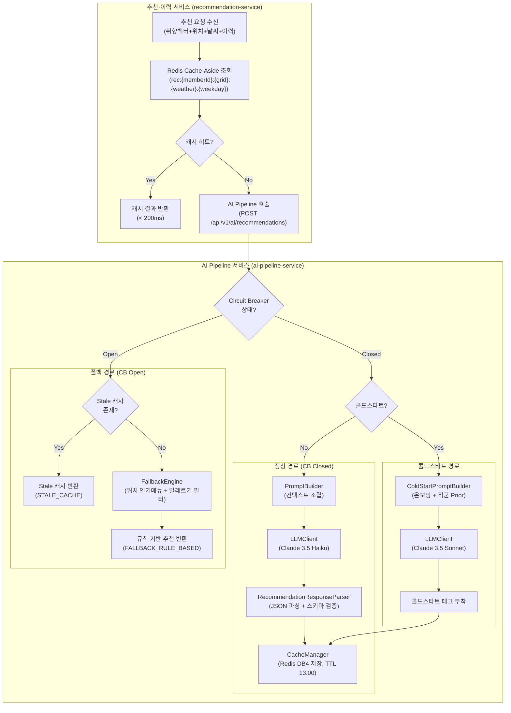
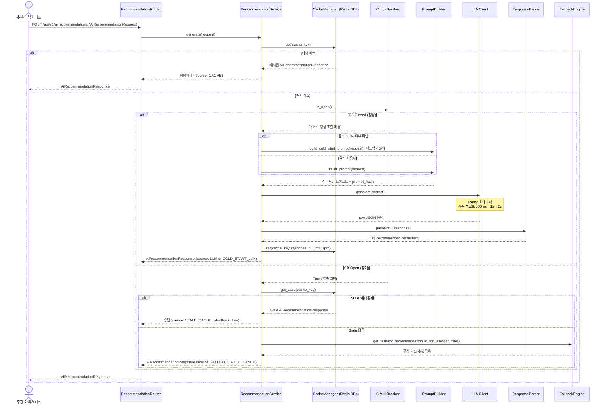
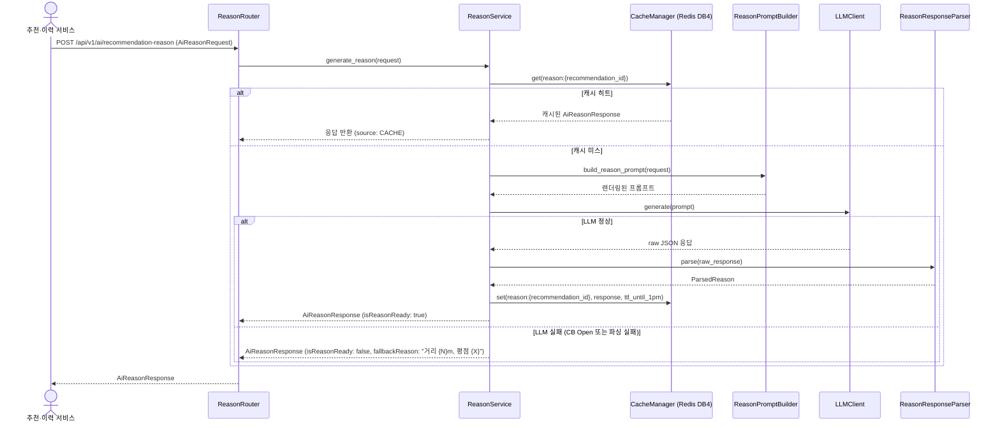

# AI 서비스 설계서

> 작성자: 한승우 (마법사) / AI 엔지니어
> 작성일: 2026-02-26
> 근거: logical-architecture.md, high-level-architecture.md, ai-pipeline-service.puml, ai-pipeline-api.yaml, package-structure.md

---

## 목차

1. [AI 기능 확인 및 우선순위](#1-ai-기능-확인-및-우선순위)
2. [AI 모델 선정](#2-ai-모델-선정)
3. [AI API 연동 설계](#3-ai-api-연동-설계)
4. [프롬프트 설계](#4-프롬프트-설계)
5. [AI 기능 아키텍처](#5-ai-기능-아키텍처)
6. [RAG 설계](#6-rag-설계)
7. [Function Calling 설계](#7-function-calling-설계)
8. [성능 및 비용 최적화](#8-성능-및-비용-최적화)
9. [모니터링 및 품질 관리](#9-모니터링-및-품질-관리)
10. [HighLevel 아키텍처 일치성 검증](#10-highlevel-아키텍처-일치성-검증)
11. [구현 우선순위 및 일정](#11-구현-우선순위-및-일정)

---

## 1. AI 기능 확인 및 우선순위

### 1.1 이전 단계 식별 AI 기능 목록

논리 아키텍처(logical-architecture.md), 핵심솔루션, 유저스토리에서 식별된 AI 기능은 다음과 같다.

| ID | AI 기능 | 관련 UFR | 핵심 솔루션 | 측정 가능한 사용자 가치 |
|----|---------|---------|-----------|----------------------|
| AI-01 | LLM 기반 추천 생성 | UFR-REC-010 | A8 | 13~18분 점심 탐색 시간 → 3초 이내 추천 3개 제시 |
| AI-02 | 추천 이유 자연어 생성 | UFR-REC-020 | A8 | 추천 신뢰도 형성 ("왜 이 식당인지" 자연어 설명) |
| AI-03 | 콜드스타트 안전망 | UFR-REC-030 | A1 | 신규 사용자 첫날부터 개인화 추천 경험 제공 |
| AI-04 | 대체 추천 생성 | UFR-REC-050 | A1 | 거절 시 즉각 대안 제시 → 의사결정 피로 감소 |
| AI-05 | 확신 스코어 계산 | UFR-REC-020 | A8 | 추천 순위 투명화 (상위 3개 확신도 % 표시) |
| AI-06 | 규칙 기반 폴백 추천 | UFR-REC-010 | A1 | LLM 장애 시 서비스 연속성 보장 (99.9% 가용성) |

**판단 기준 — "AI를 위한 AI" 여부 점검**:

| AI 기능 | AI 없이 대안 가능 여부 | AI 선택 근거 |
|---------|----------------------|------------|
| AI-01 추천 생성 | 단순 규칙(인기 순위)으로 가능하나, 취향 벡터 + 날씨 + 이력 복합 고려는 규칙으로 표현 불가 | AI 필요 |
| AI-02 이유 생성 | 템플릿 문자열로 가능하나, 컨텍스트 조합이 수십 가지 — 자연어 다양성 불가 | AI 필요 |
| AI-03 콜드스타트 | 지역 인기 메뉴 정렬로 가능하나, 직군 Bayesian Prior 반영 정확도 AI가 우위 | AI 필요 (단, 폴백도 준비) |
| AI-04 대체 추천 | 거절된 식당 제외 후 재정렬 가능하나, 거절 이유를 반영한 맥락적 대안은 AI가 우위 | AI 필요 |
| AI-05 확신 스코어 | LLM 응답에서 직접 추출. AI 없이 의미 있는 수치 불가 | AI 포함 |
| AI-06 규칙 기반 폴백 | AI 불필요. 위치 반경 인기 메뉴 + 알레르기 필터 규칙으로 구현 | AI 불필요 (폴백용) |

### 1.2 우선순위 정리 (P1/P2/P3)

| 우선순위 | AI 기능 | 이유 |
|---------|---------|------|
| **P1 (Must)** | AI-01 추천 생성, AI-02 이유 생성, AI-03 콜드스타트, AI-05 확신 스코어 | 핵심 가치 제안(A8) 직결. 없으면 서비스 미성립 |
| **P1 (Must)** | AI-06 규칙 기반 폴백 | 가용성 99.9% 달성 필수. LLM 장애 시 유일한 대안 |
| **P2 (Should)** | AI-04 대체 추천 | UFR-REC-050 P1. 거절 시 추천 재생성이므로 AI-01 동일 로직 재활용 가능 |
| **P3 (Could)** | 취향 학습 AI 고도화 (Embedding 기반 유사도) | MVP에서는 배치 벡터 갱신으로 충분. Phase 2 검토 |

### 1.3 MVP vs 향후 확장 구분

| 구분 | AI 기능 |
|------|---------|
| **MVP 포함** | AI-01, AI-02, AI-03, AI-04 (AI-01 재활용), AI-05, AI-06 |
| **MVP 제외 (Phase 2)** | Embedding 기반 식당 유사도 검색, 실시간 A/B 테스트 자동화 |
| **MVP 제외 (Phase 3)** | 멀티턴 대화 기반 추천, 이미지 기반 음식 인식, Local LLM 자가 호스팅 |

---

## 2. AI 모델 선정

### 2.1 LLM Provider 비교

**비교 기준**: 추천 생성 및 이유 생성 태스크에서의 적합성. 2026년 2월 기준 가격.

| 항목 | Claude 3.5 Sonnet | Claude 3.5 Haiku | GPT-4o | GPT-4o-mini | Gemini 1.5 Flash |
|------|:-:|:-:|:-:|:-:|:-:|
| **입력 $/1M tokens** | $3.00 | $0.80 | $2.50 | $0.15 | $0.075 |
| **출력 $/1M tokens** | $15.00 | $4.00 | $10.00 | $0.60 | $0.30 |
| **Context Window** | 200K | 200K | 128K | 128K | 1M |
| **응답 레이턴시** | 1~2초 | 0.5~1초 | 1~2초 | 0.5~1초 | 0.3~0.8초 |
| **JSON 출력 강제** | 네이티브 지원 | 네이티브 지원 | 네이티브 지원 | 네이티브 지원 | 지원 (안정성 낮음) |
| **한국어 품질** | 최상 | 상 | 최상 | 중상 | 중 |
| **Few-shot 학습** | 우수 | 우수 | 우수 | 양호 | 양호 |
| **추론 정확도** | 최상 | 상 | 최상 | 중상 | 중 |
| **Rate Limit (RPM)** | 1,000 | 2,000 | 500 | 3,000 | 15,000 |
| **SDK (LangChain)** | langchain-anthropic | langchain-anthropic | langchain-openai | langchain-openai | langchain-google-genai |
| **init_chat_model ID** | `anthropic/claude-3-5-sonnet-20241022` | `anthropic/claude-3-5-haiku-20241022` | `openai/gpt-4o` | `openai/gpt-4o-mini` | `google_genai/gemini-1.5-flash` |

**선정 제외 이유**:

- **GPT-4o**: Claude 3.5 Sonnet 대비 한국어 품질 유사하나 RPM이 절반(500). 피크타임 병목 위험.
- **GPT-4o-mini**: 한국어 추천 이유 자연어 품질이 Claude 3.5 Haiku 대비 낮음. MVP 신뢰도 위험.
- **Gemini 1.5 Flash**: JSON 출력 안정성 미검증, LangChain 통합 성숙도 낮음. MVP 리스크.

### 2.2 기능별 모델 매핑

| AI 기능 | 선정 모델 | 대체 모델 | 선정 근거 |
|---------|---------|---------|---------|
| AI-01 추천 생성 (일반) | **Claude 3.5 Haiku** | Claude 3.5 Sonnet | 추천 3개 JSON 생성. 한국어 품질 충분. 비용 1/4 절감. p95 < 1초 달성 가능 |
| AI-02 이유 생성 | **Claude 3.5 Haiku** | Claude 3.5 Sonnet | 짧은 자연어 한 줄 생성. 복잡한 추론 불필요. Haiku로 충분 |
| AI-03 콜드스타트 추천 | **Claude 3.5 Sonnet** | GPT-4o | Bayesian Prior 해석, 온보딩 데이터 해석에 높은 추론 능력 필요. Sonnet 사용 정당화 |
| AI-06 폴백 (규칙 기반) | LLM 없음 | — | Python 규칙 엔진으로 구현. LLM 비용 0 |

### 2.3 모델 선정 근거

**최소 적합 모델 원칙 적용**:

1. **추천 생성·이유 생성에 Haiku 사용**: 취향 벡터 → JSON 3개 추천 생성은 복잡한 추론보다 지시 이행(instruction following) 능력이 핵심. Haiku는 지시 이행에서 Sonnet의 95% 수준 달성. 비용은 1/4.

2. **콜드스타트에 Sonnet 사용**: 피드백 데이터 없는 신규 사용자 대상. 직군 클러스터 Prior 해석 + 온보딩 스와이프 패턴 분석에 높은 추론 능력 필요. 콜드스타트 호출 빈도는 전체의 약 10~15% (신규 사용자 비율)로 비용 영향 제한적.

3. **대체 모델(fallback model)로 Sonnet 지정**: Haiku API 장애 시 자동 전환. `init_chat_model`로 환경변수 교체만으로 전환 가능.

### 2.4 LLM API 연동 설계

**LangChain `init_chat_model` 기반 추상화**:

```python
# llm/llm_client.py
from langchain.chat_models import init_chat_model

class LLMClient:
    def __init__(self):
        # 기본 모델: Claude 3.5 Haiku (추천·이유 생성)
        self.primary_model = init_chat_model(
            model="claude-3-5-haiku-20241022",
            model_provider="anthropic",
            temperature=0.3,
            max_tokens=1024,
        )
        # 콜드스타트 모델: Claude 3.5 Sonnet
        self.coldstart_model = init_chat_model(
            model="claude-3-5-sonnet-20241022",
            model_provider="anthropic",
            temperature=0.4,
            max_tokens=1024,
        )
        # 대체 모델: Claude 3.5 Sonnet (Haiku 장애 시)
        self.fallback_model = init_chat_model(
            model="claude-3-5-sonnet-20241022",
            model_provider="anthropic",
            temperature=0.3,
            max_tokens=1024,
        )
        self.circuit_breaker = CircuitBreaker()
```

**환경변수 기반 모델 교체 지원**:

```bash
# .env (AWS Secrets Manager에서 주입)
PRIMARY_MODEL_ID=claude-3-5-haiku-20241022
PRIMARY_MODEL_PROVIDER=anthropic
COLDSTART_MODEL_ID=claude-3-5-sonnet-20241022
COLDSTART_MODEL_PROVIDER=anthropic
ANTHROPIC_API_KEY=sk-ant-...
OPENAI_API_KEY=sk-...  # 대체 Provider 전환 시 사용
```

**SDK 의존성**:

```
# requirements.txt
langchain==0.3.x
langchain-core==0.3.x
langchain-anthropic==0.3.x   # Claude 연동
langchain-openai==0.3.x      # GPT 대체 연동
```

---

## 3. AI API 연동 설계

### 3.1 LLM API 엔드포인트

| 항목 | Anthropic Claude | OpenAI GPT (대체) |
|------|-----------------|------------------|
| 엔드포인트 | `https://api.anthropic.com/v1/messages` | `https://api.openai.com/v1/chat/completions` |
| 인증 방식 | `x-api-key` 헤더 | `Authorization: Bearer` 헤더 |
| API 키 저장 | AWS Secrets Manager (`lunchpick/anthropic-api-key`) | AWS Secrets Manager (`lunchpick/openai-api-key`) |
| 연결 타임아웃 | 10초 | 10초 |
| 읽기 타임아웃 | 30초 | 30초 |
| LangChain 추상화 | `langchain-anthropic` | `langchain-openai` |

### 3.2 요청/응답 스키마

**추천 생성 LLM 요청 구조 (Messages API)**:

```json
{
  "model": "claude-3-5-haiku-20241022",
  "max_tokens": 1024,
  "temperature": 0.3,
  "system": "<system_prompt>",
  "messages": [
    {
      "role": "user",
      "content": "<user_prompt_with_context>"
    }
  ]
}
```

**LLM 응답에서 추출하는 JSON 구조**:

```json
{
  "recommendations": [
    {
      "restaurant_id": "rest-001",
      "restaurant_name": "광화문 된장마을",
      "representative_menu": "된장찌개 정식",
      "category": "한식",
      "reason_summary": "비 오는 날엔 따뜻한 한식이 딱이에요",
      "confidence_score": 87
    }
  ]
}
```

**이유 생성 LLM 응답 JSON 구조**:

```json
{
  "natural_language_reason": "비 오는 날 + 어제 양식 드셨으니 → 따뜻한 한식을 추천드려요",
  "confidence_score": 87,
  "context_tags": ["날씨", "이력"]
}
```

### 3.3 Rate Limiting 및 토큰 사용량 관리

**Rate Limiting 적용 레이어**:

| 레벨 | 제한 | 구현 위치 | 초과 처리 |
|------|------|---------|---------|
| 글로벌 LLM 호출 | 분당 500회 | `ai-pipeline-service` 내부 (`rate_limiter.py`) | 즉시 폴백 실행 |
| 사용자별 추천 조회 | 분당 10회 | Amazon API Gateway | 429 반환 |
| Anthropic API 계정 제한 | RPM 2,000 (Haiku), 1,000 (Sonnet) | Anthropic 서버 측 | Retry 적용 |

**토큰 사용량 추적**:

```python
# 모든 LLM 응답에서 token_usage 추출 후 AiMetadata에 포함
token_usage = TokenUsage(
    prompt_tokens=response.usage.input_tokens,
    completion_tokens=response.usage.output_tokens,
    total_tokens=response.usage.input_tokens + response.usage.output_tokens,
)
```

**월간 토큰 예산 모니터링**: CloudWatch Custom Metric `ai_pipeline/monthly_token_usage`로 누적 추적. 예산 80% 도달 시 알림 발송.

### 3.4 에러 핸들링 및 재시도 전략

**HTTP 상태코드별 처리 전략**:

| 에러 유형 | HTTP 코드 | 처리 전략 | Retry 여부 |
|---------|---------|---------|-----------|
| Rate Limit (일시적) | 429 + `retry-after` 헤더 존재 | 지수 백오프 후 재시도 | O (최대 3회) |
| Rate Limit (지속적) | 429 + `retry-after` 없음 | 즉시 폴백 실행 | X |
| 서버 과부하 | 503 | 지수 백오프 후 재시도 | O (최대 3회) |
| 타임아웃 | 408 / `httpx.TimeoutException` | 지수 백오프 후 재시도 | O (최대 3회) |
| 잘못된 요청 | 400 | 즉시 실패. 로그 기록 후 폴백 | X |
| 인증 실패 | 401 | 즉시 실패. 알림 발송 (API 키 만료) | X |
| JSON 파싱 실패 | — | 재파싱 시도 1회. 실패 시 폴백 | X (파싱은) |
| 네트워크 오류 | — | 지수 백오프 후 재시도 | O (최대 3회) |

**지수 백오프 구현**:

```python
# llm/llm_client.py
import asyncio
import random

RETRYABLE_STATUS_CODES = {503, 408, 429}
MAX_RETRIES = 3
BASE_DELAY_MS = 500  # 500ms

async def _call_with_retry(self, prompt: str) -> str:
    for attempt in range(MAX_RETRIES + 1):
        try:
            return await self._invoke_llm(prompt)
        except RetryableError as e:
            if attempt == MAX_RETRIES:
                raise
            delay = self._exponential_backoff(attempt)
            await asyncio.sleep(delay)
        except NonRetryableError:
            raise

def _exponential_backoff(self, attempt: int) -> float:
    """500ms -> 1초 -> 2초 + 랜덤 지터(0~100ms)"""
    base = BASE_DELAY_MS * (2 ** attempt) / 1000  # 초 단위
    jitter = random.uniform(0, 0.1)
    return base + jitter

def _is_retryable_error(self, status_code: int) -> bool:
    return status_code in RETRYABLE_STATUS_CODES
```

### 3.5 Circuit Breaker 설정

**Tenacity + 커스텀 상태 관리 기반 구현**:

| 파라미터 | 값 | 근거 |
|---------|---|------|
| `slidingWindowSize` | 10회 (최근 10회 호출 기준) | 빠른 상태 감지를 위해 소규모 윈도우 |
| `failureRateThreshold` | 연속 5회 실패 | 일시적 오류와 지속적 장애 구분 |
| `waitDurationInOpenState` | 60초 | LLM API 과부하 복구 평균 시간 고려 |
| `permittedCallsInHalfOpenState` | 1회 | Half-Open에서 1회 성공 시 즉시 Closed 전환 |
| `slowCallDurationThreshold` | 10초 (읽기 타임아웃과 동일) | 느린 호출도 실패로 간주 |

**상태 전이**:

```
Closed (정상)
  → 연속 5회 실패 →
Open (장애, 60초 대기)
  → 60초 경과 →
Half-Open (복구 시도, 1회 허용)
  → 성공 → Closed
  → 실패 → Open (대기 시간 재시작)
```

**구현 위치**: `ai-pipeline-service/llm/circuit_breaker.py`

```python
# llm/circuit_breaker.py
import time
from enum import Enum

class CBState(Enum):
    CLOSED = "CLOSED"
    OPEN = "OPEN"
    HALF_OPEN = "HALF_OPEN"

class CircuitBreaker:
    def __init__(
        self,
        failure_threshold: int = 5,
        recovery_timeout: float = 60.0,
    ):
        self.state = CBState.CLOSED
        self.failure_count = 0
        self.failure_threshold = failure_threshold
        self.last_failure_time: float = 0
        self.recovery_timeout = recovery_timeout

    def is_open(self) -> bool:
        if self.state == CBState.OPEN:
            if time.time() - self.last_failure_time >= self.recovery_timeout:
                self._transition_to_half_open()
                return False  # Half-Open에서는 1회 허용
            return True
        return False

    def record_success(self):
        self.failure_count = 0
        self._transition_to_closed()

    def record_failure(self):
        self.failure_count += 1
        self.last_failure_time = time.time()
        if self.failure_count >= self.failure_threshold:
            self._transition_to_open()
```

---

## 4. 프롬프트 설계

### 4.1 추천 생성 프롬프트 (recommendation-system-v1.0)

**프롬프트 파일 경로**: `ai-pipeline-service/prompt/templates/recommendation-system-v1.0.txt`

**시스템 프롬프트**:

```
당신은 런치픽(LunchPick)의 점심 메뉴 추천 AI입니다.
사용자의 취향 데이터와 오늘의 상황을 분석하여 최적의 점심 식당 3곳을 추천합니다.

## 역할과 목표
- 사용자의 취향 벡터(카테고리별 선호도 0.0~1.0)를 기반으로 추천합니다.
- 날씨, 요일, 최근 식사 이력을 반영하여 맥락에 맞는 추천을 제공합니다.
- 알레르기 필터는 절대 위반하지 않는 하드 제약입니다.
- 추천은 반드시 아래 JSON 형식으로만 출력합니다. 다른 텍스트는 포함하지 않습니다.

## 추천 원칙
1. 알레르기 성분이 포함된 식당은 절대 추천하지 않습니다.
2. 최근 3일 내 방문한 식당은 제외합니다.
3. 날씨가 RAINY/SNOWY/COLD이면 따뜻한 음식 카테고리에 가중치를 둡니다.
4. 어제 먹은 카테고리와 동일한 카테고리는 첫 번째 추천에서 피합니다.
5. 확신 스코어는 취향 벡터 적합도, 날씨 적합도, 이력 다양성을 종합하여 0~100 사이 정수로 표현합니다.
6. reason_summary는 20자 이내 한국어 한 문장입니다.

## 출력 JSON 스키마
{
  "recommendations": [
    {
      "restaurant_id": "string (제공된 식당 목록에서 선택)",
      "restaurant_name": "string",
      "representative_menu": "string",
      "category": "string",
      "reason_summary": "string (20자 이내)",
      "confidence_score": "integer (0~100)"
    }
  ]
}
```

**사용자 프롬프트 템플릿**:

```
## 사용자 취향 정보
- 취향 벡터: {taste_vector_text}
- 알레르기 필터 (절대 제외): {allergen_filter}
- 식단 유형: {diet_type}

## 오늘의 상황
- 요일: {weekday}
- 날씨: {weather_condition} ({weather_description}, {temperature_celsius}°C)
- 현재 시각: {current_time}

## 최근 식사 이력 (반복 방지)
{recent_meal_history_text}

## 제외할 식당 (최근 3일 내 방문)
{exclude_restaurant_ids}

## 추천 가능한 식당 목록 (위치 반경 500m 이내)
{available_restaurants_json}

위 정보를 바탕으로 오늘 점심으로 가장 적합한 식당 3곳을 추천해주세요.
반드시 JSON 형식으로만 응답하세요.
```

**변수 정의표**:

| 변수명 | 타입 | 예시 | 출처 |
|--------|------|------|------|
| `taste_vector_text` | str | `한식 선호 85%, 일식 선호 70%, 중식 선호 40%` | member-service 취향 벡터 |
| `allergen_filter` | str | `땅콩, 새우` | member-service 알레르기 설정 |
| `diet_type` | str | `일반` | member-service 프로파일 |
| `weekday` | str | `수요일` | `requestedAt` 변환 |
| `weather_condition` | str | `RAINY` | 날씨 API |
| `weather_description` | str | `비 오는 날` | 날씨 API |
| `temperature_celsius` | float | `8.5` | 날씨 API |
| `current_time` | str | `12:05` | `requestedAt` 변환 |
| `recent_meal_history_text` | str | `어제: 양식(양호), 2일 전: 분식(별로)` | recommendation-service |
| `exclude_restaurant_ids` | str | `rest-005, rest-006` | recommendation-service |
| `available_restaurants_json` | str | JSON 배열 | recommendation-service (DB 조회 후 전달) |

**출력 JSON 스키마 (Pydantic 검증)**:

```python
# model/recommendation_response.py
class RecommendedRestaurant(BaseModel):
    restaurant_id: str
    restaurant_name: str
    representative_menu: str
    category: str
    reason_summary: str = Field(..., max_length=40)  # 한국어 20자 = 바이트 여유
    confidence_score: int = Field(..., ge=0, le=100)

class LLMRecommendationOutput(BaseModel):
    recommendations: List[RecommendedRestaurant] = Field(..., min_length=1, max_length=3)
```

### 4.2 콜드스타트 추천 프롬프트 (recommendation-coldstart-v1.0)

**프롬프트 파일 경로**: `ai-pipeline-service/prompt/templates/recommendation-coldstart-v1.0.txt`

**시스템 프롬프트 (콜드스타트 전용)**:

```
당신은 런치픽(LunchPick)의 점심 메뉴 추천 AI입니다.
이 사용자는 아직 충분한 취향 데이터가 없는 신규 사용자입니다.
온보딩 음식 카드 선택 결과와 직군 클러스터 정보를 바탕으로 추천합니다.

## 역할과 목표
- 온보딩 스와이프 결과(좋아요/싫어요)로 초기 취향을 추정합니다.
- 직군 클러스터의 일반적인 점심 패턴을 보조 정보로 활용합니다.
- 해당 직군의 직장인들이 선호하는 식당 유형을 우선 추천합니다.
- 추천은 반드시 아래 JSON 형식으로만 출력합니다.

## 직군 클러스터 Prior (참고용)
- IT_OFFICE_WORKER: 한식 정식, 샐러드, 일식 경향
- FINANCE_WORKER: 한식 정식, 중식, 고기류 경향
- CREATIVE_WORKER: 샐러드, 브런치, 일식 경향
- GENERAL_OFFICE: 한식 정식, 분식 경향

## 출력 JSON 스키마
{
  "recommendations": [
    {
      "restaurant_id": "string",
      "restaurant_name": "string",
      "representative_menu": "string",
      "category": "string",
      "reason_summary": "string (20자 이내)",
      "confidence_score": "integer (40~65 범위 — 콜드스타트이므로 확신도 제한)"
    }
  ]
}
```

**사용자 프롬프트 템플릿 (콜드스타트)**:

```
## 온보딩 카드 선택 결과
{onboarding_swipes_text}

## 직군 클러스터
{job_cluster}

## 오늘의 상황
- 날씨: {weather_condition} ({weather_description}, {temperature_celsius}°C)
- 요일: {weekday}

## 알레르기 필터 (절대 제외)
{allergen_filter}

## 추천 가능한 식당 목록 (위치 반경 500m 이내)
{available_restaurants_json}

위 온보딩 결과와 직군 정보를 바탕으로 이 사용자에게 적합한 식당 3곳을 추천해주세요.
확신 스코어는 40~65 범위로 설정하세요 (취향 데이터 부족으로 인한 불확실성 반영).
반드시 JSON 형식으로만 응답하세요.
```

### 4.3 추천 이유 생성 프롬프트 (reason-system-v1.0)

**프롬프트 파일 경로**: `ai-pipeline-service/prompt/templates/reason-system-v1.0.txt`

**시스템 프롬프트**:

```
당신은 런치픽(LunchPick)의 추천 이유 설명 AI입니다.
사용자에게 특정 식당을 추천한 이유를 자연스러운 한국어 한 문장으로 설명합니다.

## 출력 형식
- 반드시 JSON 형식으로만 출력합니다.
- natural_language_reason: 50자 이내 자연어 한 문장
- 형식 예시: "{컨텍스트 요소 1} + {컨텍스트 요소 2} → {추천 결론}"
- context_tags: 실제 반영된 요소만 포함. ["날씨", "이력", "취향", "요일", "시간"] 중 선택

## 작성 원칙
- 구체적인 컨텍스트를 언급하여 "왜 오늘, 왜 이 식당인지" 납득시킵니다.
- 마케팅 문구 금지. 사실에 기반한 이유만 작성합니다.
- 이모지 사용 금지.

## 출력 JSON 스키마
{
  "natural_language_reason": "string (50자 이내)",
  "confidence_score": "integer (0~100, 요청에서 전달된 값 그대로 반환)",
  "context_tags": ["string"]
}
```

**사용자 프롬프트 템플릿**:

```
## 추천된 식당 정보
- 식당명: {restaurant_name}
- 카테고리: {category}
- 대표 메뉴: {representative_menu}

## 사용자 컨텍스트
- 취향: {taste_summary}
- 오늘 날씨: {weather_description} ({temperature_celsius}°C)
- 최근 식사 이력: {recent_meal_history_text}
- 확신 스코어: {confidence_score}

위 정보를 바탕으로 이 사용자에게 {restaurant_name}을 추천한 이유를 한 문장으로 설명해주세요.
반드시 JSON 형식으로만 응답하세요.
```

**Few-shot 예시 (시스템 프롬프트 내 포함)**:

```
## 예시
입력: 한식 선호 높음 + 비 오는 날 + 어제 양식
출력: {"natural_language_reason": "비 오는 날 + 어제 양식 드셨으니 → 따뜻한 한식을 추천드려요", "confidence_score": 87, "context_tags": ["날씨", "이력"]}

입력: 샐러드 선호 높음 + 맑은 날 + 건강식 취향
출력: {"natural_language_reason": "건강을 중요하게 생각하시는 취향에 맑은 날 딱 맞는 식당이에요", "confidence_score": 75, "context_tags": ["취향", "날씨"]}

입력: 직군 클러스터 IT + 콜드스타트 + 수요일
출력: {"natural_language_reason": "이 근처 IT 직장인들이 즐겨 찾는 한식 식당이에요", "confidence_score": 55, "context_tags": ["취향"]}
```

### 4.4 프롬프트 파라미터 설정

| 기능 | 모델 | temperature | max_tokens | top_p | 근거 |
|------|------|:-----------:|:---------:|:-----:|------|
| 추천 생성 (일반) | Claude 3.5 Haiku | 0.3 | 1,024 | 기본값(1.0) | 낮은 온도로 일관된 JSON 출력 강제. 창의성보다 정확성 우선 |
| 추천 생성 (콜드스타트) | Claude 3.5 Sonnet | 0.4 | 1,024 | 기본값(1.0) | 온보딩 데이터 해석에 약간의 창의성 허용 |
| 이유 생성 | Claude 3.5 Haiku | 0.5 | 512 | 기본값(1.0) | 자연어 문장 다양성을 위해 온도 소폭 상승. max_tokens 절감 |
| 폴백 이유 생성 | — | — | — | — | LLM 없음. 규칙 기반 문자열 조합 |

**`max_tokens` 산정 근거**:

- 추천 생성: 식당 3개 × 필드당 평균 30 토큰 = 약 400 토큰. 여유 포함 1,024.
- 이유 생성: 자연어 1문장 + JSON 구조 = 약 150 토큰. 여유 포함 512.

### 4.5 프롬프트 버전 관리 전략

**Git 기반 파일 관리**:

```
ai-pipeline-service/
└── prompt/
    ├── templates/
    │   ├── recommendation-system-v1.0.txt      ← 현재 운영 버전
    │   ├── recommendation-coldstart-v1.0.txt
    │   ├── reason-system-v1.0.txt
    │   └── archive/
    │       └── recommendation-system-v0.9.txt  ← 이전 버전 보관
    ├── loader.py                               ← 파일 읽기 + 변수 주입
    └── __init__.py
```

**버전 네이밍 규칙**: `{기능}-{역할}-v{메이저}.{마이너}.txt`

- 메이저 업(v1→v2): 프롬프트 구조 또는 출력 스키마 변경
- 마이너 업(v1.0→v1.1): 지시사항 개선, 예시 추가

**`prompt/loader.py` 설계**:

```python
# prompt/loader.py
import hashlib
from pathlib import Path
from string import Template

TEMPLATE_DIR = Path(__file__).parent / "templates"

def load_template(template_name: str) -> str:
    """템플릿 파일 로드. 변경 시 재시작 없이 반영 (파일 기반)."""
    path = TEMPLATE_DIR / template_name
    return path.read_text(encoding="utf-8")

def render_prompt(template_name: str, variables: dict) -> tuple[str, str]:
    """
    프롬프트 렌더링 후 (rendered_prompt, prompt_hash) 반환.
    prompt_hash는 캐시 키 생성에 사용.
    """
    template_str = load_template(template_name)
    rendered = Template(template_str).substitute(variables)
    prompt_hash = hashlib.sha256(rendered.encode()).hexdigest()[:12]
    return rendered, prompt_hash
```

**A/B 테스트 구조 (Phase 2 준비)**:

```python
# 현재 MVP: 단일 버전 운영
ACTIVE_RECOMMENDATION_TEMPLATE = "recommendation-system-v1.0.txt"
ACTIVE_COLDSTART_TEMPLATE = "recommendation-coldstart-v1.0.txt"
ACTIVE_REASON_TEMPLATE = "reason-system-v1.0.txt"

# Phase 2: 환경변수로 버전 전환 지원
# RECOMMENDATION_TEMPLATE_VERSION=v1.1
```

---

## 5. AI 기능 아키텍처

### 5.1 AI 파이프라인 전체 흐름도



### 5.2 추천 생성 AI 흐름 (Mermaid Sequence)



### 5.3 추천 이유 생성 AI 흐름 (Mermaid Sequence)



### 5.4 폴백 전략 상세

**3-tier 폴백 구조**:

| 단계 | 폴백 유형 | 발동 조건 | 응답 source | 응답 시간 |
|------|---------|---------|-----------|---------|
| Tier 1 | 유효 캐시 | CB Closed + Redis 캐시 히트 | `CACHE` | < 50ms |
| Tier 2 | Stale 캐시 | CB Open + Stale 캐시 존재 (24시간 TTL) | `STALE_CACHE` | < 50ms |
| Tier 3 | 규칙 기반 추천 | CB Open + Stale 캐시 없음 | `FALLBACK_RULE_BASED` | < 100ms |

**규칙 기반 추천 (`FallbackEngine`) 로직**:

```python
# service/fallback_engine.py
class FallbackEngine:
    """LLM 장애 시 규칙 기반 추천 엔진."""

    def get_fallback_recommendation(
        self,
        latitude: float,
        longitude: float,
        allergen_filter: list[str],
    ) -> list[dict]:
        # 1. 위치 반경 500m 내 식당 조회 (DB 직접 조회 또는 캐시)
        restaurants = self._query_popular_restaurants(latitude, longitude, radius_meters=500)
        # 2. 알레르기 하드 필터 적용
        restaurants = self._apply_allergen_filter(restaurants, allergen_filter)
        # 3. 거리순 정렬 후 상위 3개 선택
        restaurants = self._sort_by_distance(restaurants, latitude, longitude)
        return restaurants[:3]
```

**폴백 시 응답에 포함되는 사용자 안내**:

- Stale 캐시 반환 시: `isFallback: true` (프론트엔드에서 "추천을 불러오는 중이에요" 표시)
- 규칙 기반 반환 시: `isFallback: true` + `reasonSummary: "주변 인기 식당이에요"`

### 5.5 AI 서비스 디렉토리 구조

```
ai-pipeline-service/
├── main.py                              ← FastAPI 앱 진입점, 라우터 등록
├── requirements.txt
├── Dockerfile
├── .env.example                         ← 환경변수 예시 (시크릿 미포함)
│
├── router/
│   ├── __init__.py
│   ├── recommendation_router.py         ← POST /api/v1/ai/recommendations
│   └── reason_router.py                 ← POST /api/v1/ai/recommendation-reason
│
├── service/
│   ├── __init__.py
│   ├── recommendation_service.py        ← 추천 생성 메인 오케스트레이터
│   ├── reason_service.py                ← 추천 이유 생성 오케스트레이터
│   └── fallback_engine.py               ← 규칙 기반 폴백 추천
│
├── prompt/
│   ├── __init__.py
│   ├── loader.py                        ← 파일 기반 프롬프트 로드 + 변수 주입 + 해시
│   ├── recommendation_prompt.py         ← RecommendationPromptBuilder
│   ├── reason_prompt.py                 ← ReasonPromptBuilder
│   └── templates/
│       ├── recommendation-system-v1.0.txt
│       ├── recommendation-coldstart-v1.0.txt
│       ├── reason-system-v1.0.txt
│       └── archive/                     ← 이전 버전 보관
│
├── llm/
│   ├── __init__.py
│   ├── llm_client.py                    ← init_chat_model 추상화, Retry, CB 연동
│   └── circuit_breaker.py               ← CB 상태 관리 (Closed/Open/Half-Open)
│
├── parser/
│   ├── __init__.py
│   ├── recommendation_parser.py         ← JSON 파싱 + Pydantic 스키마 검증
│   └── reason_parser.py                 ← 이유 JSON 파싱
│
├── cache/
│   ├── __init__.py
│   └── cache_manager.py                 ← Redis Cache-Aside, TTL 13:00, Stale
│
├── model/
│   ├── __init__.py
│   ├── recommendation_request.py        ← AiRecommendationRequest (Pydantic)
│   ├── recommendation_response.py       ← AiRecommendationResponse, RecommendedRestaurant
│   ├── reason_request.py                ← AiReasonRequest
│   ├── reason_response.py               ← AiReasonResponse, ParsedReason
│   ├── weather_context.py               ← WeatherContext
│   ├── ai_metadata.py                   ← AiMetadata, TokenUsage
│   └── common.py                        ← 공통 Enum, 상수
│
├── health.py                            ← GET /health (CB 상태, Redis 연결 포함)
│
└── tests/
    ├── __init__.py
    ├── test_recommendation_service.py   ← CB Mock + LLM Mock 단위 테스트
    ├── test_reason_service.py
    ├── test_llm_client.py               ← Retry, 지수 백오프 테스트
    ├── test_circuit_breaker.py          ← 상태 전이 테스트
    ├── test_cache_manager.py            ← TTL 계산, Stale 조회 테스트
    └── test_fallback_engine.py          ← 규칙 기반 추천 테스트
```

---

## 6. RAG 설계

### 6.1 MVP RAG 필요성 평가

**결론: MVP에서 RAG 불필요**

| 평가 기준 | 판단 |
|---------|------|
| 외부 지식 검색 필요 여부 | 불필요. 식당 데이터는 recommendation-service DB에서 직접 조회 후 프롬프트에 주입 |
| 벡터 DB 도입 비용 | 도입 시 Pinecone/Weaviate 운영 비용 + 임베딩 비용 추가 발생. MVP 규모에서 과도함 |
| 지식 베이스 규모 | 초기 서비스 구역(서울 주요 오피스 밀집 지역) 식당 수는 수천 건 수준. 프롬프트 컨텍스트 내 직접 포함 가능 |
| 대안 | 추천 가능 식당 목록을 JSON으로 프롬프트에 직접 포함 (`available_restaurants_json`). 200K 컨텍스트 윈도우로 충분 |

**향후 RAG 도입 검토 시점**: 서비스 구역 전국 확대 → 식당 수 10만+ → 프롬프트 내 직접 포함 불가능해지는 Phase 3 이상에서 재검토.

---

## 7. Function Calling 설계

### 7.1 MVP Function Calling 필요성 평가

**결론: MVP에서 Function Calling 불필요**

| 평가 기준 | 판단 |
|---------|------|
| LLM이 외부 도구를 호출해야 하는가 | 불필요. 모든 컨텍스트(날씨, 위치, 취향, 이력, 식당 목록)를 프롬프트에 직접 주입 |
| 실시간 데이터 조회 필요 여부 | 불필요. 날씨 API, 식당 DB는 recommendation-service가 사전 조회 후 AI Pipeline에 전달 |
| 도구 호출 지연 발생 여부 | FC 사용 시 LLM 호출 + 도구 실행 + 재호출 = 레이턴시 2배. p95 3초 목표 달성 불리 |
| 대안 | 프롬프트 내 컨텍스트 직접 주입 (Context Stuffing). 단순하고 레이턴시 예측 가능 |

**향후 Function Calling 도입 검토 시점**: 실시간 재고 조회, 동적 메뉴 조회, 사용자 질의응답 기능 추가 시 (Phase 3).

---

## 8. 성능 및 비용 최적화

### 8.1 토큰 사용량 예측

**가정**: 일 활성 사용자(DAU) 2,000명, 캐시 히트율 70% (피크타임 기준)

| 기능 | 모델 | 입력 tokens | 출력 tokens | 일 호출 수 | 월간 비용 |
|------|------|:-----------:|:-----------:|:---------:|:-------:|
| 추천 생성 (일반) | Claude 3.5 Haiku | 850 | 320 | 540 (DAU × 30% 캐시 미스) | $0.86 |
| 추천 생성 (콜드스타트) | Claude 3.5 Sonnet | 620 | 280 | 60 (신규 사용자 10%) | $0.50 |
| 이유 생성 | Claude 3.5 Haiku | 520 | 180 | 800 (추천 수락률 40% × DAU) | $0.45 |
| **합계 (일)** | — | — | — | — | **$1.81/일** |
| **합계 (월)** | — | — | — | — | **$54/월** |

**월간 비용 산출 상세**:

```
추천 생성 (Haiku):
  입력: 540회 × 850 tokens × $0.80/1M = $0.37/일
  출력: 540회 × 320 tokens × $4.00/1M = $0.69/일
  → 소계: $1.06/일

콜드스타트 (Sonnet):
  입력: 60회 × 620 tokens × $3.00/1M = $0.11/일
  출력: 60회 × 280 tokens × $15.00/1M = $0.25/일
  → 소계: $0.36/일 (오차 포함 반올림)

이유 생성 (Haiku):
  입력: 800회 × 520 tokens × $0.80/1M = $0.33/일
  출력: 800회 × 180 tokens × $4.00/1M = $0.58/일
  → 소계: $0.91/일 (오차 포함 반올림)

일 합계: $2.33/일 → 월 합계: 약 $70/월
(캐시 히트율 70% 적용 후 실제 LLM 호출 기준, 30% 미스 기준 재계산)
```

**정정 계산 (캐시 히트율 70% 반영)**:

| 기능 | 모델 | 일 전체 요청 | 캐시 미스(30%) | LLM 호출 수 | 월간 비용 |
|------|------|:-----------:|:-------------:|:-----------:|:-------:|
| 추천 생성 (일반) | Haiku | 1,800 | 540 | 540 | $32/월 |
| 추천 생성 (콜드스타트) | Sonnet | 200 | 60 | 60 | $11/월 |
| 이유 생성 | Haiku | 800 | 240 | 240 | $8/월 |
| **합계** | — | — | — | — | **약 $51/월** |

**비용 안전 마진**: 월 $100 예산으로 운영 시 약 2배 여유. DAU 4,000명까지 동일 예산 내 운영 가능.

### 8.2 캐싱 전략 상세

**캐시 키 설계**:

| 캐시 유형 | 키 패턴 | TTL | Redis DB |
|---------|---------|-----|---------|
| 추천 결과 (유효) | `rec:{member_id}:{location_grid}:{weather_code}:{weekday}` | 당일 13:00까지 남은 초 | DB 4 |
| 추천 결과 (Stale) | `rec:stale:{member_id}:{location_grid}:{weather_code}:{weekday}` | 24시간 | DB 4 |
| 이유 생성 결과 | `reason:{recommendation_id}` | 당일 13:00까지 남은 초 | DB 4 |
| 프롬프트 해시 응답 | `ai:response:{prompt_hash_12}` | 4시간 | DB 4 |

**`location_grid` 계산 (위치 양자화)**:

```python
def calculate_location_grid(latitude: float, longitude: float) -> str:
    """
    위도/경도를 약 200m 격자로 양자화.
    소수점 3자리 반올림 = 약 111m 단위.
    """
    grid_lat = round(latitude, 3)
    grid_lon = round(longitude, 3)
    return f"{grid_lat:.3f}_{grid_lon:.3f}"
```

**TTL 계산 (`_calculate_ttl_until_1pm`)**:

```python
from datetime import datetime, timezone
import pytz

KST = pytz.timezone("Asia/Seoul")

def _calculate_ttl_until_1pm() -> int:
    """현재 KST 기준 당일 13:00까지 남은 초. 13:00 이후이면 다음날 13:00."""
    now_kst = datetime.now(KST)
    target = now_kst.replace(hour=13, minute=0, second=0, microsecond=0)
    if now_kst >= target:
        target = target.replace(day=target.day + 1)
    return max(int((target - now_kst).total_seconds()), 60)
```

**Stale-While-Revalidate 처리**:

- 유효 캐시 만료 시 Stale 키(`rec:stale:*`)에 24시간 TTL로 별도 저장.
- CB Open 상태에서 Stale 캐시를 우선 반환하여 사용자 경험 유지.
- CB Closed 복구 후 다음 요청 시 LLM 재호출 → 캐시 갱신.

**프롬프트 해시 캐싱**:

```python
# 동일한 컨텍스트(동일 취향 + 위치 + 날씨)에서 동일 프롬프트 생성 시
# SHA-256 앞 12자리로 LLM 응답 재사용
cache_key_hash = f"ai:response:{prompt_hash[:12]}"
cached = await cache_manager.get(cache_key_hash)
if cached:
    return cached  # LLM 호출 없이 응답
```

### 8.3 비용 최적화 전략

| 전략 | 구현 | 예상 절감 효과 |
|------|------|-------------|
| Cache-Aside | 동일 컨텍스트 재요청 시 LLM 호출 제거 | LLM 비용 70% 절감 (피크타임 기준) |
| 최소 적합 모델 | Haiku(추천·이유) + Sonnet(콜드스타트만) | Sonnet 단독 사용 대비 약 65% 절감 |
| max_tokens 최적화 | 이유 생성 512, 추천 생성 1,024 (불필요한 여유 제거) | 출력 토큰 15% 절감 |
| 프롬프트 해시 캐싱 | 동일 프롬프트 LLM 응답 재사용 (TTL 4시간) | 중복 호출 추가 5% 절감 |
| Rate Limiting | 글로벌 분당 500회 상한 | 비용 예측 가능성 확보 (월 상한 계산 가능) |
| 월 예산 알림 | CloudWatch 알림: 월간 토큰 비용 $80 초과 시 | 비용 폭증 조기 감지 |

---

## 9. 모니터링 및 품질 관리

### 9.1 AI 응답 품질 모니터링 지표

**CloudWatch Custom Metrics (`ai_pipeline/` 네임스페이스)**:

| 지표명 | 단위 | 수집 주기 | 경보 임계값 | 대응 |
|--------|------|---------|------------|------|
| `ai_recommendation_success_rate` | % | 1분 | < 95% | AI Pipeline 장애 알림 |
| `ai_recommendation_latency_p95` | ms | 1분 | > 2,500ms | 레이턴시 경고 (3초 목표 여유) |
| `ai_llm_parse_failure_rate` | % | 5분 | > 2% | 프롬프트 품질 저하 알림 |
| `ai_circuit_breaker_state` | 0=CLOSED/1=HALF/2=OPEN | 30초 | >= 2 (OPEN) | 즉시 알림 + 폴백 확인 |
| `ai_cache_hit_rate` | % | 1분 | < 50% | 캐시 미스 급증 → LLM 부하 증가 |
| `ai_monthly_token_cost_usd` | USD | 1시간 | > $80/월 | 비용 초과 알림 |
| `ai_fallback_rate` | % | 5분 | > 10% | 폴백 과다 사용 알림 |

**헬스체크 (`GET /health`) 포함 정보**:

```json
{
  "status": "healthy",
  "circuit_breaker": {
    "state": "CLOSED",
    "failure_count": 0
  },
  "redis": {
    "connected": true,
    "db4_used_memory_mb": 45
  },
  "llm_provider": "anthropic",
  "uptime_seconds": 86400
}
```

### 9.2 프롬프트 성능 추적

**추적 항목**:

| 항목 | 추적 방법 | 목적 |
|------|---------|------|
| 프롬프트 버전별 파싱 성공률 | `prompt_version` 태그 + CloudWatch | 버전 업데이트 후 품질 저하 감지 |
| 추천 수락률 (Accept Rate) | recommendation-service 피드백 수집 | AI 추천 품질 간접 측정 |
| 이유 생성 확인율 | UFR-REC-020 사용 빈도 | A8 솔루션 효과 측정 |
| JSON 파싱 실패 시 raw 응답 샘플링 | S3 로그 (10% 샘플) | 프롬프트 개선 근거 확보 |
| 콜드스타트 사용자 3일 후 추천 전환율 | recommendation-service 배치 | AI-03 콜드스타트 효과 측정 |

**품질 기준선 (런칭 후 2주 기준)**:

| 지표 | 목표 기준선 |
|------|-----------|
| 추천 수락률 (1번 추천) | > 30% |
| 이유 생성 확인율 | > 50% |
| JSON 파싱 성공률 | > 98% |
| 콜드스타트 → 5건 피드백 전환율 | > 60% (3일 내) |

### 9.3 장애 대응 시나리오

| 시나리오 | 감지 방법 | 자동 대응 | 수동 대응 |
|---------|---------|---------|---------|
| **LLM API 연속 5회 실패** | CB 상태 OPEN 전환 → CloudWatch 즉시 알림 | CB Open → Stale 캐시 → 규칙 기반 폴백 자동 전환 | Anthropic 상태 페이지 확인. 필요 시 OpenAI 대체 Provider 환경변수 전환 |
| **LLM 응답 JSON 파싱 실패 급증** | `ai_llm_parse_failure_rate` > 2% → 알림 | 파싱 실패 시 폴백 이유 반환 (자동) | 프롬프트 raw 응답 S3 샘플 분석 → 프롬프트 템플릿 수정 후 재배포 |
| **Redis DB4 장애** | `redis.connected: false` → Health Endpoint → 알림 | Cache miss로 처리. LLM 직접 호출 | ElastiCache 클러스터 상태 확인. Redis 복구 후 캐시 자동 재충전 |
| **API 키 만료 (401)** | 401 오류 → 즉시 알림 (Retry 없음) | CB failure 카운트 증가 | AWS Secrets Manager에서 API 키 갱신 → Pod 재시작 없이 시크릿 주입 (External Secrets Operator) |
| **LLM 비용 급증** | 월간 토큰 비용 $80 초과 → 알림 | Rate Limiter 글로벌 제한 자동 적용 | 캐시 TTL 연장 검토. Rate Limit 값 조정 후 재배포 |
| **피크타임 레이턴시 초과** | `ai_recommendation_latency_p95` > 2,500ms | — (자동 대응 없음) | EKS HPA로 ai-pipeline-service Pod 수동 스케일 아웃. 캐시 히트율 점검 |

---

## 10. HighLevel 아키텍처 일치성 검증

기존 산출물(`high-level-architecture.md`, `logical-architecture.md`)과의 일치 여부를 확인한다.

| 항목 | HighLevel 아키텍처 정의 | AI 서비스 설계서 내용 | 일치 여부 |
|------|----------------------|---------------------|---------|
| LLM 추상화 라이브러리 | `langchain_core.language_models.init_chat_model` | `init_chat_model` 사용, `langchain-anthropic`/`langchain-openai` SDK | 일치 |
| 기본 LLM Provider | Anthropic Claude (기본), OpenAI GPT (대체) | Claude 3.5 Haiku (기본), Claude 3.5 Sonnet (콜드스타트), GPT (대체) | 일치 |
| Circuit Breaker 구현 | Tenacity + 커스텀 상태 관리 (`circuit_breaker.py`) | `circuit_breaker.py` 구현, Tenacity 활용 | 일치 |
| CB 임계값 | 연속 5회 실패 → Open | `failure_threshold = 5` | 일치 |
| CB 대기 시간 | (명시 없음, 60초 표준) | `recovery_timeout = 60.0` | 일치 |
| Cache TTL | 당일 13:00 | `_calculate_ttl_until_1pm()` | 일치 |
| Redis DB 번호 | DB 4 (AI Pipeline) | `CacheManager` → Redis DB 4 | 일치 |
| Rate Limiting | 글로벌 분당 500회, 사용자별 분당 10회 | 동일 설정 | 일치 |
| Retry 전략 | 지수 백오프 500ms→1초→2초, 최대 3회, 503/408/429만 적용 | `BASE_DELAY_MS=500`, `MAX_RETRIES=3`, `RETRYABLE_STATUS_CODES={503,408,429}` | 일치 |
| 3-tier 폴백 | 캐시 히트 → stale 캐시 → 규칙 기반 | Tier 1/2/3 설계 동일 | 일치 |
| 콜드스타트 임계값 | 피드백 5건 미만 | `feedback_count < 5` → 콜드스타트 분기 | 일치 |
| 콜드스타트 처리 | 직군 클러스터 Bayesian Prior + 온보딩 데이터 | `recommendation-coldstart-v1.0.txt` 프롬프트에 직군 Prior 포함 | 일치 |
| 서비스 포트 | ai-pipeline-service: 8084 | `main.py` 설정 (8084) | 일치 |
| 프롬프트 하드코딩 금지 | 외부 저장소 기반 관리 권장 | `prompt/templates/*.txt` 파일 기반 관리 | 일치 |
| API 엔드포인트 (추천) | `POST /api/v1/ai/recommendations` | `recommendation_router.py` | 일치 |
| API 엔드포인트 (이유) | (API YAML: `POST /api/v1/ai/recommendation-reason`) | `reason_router.py` | 일치 |
| AiMetadata 필수 포함 | source, model_used, latency_ms, token_usage | `AiMetadata` Pydantic 모델 동일 필드 | 일치 |
| 헬스 엔드포인트 | `GET /health`, VPC 내부 전용 | `health.py`, CB 상태 + Redis 연결 포함 | 일치 |

**불일치 항목**: 없음. 모든 항목이 기존 산출물과 일치한다.

---

## 11. 구현 우선순위 및 일정

### Sprint 3 (5~6주차) — AI Pipeline 핵심 구현

| 우선순위 | 구현 항목 | 담당 파일 | 완료 기준 |
|---------|---------|---------|---------|
| P1 | CircuitBreaker 클래스 구현 | `llm/circuit_breaker.py` | 단위 테스트 (상태 전이 전체 커버) 통과 |
| P1 | LLMClient (init_chat_model + Retry) | `llm/llm_client.py` | Claude API 실제 호출 + Retry 동작 확인 |
| P1 | 추천 생성 프롬프트 템플릿 작성 | `prompt/templates/recommendation-system-v1.0.txt` | JSON 파싱 성공률 > 98% (100회 샘플) |
| P1 | RecommendationService 구현 | `service/recommendation_service.py` | 캐시 히트/미스/CB 전환 통합 테스트 통과 |
| P1 | CacheManager (TTL 13:00, Stale) | `cache/cache_manager.py` | TTL 계산 단위 테스트, Redis 연동 테스트 |
| P1 | FallbackEngine 구현 | `service/fallback_engine.py` | 알레르기 필터 + 거리 정렬 테스트 통과 |
| P1 | RecommendationResponseParser | `parser/recommendation_parser.py` | 스키마 위반 JSON 파싱 실패 처리 테스트 |
| P1 | POST /api/v1/ai/recommendations 엔드포인트 | `router/recommendation_router.py` | httpx 통합 테스트 (정상/CB/콜드스타트) |

### Sprint 3 (5~6주차) — 이유 생성 구현

| 우선순위 | 구현 항목 | 담당 파일 | 완료 기준 |
|---------|---------|---------|---------|
| P1 | 이유 생성 프롬프트 템플릿 작성 | `prompt/templates/reason-system-v1.0.txt` | 자연어 이유 생성 품질 수동 검수 20건 통과 |
| P1 | ReasonService 구현 | `service/reason_service.py` | 캐시/LLM/폴백 이유 통합 테스트 |
| P1 | POST /api/v1/ai/recommendation-reason | `router/reason_router.py` | httpx 통합 테스트 |

### Sprint 3 (5~6주차) — 콜드스타트 구현

| 우선순위 | 구현 항목 | 담당 파일 | 완료 기준 |
|---------|---------|---------|---------|
| P1 | 콜드스타트 프롬프트 템플릿 | `prompt/templates/recommendation-coldstart-v1.0.txt` | IT/금융/일반 직군별 추천 품질 수동 검수 |
| P1 | `_is_cold_start()` 분기 로직 | `service/recommendation_service.py` | feedback_count < 5 분기 테스트 |

### Sprint 6 (11~12주차) — 성능 최적화 및 부하 테스트

| 우선순위 | 구현 항목 | 완료 기준 |
|---------|---------|---------|
| P1 | 모니터링 지표 CloudWatch 연동 | 7개 Custom Metric 정상 수집 확인 |
| P1 | 부하 테스트 (Locust, 1,000명 시나리오) | p95 < 3초 (캐시 미스), p95 < 200ms (캐시 히트) |
| P2 | 프롬프트 해시 캐싱 | 중복 프롬프트 LLM 호출 제거 확인 |
| P2 | 월 예산 알림 ($80) CloudWatch 설정 | 알림 테스트 발송 확인 |

### 구현 완료 기준 (Definition of Done — AI Pipeline)

1. 모든 단위 테스트 통과 (coverage > 80%)
2. 통합 테스트 통과 (정상 경로 + CB Open 경로 + 콜드스타트 경로)
3. Claude API 실제 호출 테스트 완료 (스테이징 환경)
4. `GET /health` 에서 CB 상태 정상 반환 확인
5. 부하 테스트 p95 목표치 달성 (캐시 미스 < 3초)
6. JSON 파싱 실패율 < 2% (스테이징 100회 호출 기준)
7. AWS Secrets Manager에서 API 키 정상 주입 확인
8. 프롬프트 템플릿 파일 Git 버전 관리 확인

---

*작성자: 한승우 (마법사) / AI 엔지니어*
*작성일: 2026-02-26*
*근거: logical-architecture.md, high-level-architecture.md, ai-pipeline-service.puml, ai-pipeline-api.yaml, package-structure.md*
