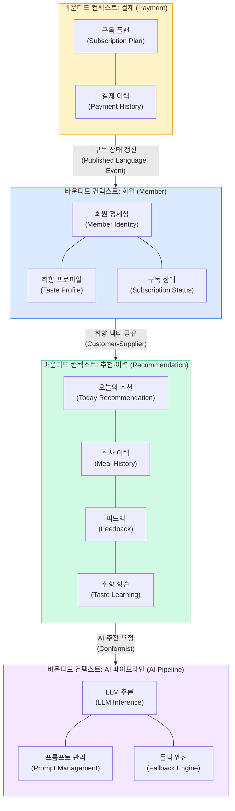
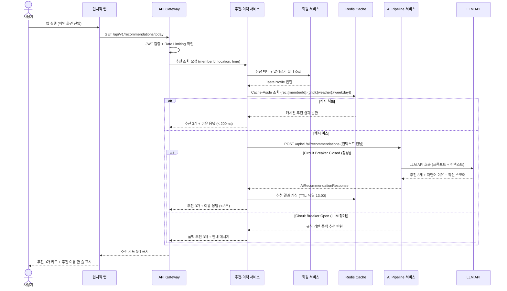
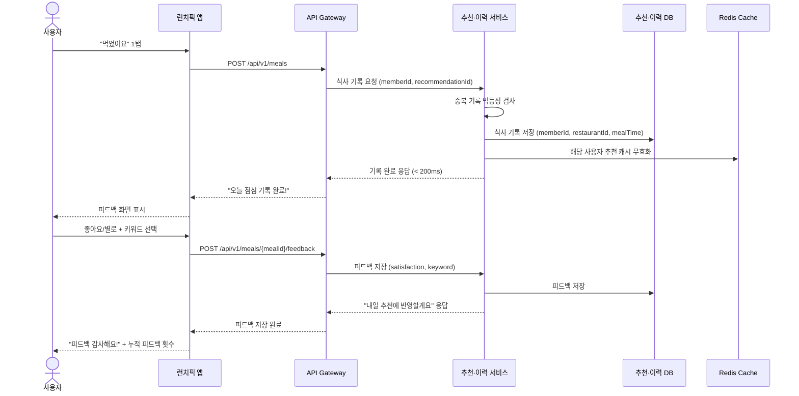
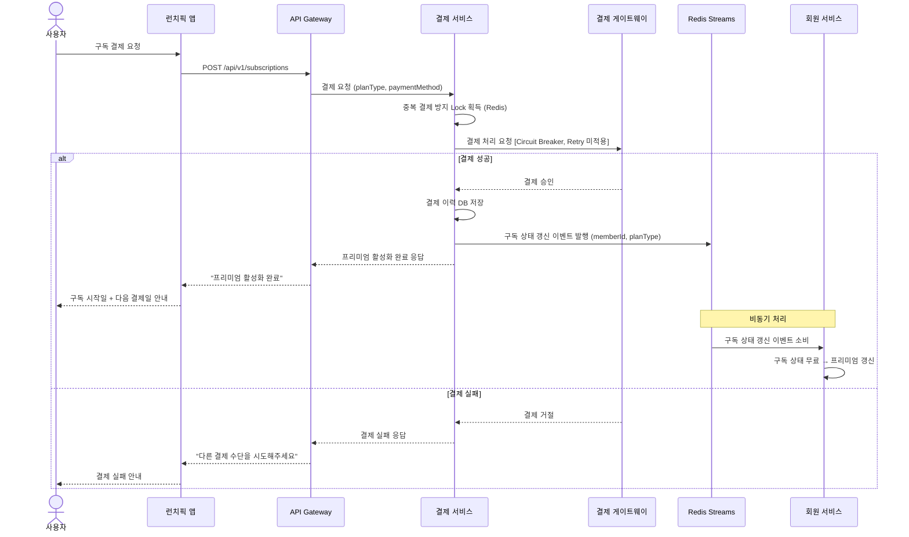
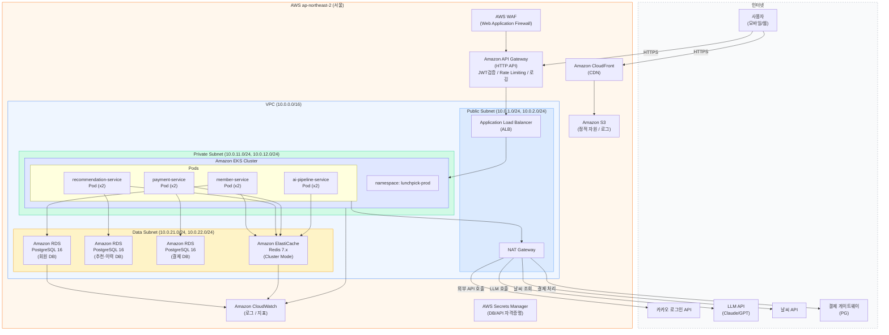

# 런치픽(LunchPick) HighLevel 아키텍처 정의서

> 작성자: 홍길동 (아키) / 소프트웨어 아키텍트
> 작성일: 2026-02-26
> 버전: 1.0
> 기반 파일: pattern-definition.md, logical-architecture.md, logical-architecture.mmd, userstory.md, package-structure.md, cache-db-design.md

---

## 목차

1. [개요 (Executive Summary)](#1-개요-executive-summary)
2. [아키텍처 요구사항](#2-아키텍처-요구사항)
3. [아키텍처 설계 원칙](#3-아키텍처-설계-원칙)
4. [논리 아키텍처 (Logical View)](#4-논리-아키텍처-logical-view)
5. [프로세스 아키텍처 (Process View)](#5-프로세스-아키텍처-process-view)
6. [개발 아키텍처 (Development View)](#6-개발-아키텍처-development-view)
7. [물리 아키텍처 (Physical View)](#7-물리-아키텍처-physical-view)
8. [기술 스택 아키텍처](#8-기술-스택-아키텍처)
9. [AI/ML 아키텍처](#9-aiml-아키텍처)
10. [개발 운영 (DevOps)](#10-개발-운영-devops)
11. [보안 아키텍처](#11-보안-아키텍처)
12. [품질 속성 구현 전략](#12-품질-속성-구현-전략)
13. [아키텍처 의사결정 기록 (ADR)](#13-아키텍처-의사결정-기록-adr)
14. [구현 로드맵](#14-구현-로드맵)
15. [위험 관리](#15-위험-관리)
16. [부록](#16-부록)

---

## 1. 개요 (Executive Summary)

### 1.1 비즈니스 목적 및 서비스 개요

런치픽(LunchPick)은 매일 반복되는 점심 메뉴 의사결정 피로를 AI 개인화 추천으로 해결하는 foodtech 버티컬 서비스다. 직장인이 평균 13~18분을 소비하는 점심 탐색 시간을 3초 이내 추천 3개 제시로 단축하고, 사용할수록 정확해지는 취향 학습 플라이휠(A1)로 락인(lock-in)을 형성한다.

**핵심 솔루션 흐름**:

| 솔루션 | 설명 |
|--------|------|
| **A5 — 원탭 기록** | "먹었어요" 1탭으로 식사 기록 완료. 피드백 루프의 마찰을 제거하여 데이터 축적을 가능하게 함 |
| **A1 — 취향 해자 플라이휠** | 쌓인 데이터가 추천 품질을 높이고, 높아진 품질이 더 많은 피드백을 유도하는 선순환 구조 |
| **A8 — 투명한 추천 근거** | "비 오는 날 + 어제 양식 → 따뜻한 한식 추천" 형태의 자연어 이유 + 확신 스코어로 추천 신뢰도 형성 |

**대상 사용자**: 수도권 오피스 밀집 지역, 25~45세, 매일 점심 외식하는 결정 피로 직장인

**예상 규모**: 피크타임(12~13시) 동시 사용자 1,000명

### 1.2 시스템 범위 및 외부 시스템

**내부 시스템 범위 (4개 마이크로서비스)**:

| 서비스 | 역할 | 기술 |
|--------|------|------|
| member-service | 회원 인증, 취향 프로파일, 구독 상태 관리 | Java 21 / Spring Boot 3.4.x |
| recommendation-service | 추천 오케스트레이션, 식사 기록, 취향 학습 | Java 21 / Spring Boot 3.4.x |
| payment-service | 구독 플랜, PG 결제, 구독 해지 | Java 21 / Spring Boot 3.4.x |
| ai-pipeline-service | LLM 호출, 프롬프트 관리, 추천 이유 생성 | Python 3.12 / FastAPI 0.115.x |

**외부 시스템 의존**:

| 외부 시스템 | 용도 | 장애 대응 |
|------------|------|---------|
| 카카오 로그인 API | 소셜 인증 위임 | Circuit Breaker + Retry |
| LLM API (Claude / GPT) | 추천 생성, 이유 자연어 생성 | Circuit Breaker + Retry + 폴백 |
| 지도 API | 도보 경로, 식당 위치 | Circuit Breaker |
| 날씨 API | 날씨 컨텍스트 수집 | Circuit Breaker + Retry |
| 결제 게이트웨이 (PG) | 구독 결제 처리 | Circuit Breaker (Retry 미적용) |

---

## 2. 아키텍처 요구사항

### 2.1 기능 요구사항 요약 (유저스토리 기반)

| Epic | UFR ID | 기능 | 우선순위 |
|------|--------|------|---------|
| 회원가입/온보딩 | UFR-MBR-010~050 | 카카오 소셜 로그인, 취향 온보딩 퀴즈, 위치 동의, 알레르기 설정, 프로필 수정 | P0~P2 |
| 오늘의 추천 | UFR-REC-010~030 | 추천 3개 조회(3초), 추천 이유 자연어 상세, 콜드스타트 안전망 | P0 |
| 추천 수락/식당 선택 | UFR-REC-040~060 | 추천 수락, 거절 및 대체 추천, 길찾기 안내 | P0~P1 |
| 식사 기록 | UFR-REC-070~090 | 원탭 기록, 빠른 수정, 피드백 제출 | P0~P1 |
| 취향 학습 | UFR-REC-100 | 매일 03:00 배치 취향 벡터 갱신 | P0 |
| 인사이트 | UFR-REC-110~120 | 이력 타임라인(30일), 취향 인사이트 리포트 | P1~P2 |
| 구독 전환 | UFR-PAY-010~030 | 플랜 조회, 구독 결제, 해지 | P0 |

### 2.2 비기능적 요구사항 (NFR)

| 분류 | 요구사항 | 수치 |
|------|----------|------|
| **성능** | 일반 API 응답 시간 | p95 < 200ms |
| **성능** | 추천 조회 응답 시간 (LLM 포함, 캐시 미스) | p95 < 3초 |
| **성능** | 추천 조회 응답 시간 (캐시 히트) | p95 < 200ms |
| **성능** | 이력 조회 응답 시간 | p95 < 500ms |
| **확장성** | 피크타임 동시 사용자 | 12~13시 1,000명 |
| **확장성** | 오토스케일링 트리거 | CPU 70% 이상 시 자동 확장 |
| **가용성** | 서비스 가용성 | 99.9% (월 다운타임 43분 이하) |
| **보안** | 전송 암호화 | TLS 1.3 |
| **보안** | 저장 암호화 | AES-256 (개인정보, 위치, 알레르기) |
| **보안** | 인증 토큰 | JWT, 접근 토큰 만료 1시간 |
| **법규** | 위치정보법 | 위치 수집 동의, 6개월 보유 후 자동 삭제 |
| **법규** | 개인정보보호법 | 최소 수집 원칙, 민감정보(알레르기) 별도 동의 |
| **법규** | 전자상거래법 | 청약철회권 7일, 자동 갱신 고지 |

### 2.3 기술 제약사항

| 분류 | 제약 |
|------|------|
| **백엔드** | Java 21 / Spring Boot 3.4.x (member, recommendation, payment) |
| **AI 파이프라인** | Python 3.12 / FastAPI |
| **데이터베이스** | PostgreSQL 16 |
| **캐시** | Amazon ElastiCache for Redis 7.x |
| **클라우드** | AWS (단일 리전, ap-northeast-2 서울) |
| **컨테이너** | Amazon EKS (Kubernetes) |

---

## 3. 아키텍처 설계 원칙

| 원칙 | 내용 | 적용 근거 |
|------|------|---------|
| **YAGNI** | MVP에 필요한 최소한의 서비스 경계와 패턴만 정의. CQRS, Event Sourcing, Saga 등 과도한 설계 배제 | 소규모 팀, 빠른 시장 검증 우선 |
| **장애 격리** | LLM 장애가 추천 서비스 전체를 마비시키지 않도록 AI Pipeline을 독립 서비스로 분리 | 피크타임 cascade failure 방지 |
| **AI 격리** | LLM 의존성을 ai-pipeline-service에 캡슐화. 다른 서비스는 LLM을 직접 호출하지 않음 | 모델 교체, 프롬프트 튜닝 시 영향 범위 최소화 |
| **폴백 우선** | 모든 AI 호출 경로에 폴백 전략 명시. LLM 장애 시 규칙 기반 추천으로 서비스 연속성 보장 | 99.9% 가용성 달성 |
| **단일 진입점** | 클라이언트는 Amazon API Gateway를 통해서만 서비스에 접근. 서비스 직접 외부 노출 없음 | 보안, 공통 처리(인증/로깅/Rate Limiting) 집중화 |

---

## 4. 논리 아키텍처 (Logical View)

### 4.1 논리 아키텍처 다이어그램

> 다이어그램 참조: `docs/design/logical-architecture.mmd`

해당 파일은 Mermaid `graph TB` 형식으로 다음 계층을 포함한다:
- **Client Layer**: React Web / 모바일 앱
- **Gateway Layer**: API Gateway (JWT 검증, TLS, 라우팅, Rate Limiting)
- **Service Layer**: 4개 마이크로서비스
- **Data Layer**: Redis Cache, PostgreSQL DB (서비스별), Redis Streams 메시지 큐
- **External Systems**: 카카오 로그인 API, LLM API, 지도 API, 날씨 API, PG

### 4.2 바운디드 컨텍스트 다이어그램



### 4.3 마이크로서비스 구성 및 통신 패턴

**마이크로서비스 구성표**:

| 서비스 | 기술 스택 | 담당 도메인 | 포트 |
|--------|---------|-----------|------|
| member-service | Java 21 / Spring Boot 3.4.x | 회원, 취향, 구독 상태 | 8081 |
| recommendation-service | Java 21 / Spring Boot 3.4.x | 추천, 이력, 피드백, 학습 | 8082 |
| payment-service | Java 21 / Spring Boot 3.4.x | 구독 플랜, 결제 | 8083 |
| ai-pipeline-service | Python 3.12 / FastAPI 0.115.x | LLM 추론, 프롬프트, 폴백 | 8084 |

**서비스 간 통신 패턴**:

| 통신 경로 | 방식 | 이유 |
|---------|------|------|
| 클라이언트 → API Gateway → 각 서비스 | 동기 REST (HTTPS) | 사용자 대면 요청. 즉각 응답 필요 |
| recommendation-service → member-service (취향 조회) | 동기 REST | 추천 생성 전 취향 벡터 조회 필수. 동기 처리 |
| recommendation-service → ai-pipeline-service | 동기 REST + Circuit Breaker | 추천 결과 즉시 반환 필요. 단, 장애 격리 |
| payment-service → Redis Streams → member-service | 비동기 메시지 | 결제 후 구독 상태 갱신은 즉각성 불필요. 결합도 최소화 |
| recommendation-service ↔ Redis | Cache-Aside | 추천 결과 캐싱/무효화 |

---

## 5. 프로세스 아키텍처 (Process View)

### 5.1 핵심 사용자 여정

#### 5.1.1 오늘의 추천 조회 플로우 (UFR-REC-010, A8)



#### 5.1.2 원탭 식사 기록 + 피드백 플로우 (UFR-REC-070, UFR-REC-090, A5)



#### 5.1.3 구독 결제 플로우 (UFR-PAY-020, A1)



### 5.2 외부 시퀀스 다이어그램 참조

> `docs/design/sequence/outer/` 디렉토리 참조

---

## 6. 개발 아키텍처 (Development View)

### 6.1 기술 스택 선정

#### 6.1.1 백엔드 기술 스택

| 서비스 | 언어 | 프레임워크 | 버전 |
|--------|------|----------|------|
| member-service | Java 21 | Spring Boot | 3.4.x |
| recommendation-service | Java 21 | Spring Boot | 3.4.x |
| payment-service | Java 21 | Spring Boot | 3.4.x |
| ai-pipeline-service | Python 3.12 | FastAPI | 0.115.x |

**Spring Boot 3.4.x 선정 이유**:
- Java 21 Virtual Threads (Project Loom) 지원으로 비동기 처리 성능 향상
- Spring Security 6.x + OAuth2 Resource Server로 JWT/카카오 OAuth 통합 용이
- Spring Data JPA + Hibernate 6.x PostgreSQL 최적화
- Spring Actuator 기반 Health Endpoint 구현 내장
- Resilience4j 2.x 공식 스타터 제공 (Circuit Breaker, Retry, Rate Limiter)

**Python 3.12 / FastAPI 선정 이유**:
- LangChain, Anthropic SDK, OpenAI SDK 등 LLM 생태계 최적화
- async/await 기반 비동기 처리로 LLM 응답 대기 시간 효율화
- Pydantic v2 기반 타입 안전 모델 정의

#### 6.1.2 프론트엔드 기술 스택

**TypeScript 5.x / React 19 / Next.js 15 선정**:

유저스토리 요구사항과의 정합성:
- **UFR-REC-010 (추천 3초 응답)**: Next.js 15 App Router의 React Server Components로 초기 렌더링 성능 최적화
- **UFR-REC-070 (원탭 기록)**: React 19 useOptimistic API로 즉각적인 UI 피드백 구현
- **UFR-MBR-010 (카카오 소셜 로그인)**: Next.js 15 + NextAuth.js로 OAuth 플로우 간소화
- **NFR-SYS-020 (피크타임 CDN)**: Next.js 정적 자원 자동 CDN 최적화 (Amazon CloudFront 연동)
- **모바일 대응**: Next.js PWA + 반응형 CSS로 홈 위젯 경험 제공

| 항목 | 선택 | 버전 |
|------|------|------|
| 언어 | TypeScript | 5.x |
| UI 프레임워크 | React | 19.x |
| 웹 프레임워크 | Next.js | 15.x |
| 스타일링 | Tailwind CSS | 4.x |
| 상태 관리 | TanStack Query | 5.x |
| 인증 | NextAuth.js | 5.x |

### 6.2 계층형 아키텍처 (전 서비스 공통)

모든 서비스는 Layered Architecture를 적용하여 관심사를 명확히 분리한다.

```
Controller Layer    — HTTP 요청/응답 처리, DTO 변환, 입력 유효성 검증
       ↓
Service Layer      — 비즈니스 로직, 트랜잭션 경계, 외부 서비스 호출 조율
       ↓
Repository Layer   — 데이터 접근, JPA Entity 매핑, 쿼리 실행
       ↓
Database           — PostgreSQL 16
```

**Java 서비스 패키지 구조** (`docs/design/class/package-structure.md` 참조):

| 계층 | 패키지 | 역할 |
|------|--------|------|
| Controller | `controller/` | REST 엔드포인트, DTO 변환 |
| Service | `service/` | 비즈니스 로직 (인터페이스 + 구현 분리) |
| Domain | `domain/` | 도메인 모델 (순수 Java 객체) |
| Repository | `repository/entity/`, `repository/jpa/` | JPA Entity, Spring Data Repository |
| Client | `client/` | 외부 서비스 HTTP 클라이언트 |
| Config | `config/` | Spring 설정, Security, JWT |
| Exception | `exception/` | 도메인 예외 클래스 |

**Python FastAPI 패키지 구조** (`ai-pipeline-service/`):

| 모듈 | 역할 |
|------|------|
| `router/` | FastAPI 라우터 (Controller 역할) |
| `service/` | 비즈니스 로직 |
| `prompt/` | 프롬프트 빌더 |
| `llm/` | LLM 클라이언트, Circuit Breaker |
| `parser/` | LLM 응답 파싱 |
| `cache/` | Redis Cache-Aside 관리 |
| `model/` | Pydantic 요청/응답 모델 |

### 6.3 코딩 표준 및 테스트 전략

**코딩 표준**: https://github.com/unicorn-plugins/npd/blob/main/resources/standards/standard_comment.md

**테스트 전략**: https://github.com/unicorn-plugins/npd/blob/main/resources/standards/standard_testcode.md

| 테스트 유형 | 도구 | 커버리지 목표 |
|------------|------|-------------|
| 단위 테스트 | JUnit 5, Mockito (Java) / pytest (Python) | 80% 이상 |
| 통합 테스트 | Spring Boot Test + Testcontainers | 핵심 플로우 100% |
| API 테스트 | RestAssured / httpx | 모든 엔드포인트 |
| 부하 테스트 | k6 / Locust | 동시 1,000명 시나리오 |
| 회귀 테스트 | GitHub Actions CI 파이프라인 | PR 머지 시 자동 실행 |

**Definition of Done**:
- 코드 리뷰 완료 (최소 1명)
- 단위 테스트 작성 및 통과 (커버리지 80% 이상)
- 통합 테스트 통과
- API 문서화 완료 (Swagger/OpenAPI 3.1)
- 스테이징 배포 및 성능 기준 충족 확인

---

## 7. 물리 아키텍처 (Physical View)

### 7.1 선정된 7개 클라우드 아키텍처 패턴

`docs/design/pattern-definition.md` 기반. YAGNI 원칙에 따라 MVP 필수 7종 선정.

| # | 패턴 | 적용 대상 | MVP 선정 근거 |
|---|------|---------|------------|
| P1 | **Federated Identity** | member-service + API Gateway | 카카오 인증 위임, 직접 구현 불필요 |
| P2 | **Gateway Offloading + Routing** | Amazon API Gateway | 인증/TLS/로깅 공통 처리 집중화, 단일 진입점 |
| P3 | **Circuit Breaker** | 전 서비스 외부 호출 레이어 | LLM·외부 API 장애 격리 핵심 |
| P4 | **Retry** | LLM, 카카오, 날씨 API 호출 | 일시적 오류 자동 복구 |
| P5 | **Rate Limiting** | API Gateway + 추천 서비스 내부 | LLM 비용 제어, 피크 과부하 방지 |
| P6 | **Cache-Aside** | recommendation-service + Redis | LLM 응답 캐싱, 추천 응답 속도 확보 |
| P7 | **Health Endpoint Monitoring** | 전 서비스 `/health` | 오토스케일링 트리거, 장애 감지 |

**경량 메시지 큐**: Redis Streams 1개 토픽 (결제→회원 구독 상태 갱신). Queue-Based Load Leveling의 간소화 구현 (Phase 2에서 AWS SQS로 정식 전환 검토).

### 7.2 AWS 인프라 구성

**컴퓨팅**:
- Amazon EKS (Kubernetes 1.31) — 4개 마이크로서비스 컨테이너 오케스트레이션
- Amazon EC2 (노드 그룹: t3.medium) — EKS 워커 노드
- EKS Auto Scaling: CPU 70% 이상 시 Horizontal Pod Autoscaler 동작

**데이터베이스**:
- Amazon RDS for PostgreSQL 16 (Multi-AZ, db.t3.medium) — 서비스별 독립 DB 인스턴스 또는 스키마 분리

**캐시**:
- Amazon ElastiCache for Redis 7.x (Cluster Mode: 3샤드 × 2레플리카, prod) — Redis DB 번호별 서비스 격리

**API Gateway**:
- Amazon API Gateway (HTTP API) — JWT 인증, TLS 종료, 라우팅, Rate Limiting, 로깅

**스토리지**:
- Amazon S3 — 정적 자원, 배치 아티팩트, 로그 아카이브

**CDN**:
- Amazon CloudFront — 프론트엔드 정적 자원 엣지 캐싱

**네트워크 토폴로지**:



---

## 8. 기술 스택 아키텍처

### 8.1 API Gateway 및 서비스 통신

| 항목 | 선택 | 버전 / 비고 |
|------|------|----------|
| **API Gateway** | Amazon API Gateway (HTTP API) | GA — JWT 인증기, 라우팅, Rate Limiting, CloudWatch 연동 |
| **서비스 간 통신** | REST over HTTP (Spring RestTemplate / WebClient, httpx) | MVP — Service Mesh(Istio) 미적용 |
| **Circuit Breaker / Retry** | Resilience4j (Java), Tenacity (Python) | Resilience4j 2.2.x, Tenacity 9.x |

> **Service Mesh 미적용 근거**: Istio/Linkerd는 사이드카 프록시 운영 복잡도가 높아 MVP 규모에서 YAGNI 원칙에 부합하지 않음. Circuit Breaker는 서비스 내 라이브러리(Resilience4j)로 충분히 구현 가능. Phase 3 이상에서 Istio 도입 재검토.

### 8.2 데이터베이스

| 항목 | 선택 | 비고 |
|------|------|------|
| **RDBMS** | Amazon RDS for PostgreSQL 16 | Multi-AZ (prod), Single-AZ (dev/staging) |
| **인스턴스** | db.t3.medium (prod) | DB 커넥션 풀 최대 100개 |
| **ORM** | Spring Data JPA + Hibernate 6.6.x | Java 서비스 |
| **Redis** | Amazon ElastiCache for Redis 7.x | Cluster Mode (3샤드 × 2레플리카, prod) |
| **Redis 클라이언트** | Spring Data Redis (Lettuce) (Java), redis-py 5.x (Python) | |

**Redis DB 번호 할당** (`docs/design/database/cache-db-design.md` 참조):

| DB 번호 | 용도 | 담당 서비스 |
|---------|------|-----------|
| DB 0 | 세션, JWT 블랙리스트 | 공통 |
| DB 1 | 회원 프로파일, 취향 프로파일 캐시 | member-service |
| DB 2 | 추천 결과, 추천 이유 캐시 | recommendation-service |
| DB 3 | 구독 플랜, 활성 구독 캐시, 중복 결제 Lock | payment-service |
| DB 4 | AI 추천 결과, LLM 응답 캐시 | ai-pipeline-service |
| DB 5~14 | 예비 | 향후 서비스 확장 |

### 8.3 메시징 및 스토리지

| 항목 | 선택 | 비고 |
|------|------|------|
| **메시지 큐** | Redis Streams (DB 0) | 결제→회원 구독 상태 갱신 이벤트. Phase 2에서 Amazon SQS 전환 검토 |
| **객체 스토리지** | Amazon S3 | 정적 자원, 배치 아티팩트, 로그 아카이브 |
| **CDN** | Amazon CloudFront | S3 정적 자원 엣지 캐싱, 3G 환경 < 3초 로드 목표 |

### 8.4 모니터링 및 관측성

| 항목 | 선택 | 역할 |
|------|------|------|
| **클라우드 모니터링** | Amazon CloudWatch | EKS 지표, RDS 지표, API Gateway 로그 |
| **분산 추적** | AWS X-Ray | 서비스 간 요청 추적, 레이턴시 병목 분석 |
| **메트릭 수집** | Prometheus + Grafana | Pod 수준 지표 (Spring Actuator / FastAPI metrics 엔드포인트 스크래핑) |
| **APM** | Spring Boot Actuator (Health, Info, Metrics) | Health Endpoint Monitoring 패턴 구현 |
| **로그 수집** | Amazon CloudWatch Logs + Fluent Bit (DaemonSet) | EKS Pod 로그 중앙 수집 |

**모니터링 경보 임계값**:

| 지표 | 경보 임계값 | 대응 |
|------|------------|------|
| Redis Hit Rate | < 70% | AI Pipeline 부하 증가 알림 |
| Redis Memory Usage | > 80% | 스케일 업 검토 |
| API Gateway 4xx Rate | > 5% | Rate Limiting 설정 검토 |
| API Gateway 5xx Rate | > 1% | 서비스 장애 알림 |
| EKS Pod CPU | > 70% | HPA 오토스케일링 트리거 |
| LLM Circuit Breaker | Open 상태 전환 | 즉시 알림 + 폴백 확인 |

---

## 9. AI/ML 아키텍처

> 주의: AI 서비스 상세 설계(Step 8)는 아직 미완료. 본 섹션은 논리 아키텍처(`logical-architecture.md`)와 클래스 설계(`package-structure.md`) 기반 개요 수준으로 작성.

### 9.1 AI Pipeline 서비스 역할

#### 9.1.1 서비스 핵심 책임

| 책임 | 상세 | 관련 솔루션 |
|------|------|-----------|
| **LLM 기반 추천 생성** | 취향 벡터 + 위치 + 날씨 + 요일 + 최근 이력 → 추천 3개 생성 | A8 |
| **추천 이유 자연어 생성** | "비 오는 날 + 어제 양식 → 따뜻한 한식 추천" 형태 자연어 한 줄 이유 | A8 |
| **확신 스코어 계산** | 상위 3개 추천의 확률(%) 계산 및 반환 | A8 |
| **폴백 추천** | LLM Circuit Breaker Open 상태 시 규칙 기반(지역 인기 메뉴 + 거리 + 알레르기 필터) 즉시 반환 | A1 |
| **콜드스타트 안전망** | 피드백 5건 미만 신규 사용자 — 직군 클러스터 Bayesian Prior + 온보딩 데이터 활용 | A1 |

#### 9.1.2 ai-pipeline-service 아키텍처 개요

```
요청 수신 (FastAPI Router)
       ↓
Cache-Aside 확인 (cache_manager.py — Redis DB 4)
       ↓ 캐시 미스
Router → PromptBuilder (prompt/recommendation_prompt.py)
       ↓ 컨텍스트 조립 (취향벡터 + 위치격자 + 날씨코드 + 요일 + 이력)
LLMClient (llm/llm_client.py — init_chat_model 추상화)
       ↓ Circuit Breaker 상태 확인
  ├── Closed: LLM API 호출 → ResponseParser → 결과 캐싱 → 반환
  ├── Open: FallbackEngine (fallback_engine.py) → 규칙 기반 추천 반환
  └── Half-Open: 제한적 LLM 호출 → 복구 감지
```

**기술 선택**:

| 항목 | 선택 | 이유 |
|------|------|------|
| LLM 추상화 | `langchain_core.language_models.init_chat_model` | Claude/GPT 모델 전환 시 환경변수 변경만으로 교체 |
| LLM API | Anthropic Claude (기본), OpenAI GPT (대체) | init_chat_model로 제공자 종속성 최소화 |
| Circuit Breaker | Tenacity + 커스텀 상태 관리 (`circuit_breaker.py`) | Python 생태계 최적화 |
| 캐시 클라이언트 | redis-py 5.x (aioredis 통합) | FastAPI 비동기 처리 최적화 |

### 9.2 프롬프트 관리 전략

| 전략 | 상세 |
|------|------|
| **버전 관리** | 프롬프트 템플릿을 코드 파일(`prompt/recommendation_prompt.py`)로 관리. Git 이력으로 버전 추적 |
| **콜드스타트 분기** | 피드백 5건 미만 감지 시 콜드스타트 전용 프롬프트 템플릿 분기 적용 |
| **컨텍스트 주입** | 취향 벡터, 위치 격자 코드, 날씨 코드, 요일, 최근 7일 이력을 프롬프트에 구조화 삽입 |
| **출력 스키마 강제** | Pydantic 모델로 LLM 응답 파싱 및 스키마 검증 (`parser/recommendation_parser.py`) |

### 9.3 LLM 비용/성능 최적화

| 전략 | 적용 방식 | 효과 |
|------|---------|------|
| **Cache-Aside** | 동일 컨텍스트(취향+위치+날씨+요일) 재요청 시 Redis 캐시 응답 (TTL: 당일 13:00) | LLM 호출 70~90% 절감, 캐시 히트 < 200ms |
| **Rate Limiting** | 글로벌: 분당 500회, 사용자별: 분당 10회 | LLM 월 비용 예측 가능, 할당량 초과 방지 |
| **Circuit Breaker** | 연속 5회 실패 → Open → 폴백 즉시 응답 | 피크타임 cascade failure 차단 |
| **Retry (지수 백오프)** | 500ms → 1초 → 2초, 최대 3회, 503/408/429에만 적용 | 일시적 오류 투명 복구 |
| **프롬프트 해시 캐싱** | SHA-256 앞 12자리로 동일 프롬프트 LLM 응답 재사용 (`ai:response:recommendation:{hash}`) | 중복 프롬프트 LLM 호출 제거 |

---

## 10. 개발 운영 (DevOps)

### 10.1 CI/CD 파이프라인

#### 10.1.1 CI (GitHub Actions)

```
코드 Push / PR 생성
       ↓
GitHub Actions CI 워크플로우
  ├── 코드 린트 (Checkstyle / Flake8)
  ├── 단위 테스트 (JUnit 5 / pytest)
  ├── 통합 테스트 (Testcontainers)
  ├── 코드 커버리지 검증 (80% 이상)
  ├── Docker 이미지 빌드
  └── 이미지 푸시 (Amazon ECR)
```

**GitHub Actions 선정 이유**: 소규모 팀에서 별도 CI 서버 운영 비용 없이 GitHub 레포지토리와 통합. AWS 공식 액션(aws-actions) 제공으로 ECR 푸시, EKS 배포 자동화 용이.

#### 10.1.2 CD (ArgoCD — GitOps)

```
ECR 이미지 태그 갱신
       ↓
Git 레포지토리 (Helm values.yaml 이미지 태그 업데이트)
       ↓
ArgoCD (GitOps 컨트롤러)
  ├── Git 상태 감지 (변경 감지 주기: 3분)
  ├── Kubernetes 현재 상태와 비교
  └── 차이 발생 시 자동 동기화 (Sync)
       ↓
Amazon EKS 배포 완료
```

**ArgoCD 선정 이유**:
- GitOps 원칙 — 배포 상태를 Git이 단일 진실 공급원(Single Source of Truth)으로 관리
- 수동 배포 금지 원칙 준수 (파이프/파이프 DevOps 원칙 정합)
- 배포 이력 추적, 롤백이 `git revert`로 가능

### 10.2 Amazon EKS 운영 설계

**네임스페이스 설계**:

| 네임스페이스 | 용도 |
|------------|------|
| `lunchpick-prod` | 운영 환경 서비스 |
| `lunchpick-staging` | 스테이징 환경 서비스 |
| `lunchpick-monitoring` | Prometheus, Grafana |
| `argocd` | ArgoCD 컨트롤러 |
| `kube-system` | EKS 시스템 컴포넌트 |

**Helm 차트 구조**:

```
helm/
├── lunchpick/
│   ├── Chart.yaml
│   ├── values.yaml              ← 공통 기본값
│   ├── values-prod.yaml         ← 운영 환경 오버라이드
│   ├── values-staging.yaml      ← 스테이징 환경 오버라이드
│   └── templates/
│       ├── deployment.yaml
│       ├── service.yaml
│       ├── hpa.yaml             ← HorizontalPodAutoscaler (CPU 70%)
│       ├── ingress.yaml
│       └── configmap.yaml
```

**Pod 리소스 기준 (prod)**:

| 서비스 | CPU Request/Limit | Memory Request/Limit | 최소 레플리카 |
|--------|-----------------|---------------------|------------|
| member-service | 250m / 500m | 512Mi / 1Gi | 2 |
| recommendation-service | 500m / 1000m | 1Gi / 2Gi | 2 |
| payment-service | 250m / 500m | 512Mi / 1Gi | 2 |
| ai-pipeline-service | 500m / 1000m | 1Gi / 2Gi | 2 |

---

## 11. 보안 아키텍처

### 11.1 AWS 플랫폼 보안 계층

| 계층 | AWS 서비스 | 역할 |
|------|----------|------|
| **엣지 방어** | AWS WAF | SQL Injection, XSS, 악성 봇 차단 |
| **DDoS 보호** | AWS Shield Standard | 네트워크/전송 계층 DDoS 자동 방어 (무료 포함) |
| **시크릿 관리** | AWS Secrets Manager | DB 자격증명, LLM API 키, PG 키 중앙 관리 및 자동 순환 |
| **암호화 키** | AWS KMS | RDS 암호화, S3 암호화 키 관리 |
| **네트워크 격리** | VPC + Security Group | 서비스 Pod → 데이터 서브넷만 허용, 외부 직접 접근 차단 |

### 11.2 인증/인가 아키텍처

**카카오 OAuth 2.0 + JWT (Federated Identity 패턴)**:

```
사용자 → 카카오 로그인 → 카카오 인증 토큰 발급
       ↓
member-service → 카카오 토큰 검증 → 내부 JWT 발급 (만료: 1시간)
       ↓
API Gateway → JWT 서명 검증 → 사용자 컨텍스트(memberId, plan) 서비스에 전달
       ↓
각 서비스 → memberId 기준 권한 검사 (인증 로직 없음)
```

| 항목 | 설계 |
|------|------|
| **소셜 로그인** | 카카오 OAuth 2.0. 카카오 토큰 검증 후 내부 JWT 발급 |
| **접근 토큰** | JWT, 만료 1시간. API Gateway에서 검증. 서비스에는 사용자 컨텍스트만 전달 |
| **JWT 블랙리스트** | 로그아웃 시 Redis DB 0에 JTI 등록 (`jwt:blacklist:{jti}`). 토큰 만료 시까지 유지 |
| **서비스 간 통신** | VPC Private Subnet 내부 통신. 외부 직접 접근 없음 |
| **Health Endpoint** | `/health` 엔드포인트 — VPC 내부만 접근 허용. 퍼블릭 노출 금지 |

### 11.3 데이터 보안

| 항목 | 설계 |
|------|------|
| **전송 암호화** | TLS 1.3. Amazon API Gateway에서 TLS 종료 |
| **개인정보 저장** | 이메일, 위치 정보: AES-256 암호화 저장 (AWS KMS 키 관리) |
| **민감정보 저장** | 알레르기/식이제한: 별도 암호화 키로 AES-256 저장 |
| **RDS 암호화** | Amazon RDS 저장 데이터 암호화 (AWS KMS) |
| **위치 정보 보관** | 위치정보법 준수: 6개월 보유 후 자동 삭제 (배치 잡) |
| **개인정보 접근 로그** | 접근 로그 6개월 보관 (Amazon CloudWatch Logs) |

### 11.4 법규 준수

| 법규 | 준수 방식 |
|------|---------|
| **위치정보법** | UFR-MBR-030 위치 수집 전 명시적 동의, 6개월 보유, 이후 자동 삭제 배치 |
| **개인정보보호법** | 최소 수집 원칙, 알레르기(민감정보) 별도 동의(UFR-MBR-040), 개인정보 접근 로그 6개월 |
| **전자상거래법** | 청약철회권 7일(UFR-PAY-030), 자동 갱신 고지, 해지 방법 명시 |

---

## 12. 품질 속성 구현 전략

### 12.1 Cache-Aside (추천 결과 캐싱)

**목적**: LLM 호출 비용 절감 + 피크타임 응답 속도 확보

| 항목 | 설계 |
|------|------|
| **캐시 키** | `rec:{member_id}:{location_grid}:{weather_code}:{weekday}` |
| **TTL** | 현재 13:00 이전: `13:00 - 현재시각` (초). 이후: 다음날 13:00까지 |
| **무효화 트리거** | 피드백 저장, 식사 기록, 취향 벡터 갱신 |
| **Stale 처리** | `rec:stale:{member_id}` (TTL 24시간) — LLM 장애 시 만료 캐시 허용 응답 |
| **피크타임 대응** | 13:00 일괄 만료 시 부하 급증 완화: 사용자별 요청 분산 + Stale-While-Revalidate |
| **기대 효과** | 캐시 히트율 > 60% (피크타임), 히트 시 응답 < 200ms |

### 12.2 Circuit Breaker (외부 API 장애 격리)

**도구**: Resilience4j 2.2.x (Java), Tenacity + 커스텀 CB (Python)

| 서비스 | 적용 대상 | 임계값 | Open 상태 동작 |
|--------|---------|--------|-------------|
| member-service | 카카오 로그인 API | 연속 5회 실패 | 로그인 불가 안내 |
| recommendation-service | AI Pipeline, 지도 API, 날씨 API | 연속 5회 실패 | AI Pipeline: 폴백 추천. 날씨: 기본 날씨 코드. 지도: 주소 텍스트 |
| payment-service | PG | 연속 5회 실패 | 결제 불가 안내 |
| ai-pipeline-service | LLM API | 연속 5회 실패 | 규칙 기반 폴백 즉시 반환 |

**Circuit Breaker 상태 전이**:
```
Closed (정상) → [연속 5회 실패] → Open (장애)
                                          ↓ [대기 60초]
                                   Half-Open (복구 시도)
                                          ↓ [성공 1회]
Closed (정상) ←─────────────────────────────────────────
```

### 12.3 Rate Limiting (LLM 비용 제어 + 과부하 방지)

| 레벨 | 제한 | 적용 위치 |
|------|------|---------|
| **글로벌 LLM** | 분당 500회 | ai-pipeline-service 내부 |
| **사용자별 추천 조회** | 분당 10회 | Amazon API Gateway |
| **글로벌 API** | 초당 1,000회 | Amazon API Gateway |

초과 시 응답: `429 Too Many Requests` + `Retry-After` 헤더

### 12.4 Retry (일시적 오류 자동 복구)

**지수 백오프 + 지터 전략**:

| 항목 | 설정 |
|------|------|
| 재시도 횟수 | 최대 3회 |
| 대기 시간 | 1차: 500ms, 2차: 1초, 3차: 2초 (+ 랜덤 지터) |
| 적용 오류 코드 | 503 (서버 과부하), 408 (타임아웃), 429 (일시적 Rate Limit) |
| 미적용 서비스 | payment-service PG 호출 (이중결제 방지) |

### 12.5 Health Endpoint Monitoring (오토스케일링 연동)

| 항목 | 설계 |
|------|------|
| **엔드포인트** | `/health` (각 서비스) |
| **구현** | Spring Boot Actuator (Java), FastAPI 커스텀 엔드포인트 (Python) |
| **포함 정보** | 서비스 상태, DB 연결, Redis 연결, Circuit Breaker 상태 (Open/Closed) |
| **접근 제한** | VPC 내부 전용. Amazon API Gateway 라우팅 미포함 |
| **오토스케일링** | EKS HPA — `/health` 200 OK 확인 후 Pod 확장. CPU 70% 이상 시 트리거 |

---

## 13. 아키텍처 의사결정 기록 (ADR)

### ADR-001: 백엔드 프레임워크 선정

| 항목 | 내용 |
|------|------|
| **상태** | 채택 (2026-02-26) |
| **결정** | Java 21 / Spring Boot 3.4.x (member, recommendation, payment) + Python 3.12 / FastAPI 0.115.x (ai-pipeline) |

**후보군 및 비교**:

| 후보 | 장점 | 단점 |
|------|------|------|
| **Spring Boot 3.4.x + Java 21** | Virtual Threads(성능), 풍부한 엔터프라이즈 생태계, Resilience4j 공식 지원, 팀 숙련도 | AI/LLM SDK 생태계 Python 대비 부족 |
| NestJS (Node.js) | TypeScript 전체 스택 통일, 빠른 프로토타입 | JVM 대비 메모리 처리 성능 불확실, Resilience4j 미지원 |
| Quarkus | GraalVM 네이티브 이미지, 빠른 시작 | 팀 숙련도 낮음, 생태계 작음 |
| **FastAPI (Python)** | LLM SDK 최적화, async 성능, 빠른 개발 | 대규모 엔터프라이즈 패턴 부족 |
| Django REST Framework | 성숙한 생태계 | 동기 처리 기본, LLM 비동기 처리 불리 |

**의사결정 사유**: Spring Boot 3.4.x는 팀 숙련도와 엔터프라이즈 패턴(Resilience4j, Spring Security, Spring Data JPA) 완성도에서 우위. AI Pipeline은 LLM SDK(langchain-anthropic, openai) 생태계와 비동기 처리 최적화로 Python/FastAPI가 유일한 현실적 선택. 언어 혼재(Polyglot)는 복잡도를 높이지만 AI 격리 원칙에 따라 ai-pipeline-service 1개 서비스에만 한정.

---

### ADR-002: 아키텍처 패턴 선정

| 항목 | 내용 |
|------|------|
| **상태** | 채택 (2026-02-26) |
| **결정** | 전 서비스 Layered Architecture (Controller → Service → Repository) |

**후보군 및 비교**:

| 후보 | 장점 | 단점 |
|------|------|------|
| **Layered Architecture** | 단순, 학습 곡선 낮음, 팀 숙련도 높음, 소규모 서비스 적합 | 도메인 복잡도 증가 시 Fat Service 위험 |
| Hexagonal (Ports & Adapters) | 도메인 순수성, 테스트 용이 | 초기 설계 비용 높음, MVP 과도한 추상화 |
| Clean Architecture | 의존성 역전, 테스트 용이 | 복잡도 높음, 소규모 팀 오버엔지니어링 |
| CQRS | 읽기/쓰기 분리, 확장성 | MVP 규모에서 과도한 복잡도 (YAGNI 위반) |

**의사결정 사유**: 4개 마이크로서비스 각각이 단일 도메인(회원/추천/결제/AI)에 집중된 작은 서비스이므로 Layered Architecture로 충분. 팀 전원이 숙련된 패턴으로 학습 비용 없이 바로 구현 가능. CQRS, Hexagonal은 Phase 3 이상의 복잡도에서 재검토.

---

### ADR-003: 클라우드 플랫폼 선정

| 항목 | 내용 |
|------|------|
| **상태** | 채택 (2026-02-26) |
| **결정** | AWS (ap-northeast-2 서울 리전, 단일 리전) |

**후보군 및 비교**:

| 후보 | 장점 | 단점 |
|------|------|------|
| **AWS** | 국내 서울 리전, 광범위한 관리형 서비스, 국내 foodtech 스타트업 레퍼런스, 팀 숙련도 | 비용이 상대적으로 높을 수 있음 |
| GCP | AI/ML 서비스 강점 (Vertex AI), BigQuery | 국내 서울 리전 가용성, 국내 레퍼런스 부족 |
| Azure | 엔터프라이즈 통합 강점 | 한국 foodtech 스타트업 레퍼런스 부족, 팀 숙련도 낮음 |
| 멀티클라우드 | 벤더 종속 감소 | 운영 복잡도 급증, MVP 과도함 |

**의사결정 사유**: 수도권 직장인 타깃 서비스로 서울 리전 저레이턴시 필수. AWS는 EKS + RDS + ElastiCache + API Gateway 조합으로 서비스 요구사항을 완전히 충족하는 관리형 서비스 제공. 국내 스타트업 레퍼런스 풍부. Geodes 패턴이 필요 없는 국내 단일 리전 운영이므로 멀티클라우드 불필요.

---

### ADR-004: 데이터베이스 선정

| 항목 | 내용 |
|------|------|
| **상태** | 채택 (2026-02-26) |
| **결정** | Amazon RDS for PostgreSQL 16 (서비스별 독립 인스턴스) |

**후보군 및 비교**:

| 후보 | 장점 | 단점 |
|------|------|------|
| **PostgreSQL 16** | ACID 보장, JSON 타입 지원(취향 벡터), 성숙한 생태계, Spring Data JPA 최적화 | 수평 샤딩 복잡도 |
| MySQL 8.x | 광범위한 호스팅 지원 | JSON 처리가 PostgreSQL 대비 제한적 |
| MongoDB | 스키마 유연성, JSON 네이티브 | 트랜잭션 제약, 결제 데이터 ACID 요구와 불일치 |
| Amazon Aurora PostgreSQL | 고성능, 클라우드 네이티브 | PostgreSQL 대비 비용 높음, MVP 과도함 |
| DynamoDB | 무한 확장성 | 복잡한 쿼리 불리, 취향 벡터/이력 조회 패턴에 불리 |

**의사결정 사유**: 취향 벡터(JSON 배열), 알레르기 필터(복합 조건 쿼리), 식사 이력(날짜 범위 쿼리) 등 구조화된 데이터와 복잡한 쿼리 요구사항에 PostgreSQL이 최적. 결제 데이터는 ACID 트랜잭션 필수. Aurora는 트래픽 1,000명 수준에서 비용 대비 과도함.

---

### ADR-005: 캐시 전략 선정

| 항목 | 내용 |
|------|------|
| **상태** | 채택 (2026-02-26) |
| **결정** | Cache-Aside 패턴 + Amazon ElastiCache for Redis 7.x |

**후보군 및 비교**:

| 후보 | 장점 | 단점 |
|------|------|------|
| **Cache-Aside (Read-Through 포함)** | 캐시 미스 시 앱이 직접 조회 후 캐시 갱신. 정합성 제어 용이 | 캐시 무효화 로직 직접 구현 필요 |
| Write-Through | 쓰기와 동시에 캐시 갱신. 정합성 높음 | 쓰기 레이턴시 증가, 취향 학습 배치와 불일치 |
| Write-Behind | 쓰기 비동기 처리, 성능 우수 | 데이터 손실 위험, 결제/이력 등 중요 데이터 부적합 |
| Memcached | 단순, 고성능 | TTL 관리, DB 번호 격리, Redis Streams 불가 |

**의사결정 사유**: 추천 결과는 당일 취향 벡터가 변하지 않는 한 동일하므로 Cache-Aside로 LLM 호출 70~90% 절감 가능. Redis는 세션/JWT 블랙리스트/Redis Streams 메시지 큐 용도로 이미 도입 예정이어서 추가 인프라 비용 없음. DB 번호별 서비스 격리로 Redis 인스턴스 1개로 다용도 활용.

---

### ADR-006: 인증/인가 전략 선정

| 항목 | 내용 |
|------|------|
| **상태** | 채택 (2026-02-26) |
| **결정** | 카카오 OAuth 2.0 (Federated Identity) + 내부 JWT |

**후보군 및 비교**:

| 후보 | 장점 | 단점 |
|------|------|------|
| **카카오 OAuth 2.0 + JWT** | 빠른 온보딩 UX, 비밀번호 관리 불필요, 보안 부담 감소 | 카카오 장애 시 신규 가입/로그인 불가 |
| 이메일/비밀번호 + JWT | 카카오 의존성 없음 | 직접 구현 비용, 비밀번호 관리 부담, 온보딩 마찰 증가 |
| AWS Cognito | 관리형 인증, 다양한 소셜 로그인 통합 | 추가 운영 비용, 카카오 커스텀 연동 복잡 |
| Session 기반 인증 | 단순 | 수평 확장 시 Sticky Session 또는 세션 공유 필요, Stateless 원칙 위배 |
| Keycloak | 완전한 IAM, 다중 소셜 로그인 | 자체 서버 운영 비용, MVP 과도함 |

**의사결정 사유**: 타깃 고객(수도권 직장인 25~45세)의 카카오 사용률이 압도적으로 높아 소셜 로그인 성공률 > 99% 달성 가능. JWT로 Stateless API를 구현하여 수평 확장 시 세션 공유 문제 없음. 카카오 장애 시 신규 가입만 불가하고 기존 사용자(JWT 유효 시간 내)는 정상 서비스 이용 가능. Phase 2에서 이메일 로그인 병행 고려.

---

### 트레이드오프 분석 요약

| 트레이드오프 | 현재 선택 | 이유 | 재검토 시점 |
|------------|---------|------|-----------|
| **성능 vs 확장성** | 단일 PostgreSQL + Cache-Aside 우선 | MVP 1,000명 규모에서 충분 | 사용자 10,000명 이상 (Phase 2) |
| **일관성 vs 가용성** | 가용성 우선 (결제 제외) | 추천/이력은 최종적 일관성 허용. 결제는 ACID 강제 | 분산 트랜잭션 요구 발생 시 |
| **단순성 vs 유연성** | 단순성 우선 (Layered Architecture) | 소규모 팀 MVP에서 유연성보다 빠른 구현 가치 높음 | Phase 3 도메인 복잡도 증가 시 |
| **비용 vs 신뢰성** | Cache-Aside로 LLM 비용 절감 | 스타트업 생존에 비용 예측 가능성 직결 | LLM 비용 구조 변화 시 |

---

## 14. 구현 로드맵

### Phase 1: MVP (Sprint 1~7, 14주)

| Sprint | 목표 | 핵심 아키텍처 작업 |
|--------|------|----------------|
| Sprint 1 (1~2주) | 인증 및 기본 인프라 구축 | EKS 클러스터, API Gateway, member-service, Federated Identity, JWT, Health Endpoint |
| Sprint 2 (3~4주) | 온보딩 + 추천 엔진 핵심 | 온보딩 퀴즈, 추천 조회, Cache-Aside, Circuit Breaker 기초 |
| Sprint 3 (5~6주) | 추천 신뢰 + 결정 UX | AI Pipeline 연동, 추천 이유(A8), 콜드스타트 안전망, Retry |
| Sprint 4 (7~8주) | 식사 기록 + 피드백 루프 | 원탭 기록(A5), 피드백 저장, 취향 학습 배치(03:00), 캐시 무효화 |
| Sprint 5 (9~10주) | 구독 모델 + 성능 최적화 | payment-service, PG 연동, Redis Streams, Rate Limiting |
| Sprint 6 (11~12주) | Should 기능 + QA | 알레르기 필터, 거절/대체, 길찾기, 부하 테스트(k6 1,000명) |
| Sprint 7 (13~14주) | 인사이트 + 런칭 준비 | 이력 타임라인, 취향 인사이트, 보안 감사, 런칭 체크리스트 |

**MVP 아키텍처 패턴 구현 일정**:

| 패턴 | 구현 방법 | Sprint |
|------|---------|--------|
| Federated Identity | 카카오 OAuth 2.0 SDK + Spring Security | Sprint 1 |
| Gateway Offloading + Routing | Amazon API Gateway HTTP API | Sprint 1 |
| Health Endpoint Monitoring | Spring Boot Actuator / FastAPI `/health` | Sprint 1 |
| Circuit Breaker | Resilience4j 2.2.x (Java) / Tenacity (Python) | Sprint 2 |
| Retry | Resilience4j Retry + 지수 백오프 | Sprint 2 |
| Cache-Aside | Spring Data Redis + redis-py | Sprint 2 |
| Rate Limiting | API Gateway 정책 + 추천 서비스 내부 LLM 제한 | Sprint 5 |

### Phase 2: 확장 (사용자 10,000명 이상)

| 항목 | 내용 |
|------|------|
| **메시지 큐 전환** | Redis Streams → Amazon SQS (Queue-Based Load Leveling 정식 도입) |
| **Bulkhead 패턴** | LLM API 호출 전용 스레드 풀 격리 |
| **이메일 로그인** | 카카오 의존성 보완을 위한 이메일/비밀번호 로그인 병행 |
| **다중 LLM 지원** | Claude + GPT 동시 A/B 테스트, 비용 최적화 |
| **Amazon Aurora PostgreSQL** | 트래픽 증가에 따른 DB 성능 업그레이드 |

### Phase 3: 고도화 (사용자 100,000명 이상)

| 항목 | 내용 |
|------|------|
| **CQRS** | 추천 이력 조회 트래픽 분리, 읽기 전용 레플리카 활용 |
| **Materialized View** | 취향 인사이트 리포트(UFR-REC-120) 사전 계산 |
| **Service Mesh** | Istio 도입 — 서비스 간 mTLS, 세밀한 트래픽 제어 |
| **BFF** | 모바일/웹/위젯 클라이언트별 최적화 API 분리 |
| **Saga** | 다중 마이크로서비스 분산 트랜잭션 복잡도 증가 대응 |
| **멀티 리전** | 사용자 지역 확장 시 멀티 리전 Geodes 패턴 검토 |

---

## 15. 위험 관리

### 15.1 아키텍처 위험

| 위험 | 발생 가능성 | 영향 | 완화 전략 |
|------|-----------|------|---------|
| **LLM API 장애** | 중간 | 높음 — 추천 서비스 중단 | Circuit Breaker + 규칙 기반 폴백. 장애 시 99% 이상 사용자 폴백 추천 수신 |
| **피크타임 DB 과부하** | 낮음 | 높음 — 전체 서비스 지연 | Cache-Aside로 DB 조회 70~90% 감소. 커넥션 풀 최대 100개 |
| **Redis 단일 장애** | 낮음 | 중간 — 캐시 무효화, LLM 호출 증가 | ElastiCache Cluster Mode (3샤드 × 2레플리카). 장애 시 LLM 직접 호출 폴백 |
| **카카오 로그인 장애** | 낮음 | 중간 — 신규 가입/로그인 불가 | Circuit Breaker로 빠른 실패 응답. 기존 JWT 유효 사용자 정상 이용 가능 |
| **LLM 비용 폭증** | 중간 | 중간 — 운영 비용 예측 불가 | Rate Limiting (분당 500회 글로벌), Cache-Aside (70~90% 절감). 월 비용 상한선 모니터링 |
| **PG 이중결제** | 낮음 | 매우 높음 — 법적 리스크 | Retry 미적용, Redis 중복 결제 방지 Lock (30초) |

### 15.2 기술 부채

| 부채 항목 | 현재 결정 | 해소 시점 |
|---------|---------|---------|
| Redis Streams 경량 메시지 큐 | 1개 토픽으로 단순 구현 | Phase 2 — Amazon SQS 전환 |
| Service Mesh 미적용 | 라이브러리 수준 Circuit Breaker | Phase 3 — Istio 도입 |
| 단일 리전 운영 | ap-northeast-2만 운영 | Phase 3 — 멀티 리전 검토 |
| PostgreSQL 단일 인스턴스 | Multi-AZ로 HA 확보 | Phase 2 — Aurora 전환 검토 |
| 프론트엔드 PWA | Next.js PWA로 네이티브 앱 대체 | Phase 2 — 네이티브 앱 출시 검토 |
| 이메일 로그인 미지원 | 카카오 전용 | Phase 2 — 이메일 로그인 병행 |

---

## 16. 부록

### 16.1 용어 정의

| 용어 | 정의 |
|------|------|
| **취향 벡터** | 사용자의 음식 선호를 수치화한 벡터. 온보딩 퀴즈 + 누적 피드백으로 갱신 |
| **콜드스타트** | 피드백 5건 미만 신규 사용자. 취향 데이터 부족으로 AI 추천 품질 저하 상태 |
| **확신 스코어** | 추천 3개 각각의 신뢰도(%). AI Pipeline이 계산하여 A8 투명성 구현 |
| **위치 격자 코드** | 위치를 약 200m 반경 격자 단위로 양자화한 코드. 캐시 키 충돌 최소화 |
| **Circuit Breaker** | 외부 API 연속 실패 시 자동으로 호출을 차단하고 폴백으로 전환하는 패턴 |
| **Cache-Aside** | 애플리케이션이 직접 캐시를 관리하는 패턴. Read: 캐시 → DB. Write: DB 후 캐시 갱신 |
| **Federated Identity** | 외부 인증 공급자(카카오)에게 인증을 위임하는 패턴 |
| **폴백 추천** | LLM 장애 시 규칙 기반(지역 인기 메뉴 + 거리 + 알레르기 필터)으로 제공하는 대체 추천 |

### 16.2 약어

| 약어 | 풀어쓰기 |
|------|---------|
| UFR | User Functional Requirement (유저 기능 요구사항) |
| NFR | Non-Functional Requirement (비기능 요구사항) |
| ADR | Architecture Decision Record (아키텍처 의사결정 기록) |
| HPA | Horizontal Pod Autoscaler |
| EKS | Amazon Elastic Kubernetes Service |
| RDS | Amazon Relational Database Service |
| PG | Payment Gateway (결제 게이트웨이) |
| LLM | Large Language Model |
| JWT | JSON Web Token |
| JTI | JWT ID (JWT 고유 식별자) |
| RPM | Requests Per Minute |
| TTL | Time To Live |
| YAGNI | You Aren't Gonna Need It |

### 16.3 관련 문서 목록

| 산출물 | 파일 경로 | 담당 |
|--------|---------|------|
| **아키텍처 패턴 정의서** | `docs/design/pattern-definition.md` | 아키 |
| **논리 아키텍처 설계서** | `docs/design/logical-architecture.md` | 아키 + 마법사 |
| **논리 아키텍처 다이어그램** | `docs/design/logical-architecture.mmd` | 아키 + 마법사 |
| **외부 시퀀스 다이어그램** | `docs/design/sequence/outer/*.puml` | 아키 |
| **내부 시퀀스 다이어그램** | `docs/design/sequence/inner/*.puml` | 아키 |
| **클래스 설계서 (요약)** | `docs/design/class/*-simple.puml` | 아키 + 마법사 |
| **패키지 구조도** | `docs/design/class/package-structure.md` | 아키 + 마법사 |
| **회원 서비스 DB 설계** | `docs/design/database/member-service.md` | 아키 |
| **추천·이력 서비스 DB 설계** | `docs/design/database/recommendation-service.md` | 아키 |
| **결제 서비스 DB 설계** | `docs/design/database/payment-service.md` | 아키 |
| **AI Pipeline DB 설계** | `docs/design/database/ai-pipeline-service.md` | 마법사 |
| **캐시 DB 설계서** | `docs/design/database/cache-db-design.md` | 아키 + 마법사 |
| **회원 서비스 API** | `docs/design/api/member-service-api.yaml` | 아키 |
| **추천·이력 서비스 API** | `docs/design/api/recommendation-service-api.yaml` | 아키 |
| **결제 서비스 API** | `docs/design/api/payment-service-api.yaml` | 아키 |
| **AI Pipeline API** | `docs/design/api/ai-pipeline-api.yaml` | 마법사 |
| **유저스토리** | `docs/plan/design/userstory.md` | 도그냥 |
| **HighLevel 아키텍처 정의서** | `docs/design/high-level-architecture.md` | 아키 (본 문서) |

---

*작성자: 홍길동 (아키) / 소프트웨어 아키텍트*
*작성일: 2026-02-26*
*버전: 1.0*
*기반 파일: pattern-definition.md, logical-architecture.md, logical-architecture.mmd, userstory.md, package-structure.md, cache-db-design.md*
