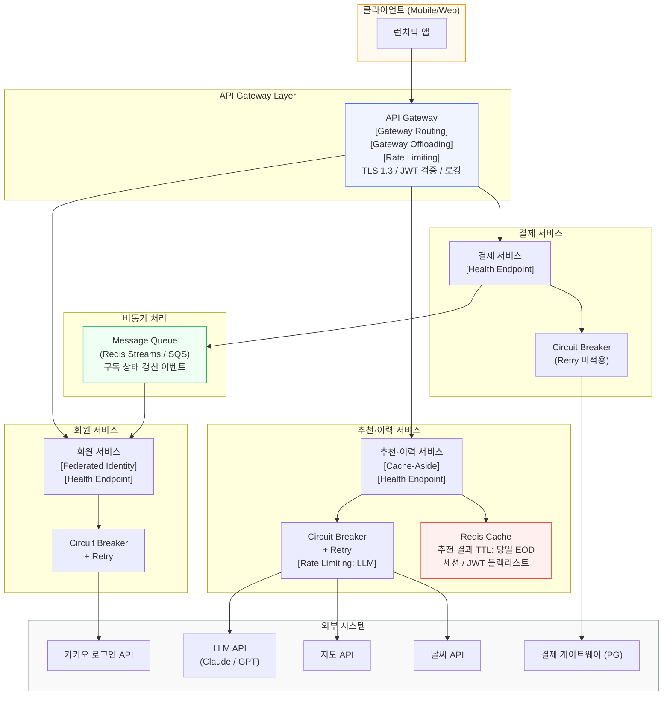

# 아키텍처 패턴 정의서

> 작성자: 홍길동 (아키) / 소프트웨어 아키텍트 + 한승우 (마법사) / AI 엔지니어
> 작성일: 2026-02-26
> 원칙: YAGNI — MVP에 필요한 최소한의 패턴만 선정

---

## 1. 요구사항 분석 결과

### 1.1 기능적 요구사항

| 서비스 | 핵심 기능 | 우선순위 |
|--------|-----------|---------|
| 회원 서비스 | 카카오 소셜 로그인, 취향 온보딩 퀴즈, 위치 동의, 알레르기/식이제한 설정 | P0 |
| 추천·이력 서비스 | 오늘의 추천 3개 조회(< 3초), 추천 이유 자연어 설명(A8), 콜드스타트 안전망 | P0 |
| 추천·이력 서비스 | 추천 수락/거절, 원탭 식사 기록(A5), 간단 피드백(10초), 일일 취향 학습 반영(A1) | P0 |
| 결제 서비스 | 구독 플랜 조회, 구독 결제/해지, PG 연동, 청약철회권 보장 | P0 |
| 공통 | 식사 이력 타임라인(30일), 취향 인사이트 리포트 | P1/P2 |

**핵심 솔루션 흐름**: A5(원탭 기록) → A1(취향 해자 플라이휠) → A8(투명한 추천 근거)

### 1.2 비기능적 요구사항

| 분류 | 요구사항 | 수치 |
|------|----------|------|
| 성능 | 일반 API 응답 시간 | p95 < 200ms |
| 성능 | 추천 조회 응답 시간 (LLM 포함) | p95 < 3초 |
| 성능 | 이력 조회 응답 시간 | p95 < 500ms |
| 확장성 | 피크타임 동시 사용자 | 12~13시 1,000명 |
| 확장성 | 오토스케일링 트리거 | CPU 70% 이상 시 자동 확장 |
| 보안 | 전송 암호화 | TLS 1.3 |
| 보안 | 저장 암호화 | AES-256 (개인정보, 위치, 알레르기) |
| 보안 | 인증 | JWT, 접근 토큰 만료 1시간 |
| 법규 | 위치정보법 | 위치 수집 동의, 6개월 보유, 이후 자동 삭제 |
| 법규 | 개인정보보호법 | 최소 수집, 민감정보 별도 동의 |
| 법규 | 전자상거래법 | 청약철회권 7일, 자동갱신 고지 |

### 1.3 기술적 도전과제 식별

| # | 도전과제 | 영향 범위 | 심각도 |
|---|---------|---------|--------|
| C1 | **LLM API 연동**: 높은 레이턴시(1~5초), 간헐적 장애, 비용 제어 필요 | 추천·이력 서비스 핵심 기능 | 높음 |
| C2 | **피크타임 확장성**: 12~13시 동시 1,000명 집중 부하 | 전 서비스, 특히 추천 조회 | 높음 |
| C3 | **다수 외부 API 의존**: 카카오 로그인, 지도 API, 날씨 API — 각각 독립적 장애 가능 | 회원 서비스, 추천·이력 서비스 | 중간 |
| C4 | **구독/결제 트랜잭션**: PG 연동, 결제 실패 복구, 구독 상태 비동기 갱신 | 결제 서비스 ↔ 회원 서비스 | 중간 |
| C5 | **실시간 컨텍스트 추천**: 위치, 날씨, 식사 이력, 취향 벡터를 조합한 동적 추천 | 추천·이력 서비스 | 중간 |
| C6 | **외부 인증 위임**: 카카오 로그인 API 의존, SSO 처리 | 회원 서비스 | 낮음 |

---

## 2. 패턴 후보 스크리닝

### 2.1 카테고리-도전과제 매핑

| 카테고리 | 도전과제 매핑 | 유망 패턴 |
|---------|------------|---------|
| 안정성 | C1(LLM 장애), C3(외부 API), C2(피크 과부하) | Circuit Breaker, Retry, Rate Limiting, Bulkhead |
| 읽기 최적화 | C1(LLM 응답 캐싱), C2(피크 읽기 집중) | Cache-Aside |
| 핵심업무 집중 | C3(외부 API 라우팅), C6(인증 오프로딩) | Gateway Offloading, Gateway Routing |
| 보안 | C6(카카오 인증 위임) | Federated Identity |
| 효율적 분산처리 | C4(결제→회원 비동기), C2(피크 부하 완충) | Queue-Based Load Leveling, Publisher-Subscriber |
| 운영 | C2(상태 모니터링), 전 서비스 | Health Endpoint Monitoring |

### 2.2 스크리닝 결과

**즉시 제외 (YAGNI — MVP 불필요 복잡도)**

| 패턴 | 제외 사유 |
|------|---------|
| CQRS | 읽기/쓰기 분리가 MVP 규모에서 과도한 설계. Phase 3 고려 |
| Event Sourcing | 이벤트 저장소 구축 비용 대비 MVP 가치 없음 |
| Saga | 분산 트랜잭션은 결제 1건. 로컬 트랜잭션 + 비동기 메시지로 충분 |
| Sharding | 피크 1,000명 규모에서 불필요 |
| Geodes | 국내 서비스만 운영, 멀티 리전 불필요 |
| Deployment Stamps | 멀티 테넌트 구조 없음 |
| Strangler Fig | 레거시 없음, 신규 서비스 |
| Sidecar / Ambassador | 서비스 메시(Istio 등) 도입 전 불필요 |
| Leader Election | 분산 스케줄러 불필요 (단일 배치 잡 충분) |
| Sequential Convoy | MVP에서 메시지 순서 보장 불필요 |
| Competing Consumers | 병렬 큐 워커가 MVP 규모에서 과도 |
| BFF (Backends for Frontends) | 클라이언트 유형 다양화 전 불필요 |
| Index Table | RDB 인덱스로 충분 |
| Materialized View | 쿼리 복잡도 MVP 수준 미도달 |

**후보 압축 결과 (8개)**

| # | 패턴 | 도전과제 | 선택 근거 |
|---|------|---------|---------|
| P1 | Federated Identity | C6 | 카카오 인증 위임, 직접 구현 불필요 |
| P2 | Gateway Offloading | C3, C6 | 인증/로깅/SSL 공통 처리 집중 |
| P3 | Gateway Routing | C3 | 단일 진입점, 서비스 라우팅 |
| P4 | Circuit Breaker | C1, C3 | LLM·외부 API 장애 격리 핵심 |
| P5 | Retry | C1, C3 | LLM 일시적 오류 복구 |
| P6 | Rate Limiting | C1, C2 | LLM 비용 제어, 피크 과부하 방지 |
| P7 | Cache-Aside | C1, C2 | LLM 응답 캐싱, 추천 응답 속도 확보 |
| P8 | Queue-Based Load Leveling | C4 | 결제→회원 비동기 처리, 피크 완충 |
| P9 | Health Endpoint Monitoring | C2 | 오토스케일링 연동, 서비스 상태 점검 |

---

## 3. 패턴 선정 매트릭스

### 3.1 적용 가중치: MVP/스타트업

| 기준 | 가중치 | MVP 관점 |
|------|--------|---------|
| 기능 적합성 | 35% | 기술적 도전과제를 직접 해소하는가 |
| 운영 용이성 | 25% | 소규모 팀이 관리 가능한가 |
| 비용 효율성 | 15% | LLM 비용·인프라 비용을 절감하는가 |
| 보안 적합성 | 10% | 법규·보안 요구사항을 충족하는가 |
| 성능 효과 | 10% | p95 응답 시간 목표를 달성하는가 |
| 확장성 | 5% | 피크 1,000명 이후 성장을 수용하는가 |

### 3.2 평가표

| 패턴 | 기능적합(35%) | 운영용이(25%) | 비용효율(15%) | 보안(10%) | 성능(10%) | 확장성(5%) | **가중합계** | 선정 |
|------|:-----------:|:-----------:|:-----------:|:--------:|:--------:|:---------:|:-----------:|:----:|
| Federated Identity | 10 | 10 | 9 | 10 | 6 | 5 | **9.45** | MVP |
| Gateway Offloading | 9 | 9 | 8 | 9 | 7 | 7 | **8.75** | MVP |
| Gateway Routing | 8 | 9 | 8 | 7 | 7 | 8 | **8.20** | MVP (Offloading과 통합) |
| Circuit Breaker | 10 | 7 | 9 | 6 | 9 | 7 | **8.65** | MVP |
| Retry | 9 | 8 | 8 | 5 | 8 | 5 | **8.15** | MVP |
| Rate Limiting | 9 | 8 | 10 | 7 | 8 | 7 | **8.70** | MVP |
| Cache-Aside | 9 | 8 | 10 | 5 | 10 | 6 | **8.65** | MVP |
| Queue-Based Load Leveling | 7 | 6 | 7 | 5 | 7 | 8 | **6.75** | Phase 2 격상 검토 |
| Health Endpoint Monitoring | 7 | 10 | 8 | 5 | 6 | 7 | **7.80** | MVP |

> Gateway Offloading과 Gateway Routing은 API Gateway 제품(Kong, AWS API Gateway 등) 단일 도입으로 동시 구현 가능. 별도 패턴이 아닌 하나의 인프라 컴포넌트로 통합 적용.

**Queue-Based Load Leveling 판단**: 결제→회원 구독 상태 갱신 1건이 비동기이나, MVP에서는 경량 메시지 브로커(Redis Streams 또는 AWS SQS) 1개 토픽으로 처리. 별도 패턴 운영 비용 대비 가치가 낮아 Phase 2에서 부하 증가 시 정식 도입.

### 3.3 AI 패턴 평가 (마법사 관점)

마법사(한승우)의 LLM API 통합 실무 관점에서 4개 패턴의 필수성을 서술한다.

#### Circuit Breaker — LLM API 장애 격리

LLM API(Claude/GPT)는 모델 업데이트, 네트워크 이슈, 서버 포화로 인해 간헐적 5xx 오류와 타임아웃이 발생한다. 장애 시 추천 서비스 전체가 블로킹되면 피크타임 12~13시에 1,000명이 동시에 타임아웃을 경험하는 최악의 시나리오가 된다.

Circuit Breaker는 LLM API 연속 실패 N회(예: 5회) 감지 시 즉시 "열림(Open)" 상태로 전환하여 이후 요청을 LLM에 보내지 않고 즉시 캐시 기반 추천 또는 폴백 추천(지역 인기 메뉴)으로 응답한다. "반열림(Half-Open)" 상태에서 LLM API 복구를 주기적으로 확인하여 자동 복구된다. 이것이 없으면 LLM 장애가 추천 API 전체 장애로 전파된다.

#### Cache-Aside — AI 추천 응답 캐싱

LLM API 호출 비용은 요청당 수십~수백 원 수준이며, 추천 품질은 취향 벡터가 갱신되지 않는 한 동일한 컨텍스트(위치, 날씨, 요일)에서 동일한 응답을 생성할 가능성이 높다. 동일한 사용자가 당일 여러 번 앱을 열 경우 매번 LLM을 호출하면 비용이 선형으로 증가한다.

Cache-Aside는 추천 결과를 Redis에 캐싱(TTL: 당일 만료)하여 동일 사용자의 재조회 시 LLM 호출 없이 캐시에서 응답한다. 피크타임 집중 조회 시 LLM 호출 수를 70~90% 감소시켜 비용 제어와 응답 속도(< 200ms) 동시 달성이 가능하다.

#### Rate Limiting — LLM API 비용 제어 및 할당량 관리

LLM API 제공자(Anthropic, OpenAI)는 분당 요청 수(RPM)와 토큰 수(TPM) 제한을 부과한다. 피크타임 1,000명이 동시에 추천을 요청하면 할당량 초과(429 Too Many Requests)로 전체 추천 서비스가 중단될 수 있다. 또한 악의적 사용자나 버그로 인한 무한 호출이 LLM 비용 폭증을 야기할 수 있다.

Rate Limiting은 사용자별(IP, 사용자 ID), 글로벌 두 레벨로 적용한다. 사용자별: 추천 조회 분당 10회 제한(정상 사용 패턴 초과 방지), 글로벌: LLM API 호출 분당 500회 제한(RPM 할당량의 80% 이내 유지). 이를 통해 LLM 월 비용을 예측 가능한 범위 내로 제어한다.

#### Retry — LLM API 일시적 오류 복구

LLM API는 503(서버 과부하), 408(타임아웃), 429(Rate Limit 일시 초과) 등 재시도 시 성공하는 일시적 오류가 빈번하다. 즉시 실패 처리하면 사용자 경험이 저하되지만, 무한 재시도는 레이턴시를 폭증시킨다.

Retry는 지수 백오프(Exponential Backoff) + 지터(Jitter) 전략으로 1차(500ms), 2차(1초), 3차(2초) 재시도를 수행한다. 최대 3회 재시도 후 Circuit Breaker 실패 카운트에 반영한다. Retry와 Circuit Breaker는 함께 적용해야 효과적이다: Retry는 일시적 오류를 복구하고, Circuit Breaker는 지속적 장애에서 불필요한 재시도 낭비를 차단한다.

---

## 4. 패턴 조합 검증

### 4.1 시너지 분석

| 조합 | 시너지 효과 |
|------|-----------|
| **Circuit Breaker + Retry** | Retry가 일시적 오류를 흡수하고, Circuit Breaker가 지속적 장애를 차단. 두 패턴이 층위를 나눠 LLM API 복원력을 완성한다. |
| **Circuit Breaker + Cache-Aside** | LLM이 "열림" 상태일 때 Cache-Aside의 캐시 데이터가 폴백 응답으로 사용된다. 장애 시 사용자는 캐시된 추천을 받아 서비스 중단을 체감하지 못한다. |
| **Rate Limiting + Cache-Aside** | Rate Limiting이 LLM 호출 수를 제한하고, Cache-Aside가 동일 요청을 캐시에서 응답하여 실제 LLM 호출 빈도를 줄인다. 두 패턴이 LLM 비용 절감을 이중으로 달성한다. |
| **Gateway Offloading + Federated Identity** | API Gateway가 카카오 토큰 검증을 수행하고, 각 마이크로서비스는 검증된 사용자 컨텍스트만 수신. 서비스별 인증 로직 중복을 제거한다. |
| **Gateway Offloading + Rate Limiting** | Rate Limiting 정책을 API Gateway에서 중앙 적용. 서비스별 Rate Limiting 구현 불필요, 운영 포인트 단일화. |
| **Health Endpoint Monitoring + Circuit Breaker** | 서비스 Health 엔드포인트가 Circuit Breaker 상태(Open/Closed)를 포함 노출. 운영팀이 LLM API 장애 상태를 실시간 모니터링할 수 있다. |

### 4.2 충돌 분석

| 조합 | 잠재적 충돌 | 해결 방안 |
|------|-----------|---------|
| **Retry + Rate Limiting** | Retry 재시도 자체가 Rate Limiting 카운터를 소비하여 정상 요청이 차단될 수 있다. | Retry 대상: LLM API 외부 호출만 적용. Rate Limiting: 사용자 진입 레이어(API Gateway)에서 적용. 두 패턴의 적용 레이어를 분리하여 충돌 방지. |
| **Cache-Aside + 실시간 컨텍스트** | 날씨·위치가 변하는데 캐시가 유효하면 컨텍스트와 맞지 않는 추천이 제공될 수 있다. | 캐시 키에 위치(반경 200m 격자), 날씨 코드, 요일을 포함. TTL은 당일 13:00까지로 제한. 사용자 피드백 갱신 시 캐시 무효화(Invalidation) 적용. |

---

## 5. 트레이드오프 분석

### P1. Federated Identity

| 항목 | 내용 |
|------|------|
| **얻는 것** | 카카오 인증 인프라 활용, 비밀번호 관리 불필요, 빠른 온보딩 UX, 보안 부담 감소 |
| **잃는 것** | 카카오 API 의존성 발생. 카카오 장애 시 신규 가입/로그인 불가 |
| **수용 근거** | 타깃 고객(수도권 직장인 25-45세)의 카카오 사용률이 압도적으로 높음. MVP 단계에서 직접 인증 구현은 비용 대비 가치 없음. Phase 2에서 이메일 로그인 병행 고려 |

### P2. Gateway Offloading + Gateway Routing (통합 적용)

| 항목 | 내용 |
|------|------|
| **얻는 것** | 단일 진입점, 공통 인증·로깅·TLS 처리 집중화, 서비스별 중복 코드 제거, API 버전 관리 용이 |
| **잃는 것** | API Gateway가 단일 장애 지점(SPOF)이 될 수 있음. 게이트웨이 자체 운영 비용 발생 |
| **수용 근거** | 관리형 API Gateway(AWS API Gateway, Kong Konnect 등) 사용으로 SPOF 위험을 클라우드 SLA로 위임. 3개 마이크로서비스 통합 관리 효율성이 운영 비용을 상회함 |

### P3. Circuit Breaker

| 항목 | 내용 |
|------|------|
| **얻는 것** | LLM·외부 API 장애 격리, 피크타임 cascade failure 방지, 폴백 전략 실행 보장 |
| **잃는 것** | 구현 복잡도 증가(상태 관리), "열림" 상태 임계값 튜닝 필요 |
| **수용 근거** | LLM API 장애는 피크타임 서비스 전체 다운과 직결됨. Resilience4j(Java)/nestjs-resilience4j 라이브러리로 라이브러리 수준에서 구현 가능하여 복잡도는 수용 가능 |

### P4. Retry

| 항목 | 내용 |
|------|------|
| **얻는 것** | LLM API 일시적 오류 자동 복구, 사용자 체감 성공률 향상 |
| **잃는 것** | 재시도 시 응답 지연 증가. 멱등하지 않은 작업에 잘못 적용 시 데이터 중복 위험 |
| **수용 근거** | LLM API 조회는 읽기 작업으로 멱등성 보장됨. 지수 백오프로 지연 최소화. 결제·기록 쓰기 API에는 Retry 미적용(멱등성 없음) |

### P5. Rate Limiting

| 항목 | 내용 |
|------|------|
| **얻는 것** | LLM API 비용 상한선 제어, 서비스 DoS 방어, 공정한 자원 분배 |
| **잃는 것** | 정상 사용자가 제한에 걸릴 경우 UX 저하. 임계값 설정 오류 시 정상 트래픽 차단 위험 |
| **수용 근거** | 추천 조회는 사용자당 점심 1회 패턴으로 일반적인 사용에서 제한 도달 없음. 임계값을 넉넉히(분당 10회) 설정하여 오탐 방지. LLM 비용 예측 가능성이 스타트업 생존에 직결 |

### P6. Cache-Aside

| 항목 | 내용 |
|------|------|
| **얻는 것** | LLM 호출 비용 70~90% 절감, 피크타임 응답 속도 < 200ms 달성, 캐시 히트 시 안정적 저레이턴시 |
| **잃는 것** | 캐시-DB 정합성 관리 필요. Redis 운영 비용 추가. 캐시 무효화 로직 구현 필요 |
| **수용 근거** | 추천 결과는 당일 취향 벡터가 변하지 않는 한 동일. Redis는 이미 세션·JWT 블랙리스트 용도로 도입 예정이어서 추가 인프라 비용 없음 |

### P7. Health Endpoint Monitoring

| 항목 | 내용 |
|------|------|
| **얻는 것** | 오토스케일링 트리거 연동, 외부 의존 API 상태 통합 노출, 장애 감지 시간 단축 |
| **잃는 것** | Health 엔드포인트 자체가 외부에 노출될 경우 정보 누출 위험 |
| **수용 근거** | `/health` 엔드포인트를 내부 VPC에서만 접근 허용(public 노출 금지). 스프링 Actuator 또는 NestJS Terminus 라이브러리로 구현 복잡도 최소화. 오토스케일링 없이는 피크타임 NFR 달성 불가 |

---

## 6. 서비스별 패턴 적용 매핑

| 패턴 | 회원 서비스 | 추천·이력 서비스 | 결제 서비스 | 적용 레이어 |
|------|:---------:|:--------------:|:---------:|----------|
| Federated Identity | O | - | - | 회원 서비스, API Gateway |
| Gateway Offloading | O | O | O | API Gateway (공통) |
| Gateway Routing | O | O | O | API Gateway (공통) |
| Circuit Breaker | O(카카오) | O(LLM, 지도, 날씨) | O(PG) | 각 서비스 내 외부 호출 레이어 |
| Retry | O(카카오) | O(LLM, 날씨) | - | 각 서비스 내 외부 호출 레이어 |
| Rate Limiting | O | O(핵심) | O | API Gateway (공통) + 추천 서비스 내부 |
| Cache-Aside | - | O(핵심) | O(플랜 조회) | 추천·이력 서비스 (Redis) |
| Health Endpoint Monitoring | O | O | O | 각 서비스 (`/health`) |

> Retry는 결제 서비스에 미적용: PG 결제 요청은 멱등하지 않아 재시도 시 이중결제 위험 발생.

---

## 7. 서비스별 패턴 적용 설계



### 핵심 흐름별 패턴 동작

#### 추천 조회 흐름 (C1, C2 해소)

```
앱 → API Gateway(Rate Limiting) → 추천 서비스
→ Cache-Aside 조회: 캐시 Hit → Redis에서 즉시 응답 (< 200ms)
→ Cache-Aside 조회: 캐시 Miss → Circuit Breaker 확인
   → Closed: Retry + LLM API 호출 → 결과 캐싱 후 응답 (< 3초)
   → Open: 폴백(캐시 만료 데이터 or 지역 인기 메뉴) 즉시 응답
```

#### 구독 결제 흐름 (C4 해소)

```
앱 → API Gateway → 결제 서비스
→ Circuit Breaker 확인 → Closed: PG 연동 결제 처리
→ 결제 성공 → Message Queue 발행(구독 상태 갱신 이벤트)
→ 회원 서비스 구독 처리 비동기 소비 → 프리미엄 활성화
(Retry 미적용: 이중결제 방지)
```

---

## 8. Phase별 구현 로드맵

### Phase 1: MVP (Sprint 1~7, 14주)

**선정 패턴 (7종)**

| 패턴 | 구현 방법 | Sprint |
|------|---------|--------|
| Federated Identity | 카카오 OAuth 2.0 SDK 연동 | Sprint 1 |
| Gateway Offloading + Routing | AWS API Gateway 또는 Kong OSS | Sprint 1 |
| Health Endpoint Monitoring | NestJS Terminus / Spring Actuator | Sprint 1 |
| Circuit Breaker | Resilience4j (NestJS: nestjs-resilience4j) | Sprint 2 |
| Retry | Resilience4j Retry (지수 백오프 + 지터) | Sprint 2 |
| Cache-Aside | Redis (ioredis / Spring Data Redis) | Sprint 2 |
| Rate Limiting | API Gateway 정책 + 추천 서비스 내부 LLM 제한 | Sprint 5 |

**메시지 큐 (경량 적용)**: Redis Streams 1개 토픽으로 결제→회원 구독 상태 갱신 처리. Queue-Based Load Leveling 패턴의 간소화 구현.

### Phase 2: 확장 (사용자 10,000명 이상)

| 추가 패턴 | 도입 근거 |
|---------|---------|
| Queue-Based Load Leveling (정식) | 트래픽 증가 시 Redis Streams를 AWS SQS/Kafka로 교체, 다중 토픽 부하 분산 |
| Bulkhead | LLM API 호출 전용 스레드 풀 격리, 타 기능으로 장애 전파 차단 |
| Competing Consumers | 일일 취향 학습 배치(UFR-REC-100) 병렬 처리 워커 도입 |

### Phase 3: 고도화 (사용자 100,000명 이상)

| 추가 패턴 | 도입 근거 |
|---------|---------|
| CQRS | 추천 이력 조회 트래픽 분리, 취향 벡터 갱신 쓰기와 분리 |
| Materialized View | 취향 인사이트 리포트(UFR-REC-120) 사전 계산 뷰 최적화 |
| BFF (Backends for Frontends) | 모바일 앱/웹/위젯 클라이언트별 최적화 API 분리 |
| Saga | 다중 마이크로서비스 분산 트랜잭션 복잡도 증가 대응 |

---

## 9. 기대 효과 및 검증 계획

### 9.1 패턴별 기대 효과

| 패턴 | 기대 효과 | 검증 지표 |
|------|---------|---------|
| Circuit Breaker | LLM 장애 시 cascade failure 방지 | LLM 다운 상황에서 추천 API 응답 200 OK 비율 > 99% |
| Cache-Aside | LLM 호출 비용 절감, 응답 속도 향상 | 캐시 히트율 > 60% (피크타임), 히트 시 응답 < 200ms |
| Rate Limiting | LLM API 월 비용 예측 가능 | LLM 일일 호출 수 상한선 이내 유지 |
| Retry | LLM 일시 오류 투명 복구 | 재시도 성공률 > 80% (일시적 503/408) |
| Gateway Offloading | 서비스별 인증 로직 제거 | 각 서비스 인증 코드 0줄 |
| Federated Identity | 온보딩 완료율 향상 | 소셜 로그인 성공률 > 99% |
| Health Endpoint | 오토스케일링 응답 시간 단축 | 피크타임 CPU 70% 도달 후 스케일아웃 < 2분 |

### 9.2 검증 계획

| 시나리오 | 검증 방법 | 목표 |
|---------|---------|------|
| LLM API 장애 모의 | Chaos Engineering (LLM 엔드포인트 차단 시뮬레이션) | 폴백 응답 정상 확인, 사용자 에러 화면 미노출 |
| 피크타임 부하 | k6/Locust로 동시 1,000명 부하 테스트 | 추천 API p95 < 3초 유지 |
| Cache Hit율 | 피크타임 Redis 모니터링 | 히트율 > 60% |
| Rate Limit 동작 | 분당 10회 초과 요청 테스트 | 429 응답 및 Retry-After 헤더 확인 |
| 결제 이중결제 방지 | PG Mock으로 결제 중복 요청 테스트 | 이중결제 0건 확인 |

---

*작성자: 홍길동 (아키) / 소프트웨어 아키텍트*
*협업: 한승우 (마법사) / AI 엔지니어 — 3.3 AI 패턴 평가 기여*
*작성일: 2026-02-26*
*기반 파일: userstory.md, 핵심솔루션.md, 이벤트스토밍요약.md, Cloud Design Patterns(개요).md*
