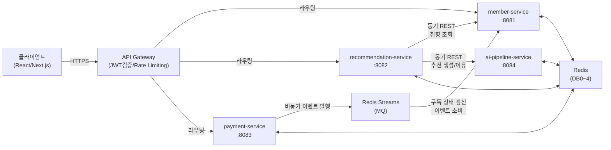

# 종합 개발 계획서

> 작성자: 홍길동 (아키) / 소프트웨어 아키텍트
> 작성일: 2026-02-26
> 버전: 1.0
> 기반: 설계 산출물 전체 + 3개 에이전트 분석 (백엔드/프론트엔드/AI)

---

## 0. 개발 범위

- **선택된 개발 단계**: Phase 1: MVP (Sprint 1~7, 14주) — 4개 마이크로서비스 + AI Pipeline 전체 구현
- **범위 요약**: 카카오 소셜 인증, 취향 온보딩, AI 기반 추천(3초 이내), 원탭 식사 기록, 취향 학습 배치, 구독 결제, 인사이트 리포트 — 피크타임 1,000명 동시 접속 대응
- **제외 범위**:
  - Phase 2 (확장): SQS 전환, Bulkhead, 이메일 로그인, 다중 LLM A/B 테스트, Aurora 전환
  - Phase 3 (고도화): CQRS, Materialized View, Service Mesh(Istio), BFF, Saga, 멀티리전

---

## 1. 마이크로서비스 목록

| 서비스명 | 설명 | 주요 API 수 | 의존 서비스 | 아키텍처 패턴 | 포트 |
|---------|------|------------|-----------|-------------|------|
| **member-service** | 카카오 OAuth 인증, 취향 프로파일 관리, 구독 상태 관리 | 9개 (외부 7 + 내부 2) | 카카오 로그인 API (외부), Redis (DB0/1) | Layered | 8081 |
| **recommendation-service** | 추천 오케스트레이션, 식사 기록, 피드백, 취향 학습 배치 | 11개 | member-service (내부), ai-pipeline-service (내부), 날씨/지도 API (외부), Redis (DB2) | Layered | 8082 |
| **payment-service** | 구독 플랜 조회, PG 결제, 구독 해지/연장 | 4개 | PG 게이트웨이 (외부), Redis Streams (MQ), Redis (DB3) | Layered | 8083 |
| **ai-pipeline-service** | LLM 호출, 프롬프트 관리, 추천 이유 생성, 폴백 추천 | 2개 (내부 전용) | LLM API (Claude/GPT), Redis (DB4) | FastAPI Layered | 8084 |

**API 수 상세 근거:**

**member-service (9개)**:
1. `POST /api/v1/auth/kakao` — 카카오 소셜 로그인
2. `POST /api/v1/members/onboarding` — 취향 온보딩 퀴즈 저장
3. `PUT /api/v1/members/onboarding/progress` — 온보딩 중간 저장
4. `POST /api/v1/members/location-consent` — 위치 동의 처리
5. `PUT /api/v1/members/dietary-restrictions` — 식이제한 설정
6. `GET /api/v1/members/profile` — 프로필 조회
7. `PUT /api/v1/members/profile` — 프로필 수정
8. `GET /internal/members/{memberId}/taste-profile` — 취향 벡터 조회 (내부)
9. `GET /api/v1/members/subscription` — 구독 상태 조회

**recommendation-service (11개)**:
1. `GET /api/v1/recommendations/today` — 오늘의 추천 3개
2. `GET /api/v1/recommendations/{id}/reason` — 추천 이유 상세
3. `POST /api/v1/recommendations/{id}/accept` — 추천 수락
4. `POST /api/v1/recommendations/{id}/reject` — 추천 거절
5. `POST /api/v1/recommendations/refresh` — 전체 새로고침
6. `POST /api/v1/meals` — 원탭 식사 기록
7. `PUT /api/v1/meals/{id}` — 식사 기록 수정
8. `DELETE /api/v1/meals/{id}` — 식사 기록 취소
9. `POST /api/v1/meals/{id}/feedback` — 피드백 제출
10. `GET /api/v1/history/timeline` — 이력 타임라인 (30일)
11. `GET /api/v1/insights` — 취향 인사이트 리포트

**payment-service (4개)**:
1. `GET /api/v1/subscriptions/plans` — 구독 플랜 조회
2. `POST /api/v1/subscriptions` — 구독 결제
3. `DELETE /api/v1/subscriptions/{id}` — 구독 해지
4. `POST /api/v1/subscriptions/extend-trial` — 7일 무료 연장

**ai-pipeline-service (2개, 내부 전용)**:
1. `POST /api/v1/ai/recommendations` — AI 추천 생성
2. `POST /api/v1/ai/recommendation-reason` — 추천 이유 생성

---

## 2. 서비스 간 의존관계



**핵심 의존관계:**
- `recommendation-service → member-service`: 동기 REST (취향 벡터 조회)
- `recommendation-service → ai-pipeline-service`: 동기 REST + Circuit Breaker (추천 생성, 추천 이유)
- `payment-service → member-service`: 비동기 메시지 (Redis Streams — 구독 상태 갱신 이벤트 3종)
- `ai-pipeline-service`: 외부 클라이언트 접근 불가, recommendation-service 전용 내부 API

---

## 3. 백킹서비스 요구사항

### 데이터베이스 (PostgreSQL 16)

| 스키마 | 용도 | 테이블 수 | 사용 서비스 |
|--------|------|----------|-----------|
| `lunchpick_member` | 회원 정보, 취향 프로파일, 식이제한, 위치동의 이력 | 4개 | member-service |
| `lunchpick_recommendation` | 추천 이력, 식사 기록, 피드백, 취향벡터 스냅샷, 학습메시지 | 5개 | recommendation-service |
| `lunchpick_payment` | 구독 정보, 결제 이력 (INSERT ONLY) | 2개 | payment-service |
| (DB 없음) | ai-pipeline-service는 Stateless — 영속 DB 미사용 | — | ai-pipeline-service |

### 캐시 (Redis 7.x)

| DB 번호 | 용도 | TTL | 사용 서비스 |
|---------|------|-----|-----------|
| DB 0 | 세션(`session:{member_id}`), JWT 블랙리스트(`jwt:blacklist:{jti}`), Redis Streams MQ | 세션 1h, JWT 토큰 만료까지 | 공통 |
| DB 1 | 취향 프로파일 캐시, 회원 프로파일 캐시 | 취향 30분, 프로파일 10분 | member-service |
| DB 2 | 추천 결과 캐시, 추천 이유 캐시, Stale 캐시 | 당일 13:00, 이유 1h, Stale 24h | recommendation-service |
| DB 3 | 구독 플랜 캐시, 활성 구독 캐시, 중복 결제 Lock | 플랜 1h, 구독 10분, Lock 30초 | payment-service |
| DB 4 | AI 추천 결과 캐시, AI 추천 이유 캐시, LLM 응답 해시 캐시 | 당일 13:00, 이유 1h, 해시 30분 | ai-pipeline-service |

### 메시지 큐 (Redis Streams)

| 토픽 | 발행자 | 소비자 | 이벤트 종류 |
|------|-------|--------|-----------|
| `subscription-events` | payment-service | member-service | 구독 활성화, 해지 예약, 7일 연장 |

**MQ 판별 근거**: 구독전환.puml 시퀀스에서 3개 비동기 흐름 확인. 결합도 최소화 + 결제 응답 시간 단축 목적. Phase 2에서 Amazon SQS 전환 검토.

---

## 4. AI 서비스 범위

- **포함 여부**: **포함** (2단계 검증 통과)
  1. 파일 존재: 7개 설계 파일 전부 존재 (ai-service-design.md, ai-pipeline-api.yaml, 클래스 설계 2개, DB 설계 1개, 시퀀스 2개)
  2. 내용 확인: AI 기능 6개, 모델 2종, 프롬프트 3개, 폴백 전략, 비용 산출 — placeholder 없는 실질적 설계

- **엔드포인트** (2개, 내부 전용):
  | HTTP 메서드 | 경로 | 설명 |
  |---|---|---|
  | POST | `/api/v1/ai/recommendations` | AI 추천 생성 (x-internal: true) |
  | POST | `/api/v1/ai/recommendation-reason` | 추천 이유 생성 (x-internal: true) |

- **사용 모델**:
  | AI 기능 | 모델 | 용도 |
  |---|---|---|
  | 추천 생성 (일반) | claude-3-5-haiku-20241022 | 취향벡터 → 추천 3개 JSON |
  | 추천 생성 (콜드스타트) | claude-3-5-sonnet-20241022 | 온보딩 + 직군 Prior 해석 |
  | 추천 이유 생성 | claude-3-5-haiku-20241022 | 자연어 이유 한 줄 |
  | 대체 (Haiku 장애 시) | claude-3-5-sonnet-20241022 | 환경변수 전환 |

- **프레임워크**: Python 3.12 / FastAPI 0.115.x
- **LLM 추상화**: `langchain_core.language_models.init_chat_model` (Claude/GPT 환경변수 전환)

- **핵심 기능**:
  | ID | AI 기능 | 우선순위 |
  |---|---|---|
  | AI-01 | LLM 기반 추천 생성 (취향벡터 + 날씨 + 이력) | P1 |
  | AI-02 | 추천 이유 자연어 생성 (컨텍스트 태그) | P1 |
  | AI-03 | 콜드스타트 안전망 (직군 Bayesian Prior) | P1 |
  | AI-04 | 대체 추천 생성 (거절 시, AI-01 재활용) | P2 |
  | AI-05 | 확신 스코어 계산 (0~100%) | P1 |
  | AI-06 | 규칙 기반 폴백 엔진 (LLM 미사용) | P1 |

---

## 5. 프론트엔드 범위

| 페이지 | 주요 기능 | 연동 API | 우선순위 |
|--------|-----------|----------|----------|
| **로그인** | 카카오 소셜 로그인, 에러 토스트 | `POST /api/v1/auth/kakao` | P0 Must |
| **취향 퀴즈** | 카드 스와이프(7장 최소), 중간 이탈 자동 저장 | `POST onboarding`, `PUT onboarding/progress` | P0 Must |
| **위치 동의** | 위치정보법 고지, 동의/거절 분기 | `POST location-consent` | P0 Must |
| **식이제한 설정** | 알레르겐 체크박스, 식이 유형, 건강정보 동의 | `PUT dietary-restrictions` | P1 Should |
| **홈 (오늘의 추천)** | 추천 카드 3개, 스와이프, 이유 바텀시트, 콜드스타트 배너 | `GET today`, `GET reason`, `POST accept/reject/refresh` | P0 Must |
| **길찾기** | 도보 경로, 카카오맵/네이버지도 딥링크 | 수락 응답 활용 (외부 지도 API) | P1 Should |
| **식사 기록 + 피드백** | 원탭 기록, 30초 실행 취소, 좋아요/별로, 키워드 선택 | `POST meals`, `DELETE/PUT meals`, `POST feedback` | P0 Must |
| **인사이트** | 이력 탭(달력 뷰), 인사이트 탭(차트, 마일스톤) | `GET timeline`, `GET insights` | P1/P2 |
| **프로필 설정** | 닉네임 수정, 알림 토글, 구독 상태 | `GET/PUT profile`, `GET subscription` | P2 Could |
| **구독 플랜** | 플랜 비교, 7일 무료 체험, 결제, 해지 | `GET plans`, `POST subscriptions`, `DELETE`, `POST extend-trial` | P0 Must |

- **기술스택**: TypeScript 5.x / React 19 / Next.js 15 / Tailwind CSS 4.x / TanStack Query 5.x / NextAuth.js 5.x
- **프로토타입 경로**: `docs/plan/design/uiux/prototype/` (HTML, CSS, JS — 10개 페이지)

---

## 6. 개발 순서 (Phase별)

### Phase 1: 환경 구성

| 영역 | 항목 |
|------|------|
| **백엔드** | Gradle Wrapper + 멀티모듈 build.gradle + common 모듈 (ApiResponse, BaseTimeEntity, BusinessException, JwtTokenProvider, DateTimeUtil) |
| **프론트엔드** | Next.js 15 App Router + Tailwind CSS 4.x + TanStack Query 5.x + NextAuth.js 5.x + 디자인 토큰 + 공통 레이아웃 |
| **AI** | Python 3.12 / FastAPI 프로젝트 골격 + uvicorn + Pydantic v2 |
| **백킹서비스** | docker-compose.yml (PostgreSQL 16 + Redis 7.x + Prism Mock) |

### Phase 2: API 계약 기반 병렬 개발

**백엔드 서비스 개발 순서** (의존관계 기반):

```
[1] common 모듈 + 백킹서비스 환경                    (병렬)
     ↓
[2] member-service                                    (단독, 외부 의존: 카카오만)
     ↓
[3a] ai-pipeline-service                              (병렬 가능, member 미의존)
[3b] payment-service                                  (병렬 가능, [2] 완료 후)
     ↓
[4] recommendation-service                            ([2]+[3a] 완료 후)
     ↓
[5] 통합 테스트
```

**프론트엔드 페이지 개발 순서** (우선순위 기반):

```
Sprint 1: 로그인 + 위치 동의 + 공통 레이아웃 (인증 인프라)
Sprint 2: 취향 퀴즈 + 홈(추천 카드) (핵심 루프)
Sprint 3: 추천 이유 바텀시트 + 수락/거절 (결정 UX)
Sprint 4: 식사 기록 + 피드백 (데이터 축적)
Sprint 5: 구독 플랜 + 결제 + 해지 (수익화)
Sprint 6: 식이제한 + 길찾기 + 빠른 수정 (Should Have)
Sprint 7: 인사이트 + 프로필 + 런칭 준비 (완성도)
```

**AI 서비스 개발 순서** (하위 레이어부터 상향식):

```
1단계: CircuitBreaker + CacheManager (기반 인프라)
2단계: LLMClient (CircuitBreaker 의존)
3단계: PromptBuilder 2종 (병렬, LLMClient 독립)
4단계: ResponseParser 2종 (병렬)
5단계: FallbackEngine (독립)
6단계: RecommendationService + ReasonService (2~5단계 완료 후)
7단계: Router 엔드포인트 2개
8단계: Health 엔드포인트
```

### Phase 3: 통합 연동

- 프론트엔드: Prism Mock → 실제 백엔드 API 전환
- 백엔드-AI: recommendation-service → ai-pipeline-service HTTP 클라이언트 + Circuit Breaker/Fallback

### Phase 4: 테스트 및 QA

- API 테스트: curl 기반 전체 엔드포인트 검증 (26개)
- 브라우저 테스트: Playwright MCP 기반 유저 시나리오 검증 (24개 TC)

---

## 7. 아키텍처 결정사항 (ADR 요약)

| 결정 | 선택지 | 결정 사유 | 영향 범위 |
|------|--------|----------|---------|
| **ADR-001: 백엔드 프레임워크** | Spring Boot 3.4.x + Java 21 / FastAPI + Python 3.12 | 팀 숙련도 + Resilience4j + LLM SDK 생태계 | 전 서비스 기술 스택 |
| **ADR-002: 아키텍처 패턴** | Layered Architecture (전 서비스) | 소규모 팀 MVP, 빠른 구현, YAGNI | 계층 구조 |
| **ADR-003: 클라우드 플랫폼** | AWS (ap-northeast-2 서울) | 저레이턴시, EKS+RDS+ElastiCache 관리형 | 인프라 전체 |
| **ADR-004: 데이터베이스** | PostgreSQL 16 (서비스별 독립 스키마) | ACID, JSONB, 복잡 쿼리, JPA 최적화 | DB 스키마 |
| **ADR-005: 캐시 전략** | Cache-Aside + Redis 7.x | LLM 호출 70~90% 절감, 다용도 Redis | 캐싱 로직 |
| **ADR-006: 인증/인가** | 카카오 OAuth 2.0 + JWT (Federated Identity) | 타깃 고객 카카오 사용률, Stateless 수평 확장 | 인증 전체 |

---

## 8. 서비스별 입력 파일 매핑

| 서비스 | API 명세 | DB 설계 | 패키지 구조 | 행위 계약 테스트 |
|--------|---------|--------|-----------|--------------|
| **member-service** | `api/member-service-api.yaml` | `database/member-service.md` (4 테이블) | `class/package-structure.md` §1 | `test/design-contract/member-service/` |
| **recommendation-service** | `api/recommendation-service-api.yaml` | `database/recommendation-service.md` (5 테이블) | `class/package-structure.md` §2 | `test/design-contract/recommendation-service/` |
| **payment-service** | `api/payment-service-api.yaml` | `database/payment-service.md` (2 테이블) | `class/package-structure.md` §3 | `test/design-contract/payment-service/` |
| **ai-pipeline-service** | `api/ai-pipeline-api.yaml` | `database/ai-pipeline-service.md` (DB 없음, Redis) | `class/package-structure.md` §4 | `test/design-contract/ai-pipeline-service/` |
| **통합 (서비스 간)** | — | — | — | `test/design-contract/integration/` |

---

## 9. 테스트 시나리오 (유저스토리 기반)

| TC-ID | 유저스토리 | 시나리오 | 검증 포인트 | 관련 시퀀스 |
|-------|-----------|----------|------------|-----------|
| TC-01 | UFR-MBR-010 (소셜 로그인) | 카카오 로그인 성공 | 신규: 취향 퀴즈 라우팅. 기존: 홈 라우팅. accessToken 세션 저장 | 회원가입-온보딩.puml |
| TC-02 | UFR-MBR-010 (로그인 실패) | 카카오 인증 실패 (401/503) | 에러 토스트 노출. 로그인 화면 유지 | 회원가입-온보딩.puml |
| TC-03 | UFR-MBR-020 (취향 퀴즈) | 카드 7장 미만 스와이프 | 완료 버튼 비활성화. 7장 완료 시 활성화 | 회원가입-온보딩.puml |
| TC-04 | UFR-MBR-020 (퀴즈 이탈) | 퀴즈 4장 후 이탈 → 재진입 | 4장 완료 상태에서 이어서 진행 | 회원가입-온보딩.puml |
| TC-05 | UFR-MBR-030 (위치 동의) | 동의 탭 | locationEnabled:true. GPS 좌표 자동 포함 | 회원가입-온보딩.puml |
| TC-06 | UFR-MBR-030 (위치 거절) | 거절 탭 | 수동 위치 입력 UI 진입 안내 | 회원가입-온보딩.puml |
| TC-07 | UFR-REC-010 (추천 조회) | 홈 화면 진입 | 스켈레톤 → 추천 카드 3개 렌더링 (식당명/메뉴/확신/거리/이유) | 오늘의추천조회.puml |
| TC-08 | UFR-REC-010 (콜드스타트) | 피드백 5건 미만 사용자 | isColdStart:true → 학습 중 배너 표시 | 오늘의추천조회.puml |
| TC-09 | UFR-REC-010 (API 오류) | 추천 API 장애 | isFallback:true → 폴백 추천 표시 + 재시도 버튼 | 오늘의추천조회.puml |
| TC-10 | UFR-REC-020 (추천 이유) | "왜?" 버튼 탭 | 바텀시트: 자연어 이유 + 확신 스코어 바 + 컨텍스트 태그 | 오늘의추천조회.puml |
| TC-11 | UFR-REC-040 (추천 수락) | "여기 갈래요" 탭 | 수락 기록. reactionTimeMs 전송. 길찾기 전환 | 추천수락-식당선택.puml |
| TC-12 | UFR-REC-050 (추천 거절) | 왼쪽 스와이프 | 거절 사유 바텀시트 → 대체 추천 카드 | 추천수락-식당선택.puml |
| TC-13 | UFR-REC-050 (대체 없음) | 거절 시 후보 없음 | "거리를 넓혀볼까요?" + 새로고침 유도 | 추천수락-식당선택.puml |
| TC-14 | UFR-REC-070 (원탭 기록) | "먹었어요!" 탭 | 체크 애니메이션 + 30초 카운트다운 바 | 식사기록.puml |
| TC-15 | UFR-REC-070 (중복 기록) | 이미 기록된 상태 재시도 | 409 → "이미 기록. 수정하시겠어요?" 다이얼로그 | 식사기록.puml |
| TC-16 | UFR-REC-080 (실행 취소) | 20초 내 취소 탭 | DELETE 호출. "기록 취소" 토스트. 이전 상태 복귀 | 식사기록.puml |
| TC-17 | UFR-REC-080 (30초 초과) | 35초 후 취소 시도 | 취소 바 자동 사라짐. "이력에서 수정 가능" 안내 | 식사기록.puml |
| TC-18 | UFR-REC-090 (피드백 제출) | 좋아요 + 키워드 선택 | GOOD + keyword 전송. "내일 반영" + 누적 횟수 | 식사기록.puml |
| TC-19 | UFR-REC-090 (피드백 스킵) | 건너뛰기 탭 | NEUTRAL 전송. "내일 반영" 메시지 | 식사기록.puml |
| TC-20 | UFR-PAY-010 (플랜 조회) | 구독 관리 진입 | 무료/프리미엄 비교 카드. 월 4,900 / 연 3,900(20%↓) | 구독전환.puml |
| TC-21 | UFR-PAY-020 (구독 결제) | 프리미엄 선택 → 결제 | 카드 16자리 검증. 동의 미체크 시 버튼 비활성. 201 → 활성화 완료 | 구독전환.puml |
| TC-22 | UFR-PAY-020 (결제 실패) | PG 실패 | 400: 인라인 에러. 402: 에러 모달 "다른 결제 수단" | 구독전환.puml |
| TC-23 | UFR-PAY-030 (해지 — 연장) | 7일 연장 선택 | "7일 연장" 토스트. 새 만료일 갱신 | 구독전환.puml |
| TC-24 | UFR-PAY-030 (해지 완료) | 해지 확인 | 해지 예약. 기간 종료까지 프리미엄 유지. 데이터 경고 | 구독전환.puml |

---

## 10. 환경 구성 정보 (Step 2 가이드용)

### 10-1. 공통 모듈 구성

| 컴포넌트 | 클래스명 | 설명 |
|---------|---------|------|
| 공통 응답 래퍼 | `ApiResponse<T>` | success, data, error, timestamp. 정적 팩토리: ok(data), fail(error) |
| 공통 에러 응답 | `ErrorResponse` | error, message, timestamp. 정적 팩토리: of(error, message) |
| JPA 베이스 엔티티 | `BaseTimeEntity` | createdAt, updatedAt (JPA Auditing) |
| 비즈니스 예외 기반 | `BusinessException` | errorCode, message. 하위 예외의 상위 타입 |
| 리소스 없음 예외 | `NotFoundException` | BusinessException 상속. (resource, id) |
| 유효성 검증 예외 | `ValidationException` | BusinessException 상속. (message) |
| 충돌 예외 | `ConflictException` | BusinessException 상속. (errorCode, message) |
| 인증 실패 예외 | `UnauthorizedException` | BusinessException 상속. (message) |
| JWT 유틸리티 | `JwtTokenProvider` | 생성/파싱/검증/만료 조회 |
| 날짜/시간 유틸리티 | `DateTimeUtil` | KST 현재시각, 점심시간 판별, 요일, ISO 8601 변환 |

> 패키지: `com.unicorn.lunchpick.common`

### 10-2. 백킹서비스 요구사항

| 백킹서비스 | 필요 여부 | 판단 근거 | 설정 정보 |
|-----------|---------|---------|---------|
| PostgreSQL 16 | O | 3개 서비스 DB (테이블 총 11개) | 스키마: lunchpick_member / lunchpick_recommendation / lunchpick_payment |
| Redis 7.x | O | 캐시 + 세션 + JWT + MQ (DB 0~4) | maxmemory-policy: allkeys-lru |
| Redis Streams (MQ) | O | 결제→회원 비동기 이벤트 3종 | 토픽: subscription-events (DB 0) |
| Prism Mock | O | 프론트엔드 독립 개발용 API Mock | 마운트: api/*.yaml (4개 서비스) |

### 10-3. 보안 구성

| 항목 | 설정 | 근거 |
|------|------|------|
| 인증 방식 | 카카오 OAuth 2.0 + JWT (1시간 만료) | Federated Identity + Stateless |
| JWT 블랙리스트 | Redis DB 0, `jwt:blacklist:{jti}` | 로그아웃 즉시 무효화 |
| 개인정보 암호화 | AES-256 (이메일, 위치 — AWS KMS) | 개인정보보호법 |
| 민감정보 암호화 | AES-256 별도 키 (알레르기/식이제한) | 건강정보 별도 동의 |
| 결제이력 보존 | INSERT ONLY, 5년 보존, 삭제 금지 | 전자상거래법 |
| 중복 결제 방지 | Redis DB 3 Lock, TTL 30초 | PG Retry 미적용 |
| Health Endpoint | VPC 내부 전용 | 외부 노출 방지 |

### 10-4. AI 서비스 구조

| 항목 | 값 | 근거 |
|------|------|------|
| 주요 클래스 | Router 2, Service 2, PromptBuilder 2, LLMClient 1, Parser 2, FallbackEngine 1, CacheManager 1, CircuitBreaker 1, Model 10 (총 21개) | ai-pipeline-service.puml |
| 의존성 방향 | Router → Service → {PromptBuilder, LLMClient, Parser, CacheManager} / LLMClient → CircuitBreaker | ai-pipeline-service-simple.puml |
| LLM 제공자 | Anthropic Claude (기본), OpenAI GPT (대체) | ai-service-design.md |
| LLM 추상화 | `langchain_core.language_models.init_chat_model` | 환경변수 전환 |
| 포트 | 8084 | high-level-architecture.md |
| 데이터 저장소 | Redis DB 4 전용 (자체 RDB 없음, Stateless) | ai-pipeline-service.md |

### 10-5. 기술스택 정보

| 영역 | 항목 | 값 | 근거 |
|------|------|-----|------|
| 백엔드 | Java | 21 (LTS, Virtual Threads) | HighLevel 아키텍처 |
| 백엔드 | Spring Boot | 3.4.x | HighLevel 아키텍처 |
| 백엔드 | 빌드 도구 | Gradle | 멀티 프로젝트 빌드 |
| 백엔드 | ORM | Spring Data JPA + Hibernate 6.6.x | PostgreSQL 최적화 |
| 백엔드 | CB/Retry | Resilience4j 2.2.x | Spring Boot 공식 스타터 |
| 프론트엔드 | TypeScript | 5.x | HighLevel 아키텍처 |
| 프론트엔드 | React | 19.x | HighLevel 아키텍처 |
| 프론트엔드 | Next.js | 15.x (App Router) | HighLevel 아키텍처 |
| 프론트엔드 | 스타일링 | Tailwind CSS 4.x | HighLevel 아키텍처 |
| 프론트엔드 | 상태 관리 | TanStack Query 5.x | HighLevel 아키텍처 |
| 프론트엔드 | 인증 | NextAuth.js 5.x | HighLevel 아키텍처 |
| AI | Python | 3.12 | LLM SDK 생태계 |
| AI | FastAPI | 0.115.x | async/await LLM 대기 |
| AI | LLM SDK | langchain-anthropic, langchain-openai | init_chat_model |
| DB | PostgreSQL | 16 | ACID, JSONB |
| 캐시/MQ | Redis | 7.x | 다용도 |
| 테스트 (Java) | JUnit 5 + Mockito | — | 커버리지 80%+ |
| 테스트 (Python) | pytest | — | ai-pipeline |
| 통합 테스트 | Spring Boot Test + Testcontainers | — | 핵심 플로우 100% |

---

*작성일: 2026-02-26 | 작성: architect (아키) 통합 + backend-developer (데브-백) + frontend-developer (데브-프론트) + ai-engineer (마법사) 분석*
